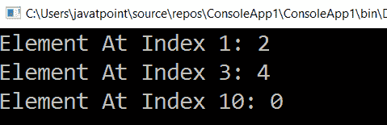

# LINQ 元素默认()方法

> 原文：<https://www.javatpoint.com/linq-elementatordefault-method>

在 LINQ，使用**elementatorddefault()**方法获取列表/集合中指定索引位置的元素，与 LINQ **ElementAt()** 方法相同。ElementAtOrDefault()和 ElementAt()之间的唯一区别是它将只返回默认值。另一方面，如果列表中不存在元素的指定索引位置，那么在这种情况下，也将返回默认值。

## LINQ 元素默认()方法的语法

使用 LINQ 元素默认()获取指定索引位置的元素的语法。

```cs

int result = objList.ElementAtOrDefault(1);

```

从上面的语法中，我们得到了指定索引位置的元素。

## LINQ 元素默认()方法示例

下面是 LINQ 元素默认()方法获取指定索引位置的元素的例子。

```cs

using System;
using System.Collections;
using System.Collections.Generic;
using System.Linq;
using System.Text;
using System.Threading.Tasks;
namespace ConsoleApp1
{
    class Program1
    {
        static void Main(string[] args)
        {
//create an array 'a' type of int having the values at specified 5 index
            int[] a = { 1, 2, 3, 4, 5,6 };
//ElementAtOrDefault() method will return the value from the specified index
            int result = a.ElementAtOrDefault(1);
            int val = a.ElementAtOrDefault(3);
/*here ElementAtOrDefault() method will return the default value '0'
    because the  array 'a' does not contain any value at index 10 position*/
            int val1 = a.ElementAtOrDefault(10);
            Console.WriteLine("Element At Index 1: {0}", result);
            Console.WriteLine("Element At Index 3: {0}", val);
            Console.WriteLine("Element At Index 10: {0}", val1);
            Console.ReadLine();
        }
    }
}

```

从上面的例子中，我们根据指定的索引从列表中获取不同的元素。这里我们指定了索引“10”的位置，它在列表中不存在；在这种情况下，这将返回默认值。

**输出:**



* * *