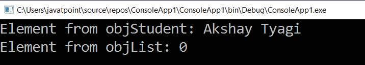
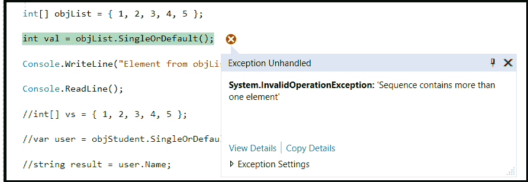

# LINQ 单一或默认方法

> 原文：<https://www.javatpoint.com/linq-singleordefault-method>

在 LINQ，SingleOrDefault()方法用于返回单个元素。如果列表/集合中没有元素，那么这将返回多个元素，并且会像 Single()方法一样引发异常。

## LINQ 单精度方法的语法

下面是使用 LINQ SingleOrDefault()方法从集合中获取单个元素的语法。

```cs

  int a = objList.SingleOrDefault();

```

在上面的语法中，我们将从集合“objList”中返回单个元素。如果集合不包含任何元素，那么它将返回默认值。

## LINQ 单一或默认()方法示例

下面是 LINQ SingleOrDefault 方法的示例，当集合中没有元素时，该方法从集合中获取单个元素。

```cs

using System;
using System. Collections;
using System.Collections.Generic;
using System. Linq;
using System. Text;
using System.Threading.Tasks;

namespace ConsoleApp1
{
    class Programme2
    {
        static void Main(string[] args)
        {
//create the object 'objStudnet' of the class 'Student' added the record to the list 
            List objStudent = new List<student>()
            {
                new Student() { Name = "Akshay Tyagi", Gender = "Male",Location="Chennai" },
                new Student() { Name = "Vaishali Tyagi", Gender = "Female", Location="Chennai" },
                new Student() { Name = "Arpita Rai", Gender = "Male",Location="Bangalore" },
                new Student() { Name = "Shubham Rastogi", Gender = "Male", Location ="Vizag"},
                new Student() { Name = "Aman Singhal", Gender = "Male", Location="Nagpur"}
            };
    //initialize the array 'vs' from 1 to 5
                int[] vs = { 1, 2, 3, 4, 5 };
    //objStudent.SingleOrDefault() method will return the information of the student
                var user = objStudent.SingleOrDefault(i => i.Name == "Akshay Tyagi");
                string result = user.Name;
                int val = vs.SingleOrDefault(j => j > 5);
                Console.WriteLine("Element from objStudent: {0}", result);
                Console.WriteLine("Element from objList: {0}", val);
                Console.ReadLine();
        }
    }
      class Student
        {
            public string Name { get; set; }
            public string Gender { get; set; }
            public string Location { get; set; }
        }
}</student> 
```

在上面的例子中，我们试图通过使用 LINQ**singletordefault()**方法从两个列表(**objsstudent，objList** )对象中获取单个元素

**输出:**



如果列表/集合返回多个元素，LINQ singletordefault()方法将抛出**invalidOperationException**错误。

```cs

using System;
using System.Collections;
using System.Collections.Generic;
using System.Linq;
using System.Text;
using System.Threading.Tasks;

namespace ConsoleApp1
{
    class Programme2
    {
        static void Main(string[] args)
        {
           List objStudent = new List<student>()
           {
                new Student() { Name = "Akshay Tyagi", Gender = "Male",Location="Chennai" },
                new Student() { Name = "Vaishali Tyagi", Gender = "Female", Location="Chennai" },
                new Student() { Name = "Arpita Rai", Gender = "Male",Location="Bangalore" },
                new Student() { Name = "Shubham Rastogi", Gender = "Male", Location ="Vizag"},
                new Student() { Name = "Aman Singhal", Gender = "Male", Location="Nagpur"}
            };
    //initialize the objList array from 1 to 5
            int[] objList = { 1, 2, 3, 4, 5 };
    //here SingleOrDefault()method will return the default value
            int val = objList.SingleOrDefault();

            Console.WriteLine("Element from objList: {0}", val);

            Console.ReadLine();

            //int[] vs = { 1, 2, 3, 4, 5 };

            //var user = objStudent.SingleOrDefault(i => i.Name == "Akshay Tyagi");

            //string result = user.Name;

            //int val = vs.SingleOrDefault(j => j > 5);

            //Console.WriteLine("Element from objStudent: {0}", result);

            //Console.WriteLine("Element from objList: {0}", val);

            Console.ReadLine();

        }

    }

    class Student

    {

        public string Name { get; set; }

        public string Gender { get; set; }

        public string Location { get; set; }

    }
}</student> 
```

如果我们运行上面的代码，它将抛出**invalidOperationException**错误，因为“**对象列表**返回了多个值。

**输出:**



* * *