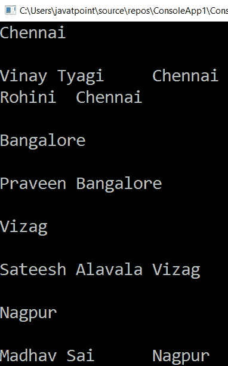

# LINQ 组比()方法

> 原文：<https://www.javatpoint.com/linq-groupby-method>

在 LINQ，GroupBy 运算符用于根据键的指定值对列表/集合项进行分组，并返回一个 IGrouping 的集合<key values="">。LINQ 的 GroupBy 方法与 SQL group by 语句相同。</key>

## LINQ 组比()方法的语法

下面是使用 LINQ GroupBy()方法根据指定的键值对元素进行分组的语法。

```cs

var student1 = objStudent.GroupBy(x => x.Location);

```

从上面的语法来看，我们是根据学生位置对集合中的“**objsstudent**”项进行分组。

## 方法语法中的 LINQ 组比()示例

下面是在方法语法中使用 LINQ 组比()的示例。

```cs

using System;
using System.Collections;
using System.Collections.Generic;
using System.Linq;
using System.Text;
using System.Threading.Tasks;

namespace ConsoleApp1
{
    class Programme2
    {
        static void Main(string[] args)
        {
//Create an object 'objStudent' of the list of the student
            List objStudent = new List <student>()
    {
    new Student() { Name = "Ak Tyagi", Gender = "Male",Location="Chennai" },
    new Student() { Name = "Rohini", Gender = "Female", Location="Chennai" },
    new Student() { Name = "Praveen", Gender = "Male",Location="Bangalore" },
    new Student() { Name = "Sateesh", Gender = "Male", Location ="Vizag"},
    new Student() { Name = "Madhav", Gender = "Male", Location="Nagpur"}
    };
   // here with the help of GrouBy we will fetch the student on the base of location
    var student1 = objStudent.GroupBy(x => x.Location);
    foreach (var sitem in student1)
    {
   // WriteLine() function here count the number of student
    Console.WriteLine(sitem.Key, sitem.Count());
    Console.WriteLine();
    foreach (var stud in sitem)
    {
    //Console.WriteLine(stud.Name + "\t" + stud.Location) show the information of the student on the base of the location
    Console.WriteLine(stud.Name + "\t" + stud.Location);
    }

    Console.WriteLine();

    }
    Console.ReadLine();
    }
    }
    //Student class containing the name of the student,gender and location of the student
    class Student
    {
    public string Name { get; set; }
    public string Gender { get; set; }
    public string Location { get; set; }
    }
    }</student> 
```

在上例中，我们根据学生的位置对“**objsstudent**”中的项目集合进行分组。

**输出:**


## 查询语法中的 LINQ 组比()示例

下面是使用 LINQ GroupBy()运算符的示例。

```cs

using System;
using System.Collections;
using System.Collections.Generic;
using System.Linq;
using System.Text;
using System.Threading.Tasks;
namespace ConsoleApp1
{
    class Programme2
    {
        static void Main(string[] args)
        {
//create an object objStudent of the Student List and add some information
            List objStudent = new List <student>()
    {
    new Student() { Name = "Vinay Tyagi", Gender = "Male",Location="Chennai" },
    new Student() { Name = "Rohini", Gender = "Female", Location="Chennai" },
    new Student() { Name = "Praveen", Gender = "Male",Location="Bangalore" },
    new Student() { Name = "Sateesh Alavala", Gender = "Male", Location ="Vizag"},
    new Student() { Name = "Madhav Sai", Gender = "Male", Location="Nagpur"}
    };
    //apply the linq queries to group the information of the student according to the location
    /*linq queries starts from, from take a variable 'std' in 
        objStudent(object of the Student List) group 'std'(declared variable) by std.Location*/
    var student = from std in objStudent
    group std by std.Location;
    //foreach loop iterate over all the information of the student
    foreach (var sitem in student)
    {
    Console.WriteLine(sitem.Key, sitem.Count());
    Console.WriteLine();
    foreach (var stud in sitem)
    {
    /*Console.WriteLine(stud.Name + "\t" + stud.Location) show the 
    information of the student on the base of the location*/
    Console.WriteLine(stud.Name + "\t" + stud.Location);
    }
    Console.WriteLine();
    }
    Console.ReadLine();
    }
    }
    class Student
    {
    public string Name { get; set; }
    public string Gender { get; set; }
    public string Location { get; set; }
    }
    }</student> 
```

**输出:**



* * *