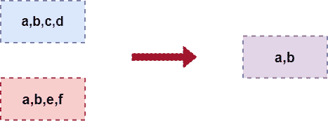
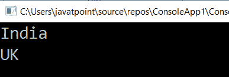

# LINQ 相交法

> 原文：<https://www.javatpoint.com/linq-intersect-method>

在 LINQ，Intersect 方法或运算符用于从两个集合中返回公共元素。

这是 LINQ 相交法的图示。



LINQ 相交方法将两个集合组合成一个集合，并只返回集合中匹配的元素。

## LINQ 相交法的语法

使用 intersect 方法从多个集合中获取匹配元素的语法。

```

var result = count1.Intersect(count2);

```

从上面的语法中，我们使用 intersect 方法将两个集合合并为一个集合来获得结果。

## LINQ 相交法示例

这是 LINQ 相交法的例子。

```

using System;
using System. Collections;
using System.Collections.Generic;
using System. Linq;
using System. Text;
using System.Threading.Tasks;

namespace ConsoleApp1
{
    class Programme2
    {
        static void Main(string[] args)
        {
//declare the two array variable count1 and count2 of the type string 
            string[] count1 = { "India", "Australia", "UK", "USA" };
            string[] count2 = { "India", "China", "UK", "China" };
/*apply the Intersect method on both of the array
 count1 and count2 and store the output in result variable*/
            var result = count1.Intersect(count2);
/*foreach loop will iterate over all the element of 
the variable item which store the output of the result variable*/ 
            foreach (var item in result)
            {
/*Console.WriteLine(item) print 
all element store in the item variable.*/
                Console.WriteLine(item);
            }
                Console.ReadLine();
        }
    }
}

```

**输出:**



* * *