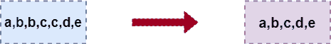
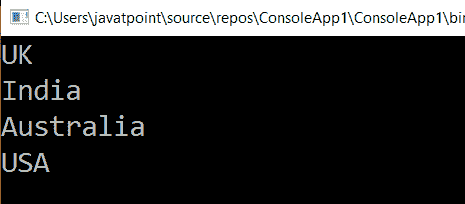

# LINQ 独特方法

> 原文：<https://www.javatpoint.com/linq-distinct-method>

在 LINQ，Distinct 方法或运算符仅用于从集合中获取不同的元素。

这是 LINQ 独特方法的图示。



LINQ Distinct 方法或运算符仅用于从集合中获取不同的元素。

## LINQ 差分法的句法

下面是使用不同方法从集合中获取唯一元素的语法。

```cs

IEnumerable<int> result = numbers.Distinct();

```

在上面的语法中，我们对“**数字**集合应用了 **distinct** 方法，以便只从集合中获取 distinct 元素。

## LINQ 独特方法示例

这是 LINQ 独特方法的例子。

```cs

using System;
using System. Collections;
using System.Collections.Generic;
using System. Linq;
using System. Text;
using System.Threading.Tasks;
namespace ConsoleApp1
{
    class Programme2
    {
        static void Main(string[] args)
        {
//taking an array named countries type of string having the list of countries 
            string[] countries = { "UK", "India", "Australia", "uk", "india", "USA" };
//apply the Distinct method to find out the different country names 
            IEnumerable result = countries.Distinct(StringComparer.OrdinalIgnoreCase);
    //with the help of foreach loop fetch each element from the list of the array
            foreach (var item in result)
            {
    /*with the help of WriteLine() function print the values of 
    the variable item having the output of the result*/ 
                Console.WriteLine(item);
            }
                Console.ReadLine();
        }

    }

    } 
```

在上面的例子中，我们用**字符串比较器应用了 **Distinct** 方法。ordinaligorcase**case property，否则对“**国**”集合执行区分大小写操作，将“**印度**”和“印度”区别对待。

**输出:**



* * *