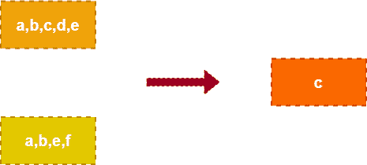
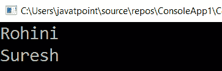

# LINQ 除外法

> 原文：<https://www.javatpoint.com/linq-except-method>

在 LINQ，Except 方法或运算符仅用于返回第一个集合中的元素，这些元素不在第二个集合中。

这是 LINQ 除了方法的图示。



如上图所示，它将返回第一个集合中的元素，而第二个集合中不存在该元素。

## 除方法外的 LINQ 语法

使用 LINQ 除外方法从第一个列表中获取第二个列表中不存在的元素的语法。

```cs

var result = arr1.Except(arr2);

```

从上面的语法中，我们比较了两个列表“ **arr1** ”、“ **arr2** ”，并使用 Except()方法获取元素。

## 除方法外的 LINQ 示例

下面是从第一个集合中获取元素的 LINQ 方法的示例。

```cs

using System;
using System. Collections;
using System.Collections.Generic;
using System. Linq;
using System. Text;
using System.Threading.Tasks;
namespace ConsoleApp1
{
    class Programme2
    {
        static void Main(string[] args)
        {
//create an array 'a' and 'b' type of string having the values
            string[] a = { "Rohini", "Suresh", "Sateesh", "Praveen" };
            string[] b = { "Madhav", "Sushmitha", "Sateesh", "Praveen" };
//Except method is used to return the value which does not exist in the second list 
            var result = a.Except(b);
            foreach (var item in result)
            {
                Console.WriteLine(item);
            }
                Console.ReadLine();
        }
    }
}

```

**输出:**



* * *