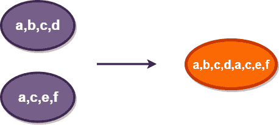
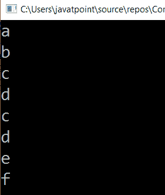

# LINQ 串联法

> 原文：<https://www.javatpoint.com/linq-concat-method>

在 LINQ，Concat 方法或运算符用于将两个集合元素连接或追加到一个集合中，并且它不会从两个序列中移除重复的元素。

**这是 LINQ·康卡特方法的图示。**



在上图中，两个元素列表组合成一个集合。

## LINQ 级联方法的语法

```cs

var result = arr1.Concat(arr2);

```

在上面的语法中，我们将两个列表连接成一个列表。

## LINQ 串联法示例

这是 LINQ·康卡特方法的例子。

```cs

using System;
using System. Collections;
using System.Collections.Generic;
using System. Linq;
using System. Text;
using System.Threading.Tasks;

namespace ConsoleApp1
{
    class Programme2
    {
        static void Main(string[] args)
        {
//here we create two array type of string variable array1 and array2 
            string[] array1 = { "a", "b", "c", "d" };

            string[] array2 = { "c", "d", "e", "f" };
/*here we will concat two array with the help of 'concat'
    method and store the output in 'result' variable*/
            var result = array1.Concat(array2);
//foreach loop will print the value of result
            foreach (var item in result)

            {

                Console.WriteLine(item);
            }

            Console.ReadLine();

        }

    }

    }

```

在上面的例子中，我们使用 concat 方法将两个序列“ **array1** ”、“ **array2** ”连接成一个序列。

**输出:**



* * *