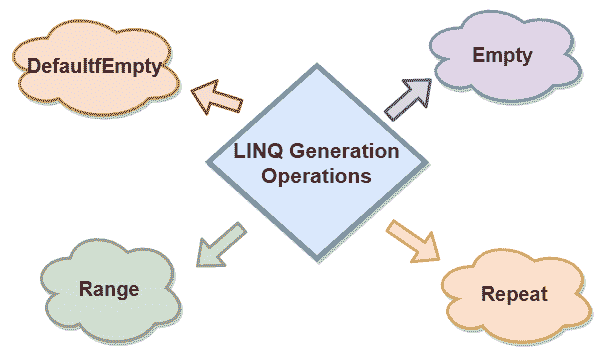

# LINQ 发电运营

> 原文：<https://www.javatpoint.com/linq-generation-operations>

在 LINQ，生成操作用于创建元素的新序列。在 LINQ，我们有不同类型的发电运营商的方法可用。这些是:

1.  defaultifempty
2.  范围
3.  重复
4.  空的

这些 LINQ 代操作符将帮助我们生成新的元素序列。

下表显示了与生成运算符方法相关的更多详细信息。

| 方法 | 描述 |
| **DefaultfEmpty** | 如果集合包含空元素，则它将返回默认值。 |
| **清空** | 它返回序列的空集合。 |
| **范围** | 它返回包含一系列数字的集合。 |
| **重复** | 它返回一个集合，该集合包含一个基于指定长度的重复值。 |

* * *