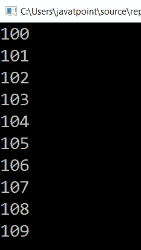

# LINQ 测距法

> 原文：<https://www.javatpoint.com/linq-range-method>

在 LINQ，Range 方法或运算符用于根据起始索引和结束索引的指定值生成整数或数字序列。

## LINQ 测距法的语法

以下是根据指定索引生成数字序列的 LINQ 范围方法的语法。

```

IEnumerable<int> obj = Enumerable.Range(100, 10);

```

从上面的语法中，我们用两个参数定义了 **Range** 方法。这里，第一个参数显示了整数的起始元素，第二个整数告诉我们它可以在序列中显示整数的极限。

## LINQ 测距法示例

下面是使用 LINQ 范围方法生成包含数字序列的集合的示例。

```

using System;
using System. Collections;
using System.Collections.Generic;
using System. Linq;
using System. Text;
using System.Threading.Tasks;

namespace ConsoleApp1
{
    class Programme2
    {
        static void Main(string[] args)
        {
//Enumerable.Range() method iterate upto 10 numbers from 100 to 109
            IEnumerable obj1 = Enumerable.Range(100, 10);
    //foreach loop used to print the numbers from 100 to 109
            foreach (var item in obj1)
            {
                Console.WriteLine(item);
            }
                Console.ReadLine();
         }
    }
} 
```

在上面的例子中，我们定义了从(100，10)开始的范围，所以它将把起始数字作为“100”，直到“109”。所有这些都是因为我们在这里将第二个参数定义为 10，所以它将返回最多 10 个数字。

**输出:**



* * *