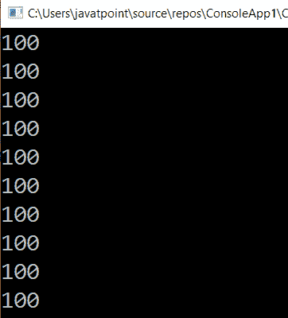

# LINQ 重复法

> 原文：<https://www.javatpoint.com/linq-repeat-method>

在 LINQ，Repeat 方法或运算符用于根据指定的索引值生成与重复次数相同的集合。

## LINQ 重复法的句法

以下是 LINQ 重复方法的语法，用于根据指定的索引值生成重复的数字。

```cs

IEnumerable<int> obj = Enumerable.Repeat(100, 10);

```

在上面的语法中，我们用两个参数定义了 Repeat 方法。这里第一个参数告诉整数的起始元素，第二个参数告诉同一个数按顺序重复多少次。

## LINQ 重复法示例

下面是 LINQ 重复方法生成集合的示例，该集合始终包含相同的数字。

```cs

using System;
using System. Collections;
using System.Collections.Generic;
using System. Linq;
using System. Text;
using System.Threading.Tasks;

namespace ConsoleApp1
{
    class Programme2
    {
        static void Main(string[] args)
        {
//IEnumerable.Repeat() method iterate upto 10 numbers 
           IEnumerable obj1 = Enumerable.Repeat(100, 10);
    //foreach loop is used to print the number 100 upto 10 times.
            foreach (var item in obj1)
            {
                Console.WriteLine(item);
            }
                Console.ReadLine();
        }
    }
} 
```

在上面的代码中，我们在范围(100，10)中定义了 Repeated 方法。所以它会把起始数字作为“100”，它会生成相同的数字“10”次。这是因为第二个参数定义为 10；这就是为什么它会返回相同的数字 10 次。

**输出:**



在这里，我们展示了如何使用 LINQ 重复方法，根据 C# 中指定的长度生成具有重复数字的集合。

* * *