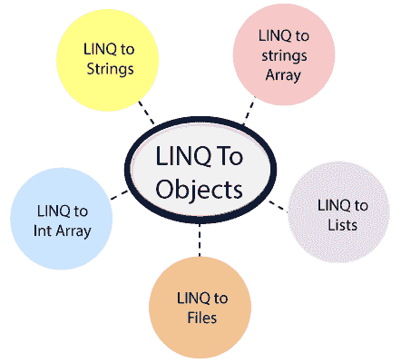

# 从 LINQ 到物体

> 原文：<https://www.javatpoint.com/linq-to-objects>

在 LINQ，如果我们在我们的应用程序中使用“**LINQ to Objects”**，它将会给我们一个机会在 LINQ 查询中直接使用 IEnumerable 或 IEnumerable < T >集合，而无需使用任何中间的 LINQ 提供程序或 API，如 LINQ to SQL，或 LINQ to XML。通过对对象使用 LINQ，我们可以将查询应用于任何可枚举集合，如列表<>、数组或字典< TKey、值>。

LINQ 到对象提供了一种使用 LINQ 查询从集合中获取数据的新方法，但在此之前，需要编写大量 foreach 循环来从集合中获取数据。

与传统的 foreach 循环相比，对象 LINQ 提供了更多的优势。这些是:

1.  当我们在多个条件下使用它们时，它们提供了更多的可读性。
2.  它以最少的应用程序代码实现了过滤、排序和分组功能。
3.  它们是任何数据源的门户，修改很少或没有修改。

如果我们在复杂的操作中使用 LINQ，那么我们将看到使用 LINQ 的好处，而不是传统的迭代循环。

现在我们将使用 LINQ 物体。这是我们可以和 LINQ 一起使用的各种物品。

*   **LINQ 对弦乐**
*   **LINQ 对弦阵**
*   **LINQ 至 Int 阵列**
*   **LINQ 转文件**
*   **LINQ 至名单**

* * *