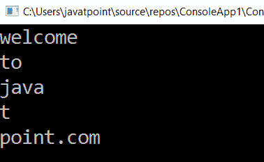

# 弦乐 LINQ

> 原文:[https://www.javatpoint.com/linq-to-strings](https://www.javatpoint.com/linq-to-strings)

字符串的 LINQ 只不过是在字符串上编写 LINQ 查询，从字符串序列中获取所需的数据。在 LINQ，我们可以在传统的字符串函数和正则表达式的基础上编写对字符串的查询，使用 LINQ 对字符串执行所需的操作。

## 字符串的 LINQ 语法

编写 LINQ 查询的语法是:

```

var result = from s in str.ToLowerInvariant().Split()

```

在上面的语法中，我们在 String 上编写了 LINQ 查询来获取独特的元素。

## 弦乐 LINQ 的例子

下面是在字符串上编写 LINQ 查询的例子，用 C#将字符串拆分成单词。

```

using System;
using System. Collections;
using System.Collections.Generic;
using System. Linq;
using System. Text;
using System.Threading.Tasks;

namespace ConsoleApp1
{
    class Programme2
    {
        static void Main(string[] args)
        {
//create a string 'str1' 
            string str1 = "Welcome     to   Java T Point.Com";
//here StringSplitOptions.RemoveEmptyEntries() is used to remove the spaces between the words.
            var result = from s in str1.ToLowerInvariant().Split(new char[] { ' ' }, StringSplitOptions.RemoveEmptyEntries)
            select s;
            foreach (var item in result)
            {
                Console.WriteLine(item);
            }
                Console.ReadLine();
        }
    }
}

```

在上面的例子中，我们在 LINQ 编写了简单的查询，将字符串“ **str** ”拆分成多个单词。这里的“str”string 对象在单词之间包含许多空格，为了去掉这些空格，我们使用了“**stringsplittoptions。移除条目**属性。如果我们使用传统编码，我们需要编写大量代码来拆分字符串并删除单词之间的空格。

**输出:**



这就是我们如何使用字符串上的 LINQ 查询从字符串中获取所需的数据。

* * *