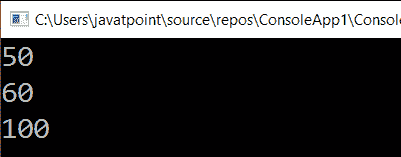

# LINQ 到整数数组

> 原文：<https://www.javatpoint.com/linq-to-int-array>

LINQ 到 int Array 意味着在整数数组上编写 LINQ 查询，以从整数数组元素中获取所需的元素。通过使用整数数组上的 LINQ 查询，我们可以从整数数组中获取所需的数据，而无需编写太多代码。

## LINQ 到整型数组的语法

在整数数组上编写 LINQ 查询以从数组集合中获取所需元素的语法。

```

IEnumerable result = from a in numarr1

                                      select a; 
```

在上面的语法中，我们编写了 LINQ 查询来从“**nummarr**”整数数组中获取数据。

## LINQ 到整数数组的示例

这里有一个 LINQ 到 int 数组的例子，从序列中获取元素，其中元素的值高于 **10** 并且低于 **200** 。

```

using System;
using System. Collections;
using System.Collections.Generic;
using System. Linq;
using System. Text;
using System.Threading.Tasks;

namespace ConsoleApp1
{
    class Programme2
    {
        static void Main(string[] args)
        {
//create an array numarray of type int
            int[] numarray = { 1, 6, 9, 10, 50, 60, 100, 200, 300 };
/*write LINQ query to get hte data from the 
numarray where the value is greater than 10 and less than 200*/
            IEnumerable result = from a in numarray
            where a > 10 && a < 200
            select a;
            foreach (int item in result)
            {
                Console.WriteLine(item);
            }
                Console.ReadLine();
        }
    }
} 
```

在上面的代码中，我们使用了“ **numarray** ”整数数组上的 LINQ 查询来获取值大于 **10** 且小于 **200** 的元素。

**输出:**



* * *