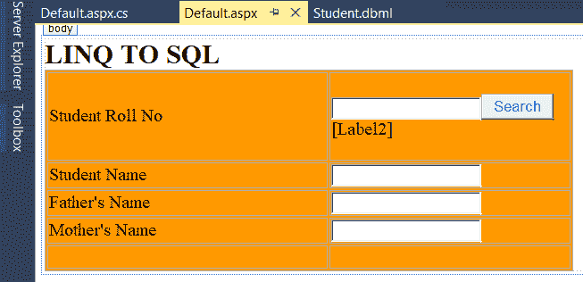

# LINQ 到 SQL (DBML 文件)

> 原文：<https://www.javatpoint.com/linq-to-sql>

LINQ 到 SQL 是的组成部分.NET 框架 3.5 版。它提供了运行时基础结构来管理作为对象的关系数据。

它允许我们使用 LINQ 查询从 SQL 数据库中访问和获取数据。它允许我们使用 LINQ 查询对像 SQL 这样的表执行选择、插入、更新和删除操作。

在 LINQ 到 SQL 中，关系数据库的数据模型被映射到一个对象模型，当执行转换成 SQL 的 LINQ 对象模型时，从数据库中获取所需的数据，当从数据库中返回数据时，LINQ 到 SQL 将把 SQL 结果转换成 LINQ 对象模型。

这是 LINQ 到 SQL 的体系结构的图示。


通过使用 LINQ 到 SQL，我们可以执行插入、删除和更新等多种操作。当我们与 ADO.Net 进行比较时，我们可以用最少的编码获得数据。

## LINQ 对 SQL 的创建及其在网络应用中的应用

这里我们举一个如何在 ASP.NET web 应用程序中创建和使用 LINQ 到 SQL(dbml 文件)的例子。

首先，我们创建一个新的应用程序。为此**打开 visual studio- >转到文件- >新建- >项目**。


现在我们选择“**Asp.Net 空 Web 应用**”，给出项目名称为“**lingtosql**，点击确定，如下图。


现在项目创建完成了。在我们使用 LINQ 来 SQL 的应用程序中，我们需要创建一个“ **DBML** ”文件。 **DBML** 文件将包含源代码，这将允许我们编写 LINQ 查询从 SQL 数据库获取数据。

要创建 DBML 文件，**右键单击项目- >转到添加- >选择新项目- >选择模板 LINQ 到 SQL** 并命名为“**学生**，如下所示。


将 LINQ 添加到 SQL dbml 文件后，窗口将如下所示打开:


这里我们观察到，我们在左侧部分有两个部分。在这里，我们可以添加或创建表作为对象，在右侧，我们可以添加所需的存储过程来获取数据。

现在打开**服务器浏览器**，右键点击**数据连接**，如下图选择**添加连接**。


选择添加连接后，会弹出一个新的窗口，我们需要**选择数据源**。这里我们将连接到现有的数据库。这就是为什么我们选择“**微软 SQL Server** ，点击继续，如下图:


现在输入要连接的数据库服务器详细信息，如下所示:


一旦我们输入了连接数据库的所有细节，点击**确定**按钮。现在添加数据库后，我们将使用以下脚本创建新表**学生数据**。

```

Create Database College
Use College
Create table StudentData
(
	RollNumber int primary key,
	StudentName varchar(50),
	FatherName varchar(50),
	MotherName varchar(50)

)
Insert into StudentData(RollNumber,StudentName,FatherName,MotherName) values(101,'Akshay','Rakesh Tyagi','Samlesh Tyagi')
Insert into StudentData(RollNumber,StudentName,FatherName,MotherName) values(102,'Vaishali','Ashok Tyagi','Munesh Tyagi')
Insert into StudentData(RollNumber,StudentName,FatherName,MotherName) values(103,'Arpita','Arvind Rai','Anni Rai')
Select *from StudentData

```

在数据库中创建**学生数据**表后，该表将显示为:


现在我们将该表拖放到 **Student.dbml** 文件中。


现在我们将看到如何使用 LINQ 到 SQL 在我们的应用程序中获取**学生数据**。**为此，我们将右键单击应用程序- >选择添加- >新项目- >选择网页表单- >** 命名为 **Default.aspx** ，然后单击**确定**按钮。

现在我们将打开 **Default.aspx** 页面，编写如下所示的代码。

**Default.aspx**

```

<%@ Page Language="C#" AutoEventWireup="true" CodeFile="Default.aspx.cs" Inherits="_Default" %>

<!DOCTYPE html>

<html >
<head runat="server">
    <title></title>
    <style type="text/css">
        .auto-style1 {
            width: 50%;
            background-color: #FF9900;
        }
        .auto-style2 {
            width: 310px;
        }
        .auto-style3 {
            width: 310px;
            height: 26px;
        }
        .auto-style4 {
            height: 26px;
        }
        .auto-style5 {
            width: 310px;
            height: 97px;
        }
        .auto-style6 {
            height: 97px;
        }
    </style>
</head>
<body>
    <form id="form1" runat="server">
        <asp:Label ID="Label1" runat="server" Font-Bold="True" Font-Size="Larger" Text="LINQ TO SQL"></asp:Label>
        <div>
            <table border="1" class="auto-style1">
                <tr>
                    <td class="auto-style5">Student Roll No</td>
                    <td class="auto-style6">
                        <asp:TextBox ID="TextBox1" runat="server"></asp:TextBox>
                        <asp:Button ID="Button1" runat="server" ForeColor="#0066FF" OnClick="Button1_Click" Text="Search" />
                        <br />
                        <asp:Label ID="Label2" runat="server"></asp:Label>
                    </td>
                </tr>
                <tr>
                    <td class="auto-style2">Student Name</td>
                    <td>
                        <asp:TextBox ID="TextBox2" runat="server"></asp:TextBox>
                    </td>
                </tr>
                <tr>
                    <td class="auto-style3">Father's Name</td>
                    <td class="auto-style4">
                        <asp:TextBox ID="TextBox3" runat="server"></asp:TextBox>
                    </td>
                </tr>
                <tr>
                    <td class="auto-style2">Mother's Name</td>
                    <td>
                        <asp:TextBox ID="TextBox4" runat="server"></asp:TextBox>
                    </td>
                </tr>
                <tr>
                    <td class="auto-style2"></td>
                    <td></td>
                </tr>
            </table>
        </div>
    </form>
</body>
</html>

```

这是应用程序的设计阶段。

**设计**



这里我们将编写代码，从收集的数据库中搜索学生的信息。对于上述设计的功能，我们将在**默认值中编写代码。Aspx.cs** 页面。

**默认。Aspx.cs**

```

using System;
using System.Collections.Generic;
using System.Linq;
using System.Web;
using System.Web.UI;
using System.Web.UI.WebControls;

public partial class _Default : System.Web.UI.Page
{
protected void Button1_Click(object sender, EventArgs e)
    {
        StudentDataContext sd = new StudentDataContext();
        StudentData student = (from s in sd.StudentDatas where s.RollNumber.ToString() == TextBox1.Text select s).FirstOrDefault();
        if(student==null)
        {
            Label2.Text = "No Record Found";
        }
        else
        {
            Label2.Text = "Record Found successfully";
            TextBox2.Text = student.StudentName;
            TextBox3.Text = student.FatherName;
            TextBox4.Text = student.MotherName;
        }
    }
}

```

现在，我们将运行代码，并看到如下所示的输出。

这是 LINQ 对 SQL 示例的结果。

**输出**


* * *