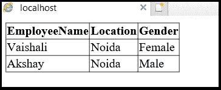

# LINQ 到 SQL 选择查询

> 原文:[https://www.javatpoint.com/linq-to-sql-select-query](https://www.javatpoint.com/linq-to-sql-select-query)

**LINQ 到 SQL** 中的选择查询用于从表中获取所有记录或行。LINQ 对 SQL 的选择查询可以用来过滤带有 **where** 子句的表中的记录。

在这里，我们还可以执行分组、连接等多种操作。根据我们的需求，使用 LINQ 进行 SQL 选择查询。

### LINQ 对 SQL 选择查询的语法

以下是 LINQ 对 SQL 选择查询的语法。

```

EmployeeDBDataContext db = new EmployeeDBDataContext();

 var result = from ed in db.EmployeeDetails

 select new

 {

     EmployeeName = ed.EmpName,

     Location = ed.Location

 };

```

使用上面的语法，我们使用 **LINQ 到 SQL 选择查询**从“**雇员详细信息**表中获取记录。

### LINQ 到 SQL 选择连接示例

在我们首先开始实现 LINQ 到 SQL 内部连接之前，需要创建一个包含所需表的数据库。将这些 LINQ 表映射到 SQL 文件(。dbml)。要了解映射的过程，**点击链接 LINQ 到 SQL** 。

一旦我们创建了所需的表并将其映射到**。dbml** 文件，现在我们要在我们的应用程序中显示数据。**为此，我们必须右键单击应用程序- >选择添加- >新项目- >选择网络表单- >将名称命名为 Default.aspx，然后单击确定按钮**。

现在打开**页面 Default.aspx** ，编写如下所示的代码。

```

<%@ Page Language="C#" AutoEventWireup="true" CodeFile="Default.aspx.cs" Inherits="_Default" %>

<!DOCTYPE html>

<html >
<head runat="server">
</head>
<body>
    <form id="form2" runat="server">
        <div>
            <asp:GridView ID="GvDetail" runat="server"></asp:GridView>
        </div>
    </form>
</body>
</html>

```

现在打开文件后面的代码并编写代码，如下所示:

```

using System;
using System.Collections.Generic;
using System. Linq;
using System. Web;
using System.Web.UI;
using System.Web.UI.WebControls;

public partial class _Default : System.Web.UI.Page
{
    protected void Page_Load(object sender, EventArgs e)
    {
        EmployeeDBDataContext db1 = new EmployeeDBDataContext();

        var result = from ed in db.EmployeeDetails

                     select new

                     {

                         EmployeeName = ed.EmpName,

                         Location = ed.Location,

                         Gender = ed.Gender

                     };

        gvDetails.DataSource = result;

        gvDetails.DataBind();

    }
}

```

从上面的例子中，我们使用 **LINQ 到 SQL 选择查询**从“**雇员详细信息**表中获取详细信息。

**输出**



* * *