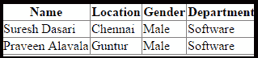

# LINQ 到 SQL 内部连接

> 原文:[https://www.javatpoint.com/linq-to-sql-inner-join](https://www.javatpoint.com/linq-to-sql-inner-join)

在 **LINQ 到 SQL** 中，内部连接将只返回记录或行，这将根据定义的条件映射两个表。

### LINQ 到 SQL 内部连接的语法

下面是使用 LINQ 到 SQL 内部连接从多个表中获取数据的语法。

**C#代码**

```

 var result = from ed in db.EmployeeDetails

join d in db.Departments on ed.DeptId equals d.DeptId

select new

{

Name = ed.EmpName,

Department = d.DeptName

};

```

从上面的语法中，我们连接了“ **EmployeeDetails** ”、“ **Departments** ”表，通过使用内部连接来获取所需的数据。

### LINQ 到 SQL 内部连接的示例

在实现 LINQ 到 SQL 的内部连接之前，我们需要创建一个包含所需表的数据库，并将这些表映射到 LINQ 到 SQL 文件(。dbml)。

要了解映射的过程，**点击链接 LINQ 到 SQL** 。

一旦我们创建了所需的表并将其映射到。dbml 文件。现在我们想在应用程序中显示数据。**为此，我们必须右键单击应用程序- >选择添加- >新项目- >选择网络表单- >将名称命名为 Default.aspx，然后单击确定按钮**。

现在打开 **Default.aspx** 页面，编写如下所示的代码

```

<%@ Page Language="C#" AutoEventWireup="true" CodeFile="Default.aspx.cs" Inherits="_Default" %>

<!DOCTYPE html>

<html >
<head runat="server"
>
</head>
<body>
    <form id="form1" runat="server">
        <div>
            <asp:GridView ID="gvDetails" runat="server"></asp:GridView>
        </div>
    </form>
</body>
</html>

```

现在打开文件后面的代码，编写如下所示的代码:

```

using System;
using System.Collections.Generic;
using System.Linq;
using System.Web;
using System.Web.UI;
using System.Web.UI.WebControls;

public partial class _Default : System.Web.UI.Page
{
    private object db;

    protected void Page_Load(object sender, EventArgs e)
    {
        var result = from ed in db.Employeedetail

                     join d in db.Department on ed.DeptId equals d.DeptId

                     where d.DeptName.Equals("software")

                     select new

                     {

                         Name = ed.EmpName,

                         Location = ed.Location,

                         Gender = ed.Gender,

                         Department = d.DeptName

                     };

        gvDetails.DataSource = result;

        gvDetails.DataBind();

    }
}

```

从上面的例子中，我们试图使用内部连接从“**employee tails**”和“ **Departments** ”表中获取数据。

**输出**



* * *