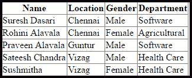

# LINQ 加入 SQL 组

> 原文：<https://www.javatpoint.com/linq-to-sql-group-join>

在 LINQ 对 SQL 中，一个带有**进入**表达式的联接子句被称为**组**联接。在 LINQ 到 SQL 中，组连接基于两个集合中的匹配元素生成一系列对象元素。

### LINQ 到 SQL 组连接的语法

使用 LINQ 到 SQL 组连接从多个表中获取数据的语法。

```

var result = from ed in db.EmployeeDetails
join d in db. Departments on ed.DeptId equals d.DeptId into edept
from dpem in edept
select new
{
Name = ed.EmpName,
Department = dpem.DeptName
};

```

从上面的语法中，我们连接了“雇员详细信息”、“部门”表，通过使用组连接来获取所需的数据。

### LINQ 到 SQL 组连接的示例

在我们开始实现 LINQ 到 SQL 组连接示例之前，首先我们需要创建一个包含所需表的数据库，并将这些表映射到 LINQ 到 SQL 文件(**)。dbml** )。

要了解映射的过程，**点击链接 LINQ 到 SQL** 。

一旦我们创建了所需的表并将其映射到**。dbml** 文件。现在我们想在应用程序中显示数据。**为此，我们必须在应用程序上进行右键单击- >选择添加- >新项目- >选择网页表单- >命名为 Default.aspx，然后单击确定按钮**。

现在打开 **Default.aspx** 页面，编写如下代码:

```

<%@ Page Language="C#" AutoEventWireup="true" CodeFile="Default.aspx.cs" Inherits="_Default" %>

<!DOCTYPE html>

<html >
<head runat="server">

</head>
<body>
    <form id="form1" runat="server">
        <div>
            <asp:GridView ID="gvDetails" runat="server"></asp:GridView>
        </div>
    </form>
</body>
</html>

```

现在打开文件后面的代码，编写如下所示的代码:

```

using System;
using System.Collections.Generic;
using System.Linq;
using System.Web;
using System.Web.UI;
using System.Web.UI.WebControls;

public partial class _Default : System.Web.UI.Page
{
    protected void Page_Load(object sender, EventArgs e)

    {

        EmployeeDBDataContext db = new EmployeeDBDataContext();

        if (!Page.IsPostBack)

        {

            var result = from ed in db.EmployeeDetails

                         join d in db.Departments on ed.DeptId equals d.DeptId into edept

                         from dpem in edept

                         select new

                         {

                             Name = ed.EmpName,

                             Location = ed.Location,

                             Gender = ed.Gender,

                             Department = dpem.DeptName

                         };

            gvDetails.DataSource = result;

            gvDetails.DataBind();

        }

    }
}

```

从上面的例子中，我们试图使用组连接从“**员工详细信息”**和“**部门”**表中获取数据。

**输出**



* * *