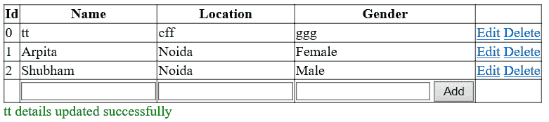

# LINQ 对 SQL 的插入、删除和更新操作

> 原文：<https://www.javatpoint.com/linq-to-sql-crud-operations>

无论我们对对象做什么，比如添加、删除或更新对象集合中的项目，LINQ 到 SQL 都可以维护更改，直到我们使用**方法提交更改。**。提交更改后，LINQ 到 SQL 将把我们的操作翻译成 SQL，并将更改提交给数据库。

### LINQ 对 SQL 插入/更新和删除的语法

以下是在 LINQ 使用的插入/更新或删除操作的语法。

## LINQ 到 SQL 插入操作

下面是在 C# 中使用 LINQ 到 SQL 插入操作查询将数据插入数据库的语法。

```cs

EmployeeDBDataContext db = new EmployeeDBDataContext();
EmployeeDetail emp = new EmployeeDetail();
emp.EmpName = txtname.Text;
emp.Location = txtlocation.Text;
db.EmployeeDetails.InsertOnSubmit(emp);
db.SubmitChanges();

```

## LINQ 到 SQL 更新操作

下面是使用 LINQ 到 SQL 更新操作查询来更新数据库中的数据的语法。

```cs

EmployeeDBDataContext db = new EmployeeDBDataContext();
EmployeeDetail emp = new EmployeeDetail();
emp = db.EmployeeDetails.Single(x => x.EmpId == empid);
emp.EmpName = txtname.Text;
emp.Location = txtlocation.Text;
emp.Gender = txtgender.Text;
db.SubmitChanges();

```

## LINQ 至 SQL 删除操作

下面是使用 C# 中的 LINQ 到 SQL 删除操作来删除数据库中的数据的语法。

```cs

EmployeeDBDataContext db = new EmployeeDBDataContext();
EmployeeDetail emp = new EmployeeDetail();
emp = db.EmployeeDetails.Single(x => x.EmpId == empid);
db.EmployeeDetails.DeleteOnSubmit(emp);
db.SubmitChanges();

```

## LINQ 对 SQL 的插入、更新、删除操作

在我们开始实现 LINQ 到 SQL 的插入、更新和删除操作之前，首先需要创建一个包含所需表的数据库，并将这些表映射到 LINQ 到 SQL 文件(**)。dbml** )。

一旦我们创建了所需的表并将其映射到**。dbml** 文件现在，我们要在我们的应用程序中显示数据。**为此，我们将在应用程序上单击鼠标右键- >选择添加- >新项目- >选择网页表单- >命名为 Default.aspx，然后单击确定按钮**。

现在打开 Default.aspx 页面，编写如下所示的代码:

```cs

<%@ Page Language="C#" AutoEventWireup="true" CodeFile="Default.aspx.cs" Inherits="_Default" %>

<!DOCTYPE html>

<html >
<head runat="server">
    <title></title>
</head>
<body>
    <form id="form1" runat="server">

            <div class="GridviewDiv">

<asp:GridView runat="server" ID="gvDetails" ShowFooter="true" AllowPaging="true" PageSize="10" AutoGenerateColumns="false" DataKeyNames="Id,Name" OnPageIndexChanging="gvDetails_PageIndexChanging" OnRowCancelingEdit="gvDetails_RowCancelingEdit"

OnRowEditing="gvDetails_RowEditing" OnRowUpdating="gvDetails_RowUpdating" OnRowDeleting="gvDetails_RowDeleting" OnRowCommand ="gvDetails_RowCommand" >

<HeaderStyle CssClass="headerstyle" />

<Columns>

<asp:BoundField DataField="Id" HeaderText="Id" ReadOnly="true" />

<asp:TemplateField HeaderText="Name">

<ItemTemplate>

<asp:Label ID="lblName" runat="server" Text='<%# Eval("Name")%>'/>

</ItemTemplate>

<EditItemTemplate>

<asp:TextBox ID="txtName" runat="server" Text='<%# Eval("Name")%>'/>

</EditItemTemplate>

<FooterTemplate>

<asp:TextBox ID="txtfName" runat="server" />

</FooterTemplate>

</asp:TemplateField>

<asp:TemplateField HeaderText = "Location">

<ItemTemplate>

<asp:Label ID="lblLocation" runat="server" Text='<%# Eval("Location")%>'></asp:Label>

</ItemTemplate>

<EditItemTemplate>

<asp:TextBox ID="txtLocation" runat="server" Text='<%# Eval("Location")%>'/>

</EditItemTemplate>

<FooterTemplate>

<asp:TextBox ID="txtfLocation" runat="server" />

</FooterTemplate>

</asp:TemplateField>

<asp:TemplateField HeaderText="Gender">

<ItemTemplate>

<asp:Label ID="lblGender" runat="server" Text='<%# Eval("Gender")%>'/>

</ItemTemplate>

<EditItemTemplate>

<asp:TextBox ID="txtGender" runat="server" Text='<%# Eval("Gender")%>'/>

</EditItemTemplate>

<FooterTemplate>

<asp:TextBox ID="txtfGender" runat="server" />

<asp:Button ID="btnAdd" CommandName="AddNew" runat="server" Text="Add" />

</FooterTemplate>

</asp:TemplateField>

<asp:CommandField ShowEditButton="True" ShowDeleteButton="true" />

</Columns>

</asp:GridView>

<asp:Label ID="lblresult" runat="server"></asp:Label>
        </div>
    </form>
</body>
</html>

```

现在打开文件后面的代码，编写如下所示的代码:

```cs

using System;
using System.Collections.Generic;
using System.Drawing;
using System.Linq;
using System.Web;
using System.Web.UI;
using System.Web.UI.WebControls;

public partial class _Default : System.Web.UI.Page
{
    EmployeeDataContext db = new EmployeeDataContext();
    protected void Page_Load(object sender, EventArgs e)
    {
        if (!Page.IsPostBack)

        {

            BindGridview();

        }
    }
    protected void BindGridview()

    {

        var result = from ed in db.EmployeeDetails

                     select new

                     {

                         Id = ed.Id,

                         Name = ed.Name,

                         Location = ed.Location,

                         Gender = ed.Gender

                     };

        gvDetails.DataSource = result;

        gvDetails.DataBind();

    }
    protected void gvDetails_RowCommand(object sender, GridViewCommandEventArgs e)

    {

        if (e.CommandName.Equals("AddNew"))

        {

            TextBox txtname = (TextBox)gvDetails.FooterRow.FindControl("txtfName");

            TextBox txtlocation = (TextBox)gvDetails.FooterRow.FindControl("txtfLocation");

            TextBox txtgender = (TextBox)gvDetails.FooterRow.FindControl("txtfGender");

            EmployeeDetail emp = new EmployeeDetail();

            emp.Name = txtname.Text;

            emp.Location = txtlocation.Text;

            emp.Gender = txtgender.Text;

            db.EmployeeDetails.InsertOnSubmit(emp);

            db.SubmitChanges();

            lblresult.ForeColor = Color.Green;

            lblresult.Text = txtname.Text + " details inserted successfully";

            BindGridview();

        }

    }
    protected void gvDetails_RowEditing(object sender, GridViewEditEventArgs e)

    {

        gvDetails.EditIndex = e.NewEditIndex;

        BindGridview();

    }

    protected void gvDetails_RowCancelingEdit(object sender, GridViewCancelEditEventArgs e)

    {

        gvDetails.EditIndex = -1;

        BindGridview();

    }

    protected void gvDetails_PageIndexChanging(object sender, GridViewPageEventArgs e)

    {

        gvDetails.PageIndex = e.NewPageIndex;

        BindGridview();

    }
    protected void gvDetails_RowUpdating(object sender, GridViewUpdateEventArgs e)

    {

        int empid = Convert.ToInt32(gvDetails.DataKeys[e.RowIndex].Values["Id"].ToString());

        TextBox txtname = (TextBox)gvDetails.Rows[e.RowIndex].FindControl("txtName");

        TextBox txtlocation = (TextBox)gvDetails.Rows[e.RowIndex].FindControl("txtLocation");

        TextBox txtgender = (TextBox)gvDetails.Rows[e.RowIndex].FindControl("txtGender");

        EmployeeDetail emp = new EmployeeDetail();

        emp = db.EmployeeDetails.Single(x => x.Id == empid);

        emp.Name = txtname.Text;

        emp.Location = txtlocation.Text;

        emp.Gender = txtgender.Text;

        db.SubmitChanges();

        gvDetails.EditIndex = -1;

        BindGridview();

        lblresult.ForeColor = Color.Green;

        lblresult.Text = txtname.Text + " details updated successfully";
    }
    protected void gvDetails_RowDeleting(object sender, GridViewDeleteEventArgs e)

    {

        int empid = Convert.ToInt32(gvDetails.DataKeys[e.RowIndex].Values["Id"].ToString());

        string empname = gvDetails.DataKeys[e.RowIndex].Values["Name"].ToString();

        EmployeeDetail emp = new EmployeeDetail();

        emp = db.EmployeeDetails.Single(x => x.Id == empid);

        db.EmployeeDetails.DeleteOnSubmit(emp);

        db.SubmitChanges();

        BindGridview();

        lblresult.ForeColor = Color.Green;

        lblresult.Text = empname + " details deleted successfully";

    }
}

```

在上面的例子中，我们实现了 LINQ 到 SQL 的选择、插入、更新和删除操作。现在我们将运行应用程序并查看结果。



* * *