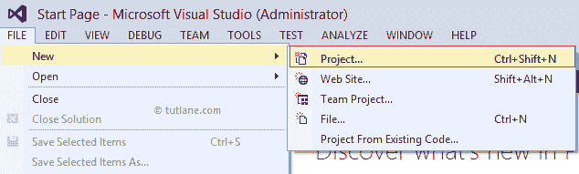

# LINQ 到 ADO.Net

> 原文:[https://www.javatpoint.com/linq-to-ado-net](https://www.javatpoint.com/linq-to-ado-net)

LINQ 对 ADO.Net 意味着使用 LINQ 对 ADO.Net 物体的查询。LINQ 到 ADO.Net 给了我们一个在 ADO.Net 写 LINQ 可枚举对象查询的机会，而 LINQ 到 ADO.Net 有三种可用的 LINQ 技术。这些是 LINQ 到数据集，LINQ 到 SQL 和 LINQ 到实体。

### LINQ 到 ADO.Net 的句法

下面是 LINQ 对 ADO.Net 对象的语法。

```

var result = from dt in ds.Tables[0].AsEnumerable()
where (dt.Field<string>("Gender") == "Male")
select new
{
Name = dt.Field<string>("empname"),
Location = dt.Field<string>("location"),
Gender = dt.Field<string>("gender"),
};

```

在上面的语法中，我们在 ADO.NET 数据集对象“ds”上编写了 LINQ 查询，以获取所需的数据。

## LINQ 到 ADO.NET 的例子

在这里，我们将看到如何使用 LINQ 到 ADO.NET，例如，我们将创建一个新的 web 应用程序，与 SQL SERVER 建立连接，并使用 LINQ 在网格视图中显示数据，编写对 ADO.NET 对象(**数据集**)的查询。

首先，我们将在数据库中创建一个新表**“EmployeeDetails”**，为此，我们将在数据库中执行以下查询，并插入一些虚拟数据以在应用程序中显示它。

现在我们将为其创建一个新的网络应用程序**转到文件- >选择新建- >选择项目，如下所示**。



选择新项目后，会弹出一个弹出窗口，我们必须**选择 ASP.NET 空 web 应用程序**，并将名称 **LINQ 给 ADO.NET**，然后单击**确定**创建新的 Web 应用程序。

现在我们将网页添加到应用程序中，为此我们必须在应用程序上点击**右键- >选择添加- >选择网页表单- >命名为“Default . aspx”**并点击**确定**按钮，它将在应用程序中创建一个新页面。

现在打开**“default . aspx”**页面，编写如下所示的代码。

```

<%@ Page Language="C#" AutoEventWireup="true" CodeFile="Default.aspx.cs" Inherits="_Default" %>

<!DOCTYPE html>

<html >
<head runat="server">
    <title></title>
</head>
<body>
    <form id="form1" runat="server">
        <div>
            <asp:GridView ID="gvDetails" CssClass="Gridview" runat="server" AutoGenerateColumns="False">

<HeaderStyle CssClass="headerstyle" />

<Columns>

<asp:BoundField HeaderText="Name" DataField="Name" />

<asp:BoundField HeaderText="Location" DataField="Location" />

<asp:BoundField HeaderText="Gender" DataField="Gender" />

</Columns>

</asp:GridView>
        </div>
    </form>
</body>
</html>

```

现在打开文件后面的代码，编写如下所示的代码:

```

using System;
using System.Collections.Generic;
using System.Data;
using System.Data.SqlClient;
using System.Linq;
using System.Web;
using System.Web.UI;
using System.Web.UI.WebControls;

public partial class _Default : System.Web.UI.Page
{
    protected void Page_Load(object sender, EventArgs e)
    {
        if (!Page.IsPostBack)

        {

            BindGridview();

        }

    }
    protected void BindGridview()

    {

        DataSet ds = new DataSet();

        using (SqlConnection con = new SqlConnection("Data Source=JavaTPoint\\SQLEXPRESS;Integrated Security=true;Initial Catalog=ADONET"))

        {

            con.Open();

            SqlCommand cmd = new SqlCommand("select * from employeedetails", con);

            cmd.CommandType = CommandType.Text;

            SqlDataAdapter da = new SqlDataAdapter(cmd);

            da.Fill(ds);

            con.Close();

            if (ds.Tables[0].Rows.Count > 0)

            {

                var result = from dt in ds.Tables[0].AsEnumerable()

                             where (dt.Field<string>("Gender") == "Male")

                             select new

                             {

                                 Name = dt.Field<string>("EmpName"),

                                 Location = dt.Field<string>("Location"),

                                 Gender = dt.Field<string>("Gender"),

                             };

                gvDetails.DataSource = result;

                gvDetails.DataBind();

            }
        }
    }
}

```

在上面的例子中，我们使用了 ADO.NET 数据集对象，并在数据集对象上编写了 LINQ 查询，以从数据集获取详细信息，其中**性别**等于**“女”**。现在，我们将运行应用程序并查看输出。

**输出**


* * *