# 登录到 SharePoint

> 原文：<https://www.javatpoint.com/login-to-sharepoint>

为了访问 SharePoint Online，不需要在您的计算机上安装任何软件，因为 SharePoint 2019 提供了一个基于网络的平台，可以使用网络浏览器轻松访问。

在您的计算机上访问 SharePoint Online(企业级 SharePoint 和 Office 365)有以下步骤。

**步骤 1:** 转到 Internet Explorer、Chrome 或任何其他浏览器，复制并粘贴下面给出的以下链接，或者您可以简单地单击以下链接:

[https://www.microsoft.com/en-in/microsoft-365/business/office-365-enterprise-e3-business-software?rtc=1&activetab=pivot%3aoverviewtab](https://www.microsoft.com/en-in/microsoft-365/business/office-365-enterprise-e3-business-software?rtc=1&activetab=pivot%3aoverviewtab)
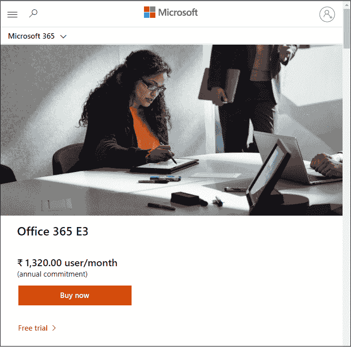

**第二步:**出现如下窗口点击**免费试用**。

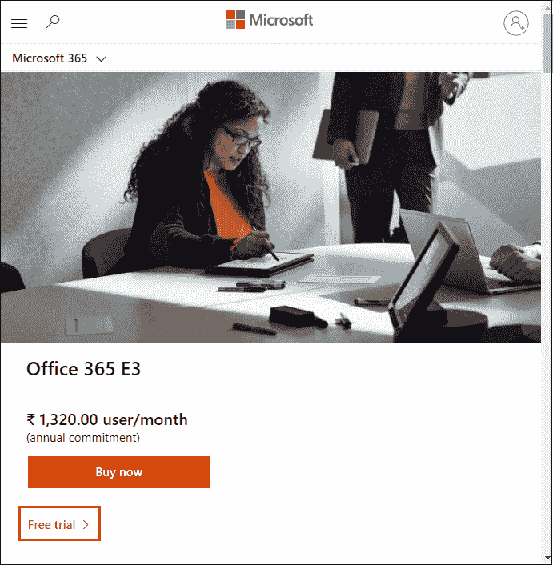

**第三步:**一旦点击**免费试用**，出现如下页面**输入您的电子邮件地址**，然后点击**下一步**。

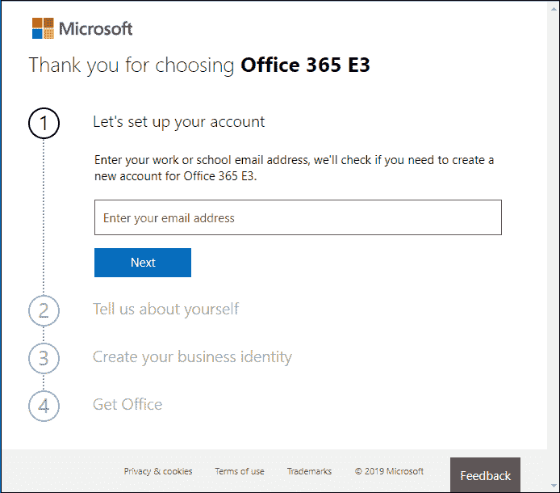

**步骤 4:** 现在，验证您的电子邮件地址。如果无误，则点击**设置账号**。否则，点击**不是你吗？**和**重新输入您的电子邮件地址**。

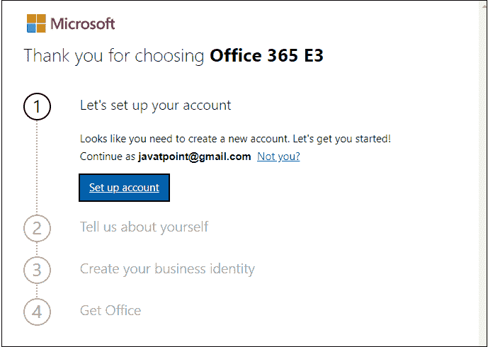

**第五步:**点击**设置账户**后，会看到如下页面**填写所需信息**点击**下一步**。

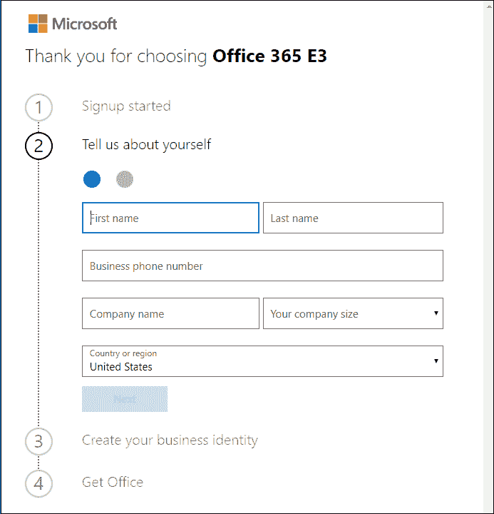

**第六步:**要证明你不是机器人，选择**给我发短信**或**给我打电话**接收 **OTP** 然后点击**发送验证码**。

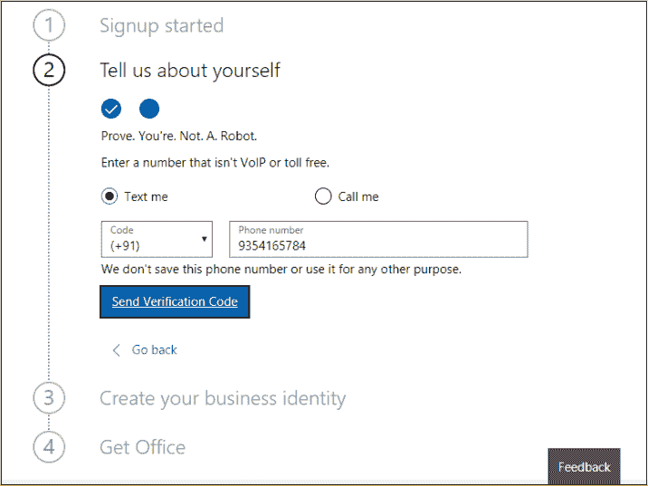

输入生成的 OTP，点击**下一步**。

**第 7 步:**现在，**通过为您的域名提供**名称来创建您的商业身份**，然后是 onmicrosoft.com**并点击**检查可用性**。如果名称可用，那么您将看到消息“**您的域 name.onmicrosoft.com 可用**”在这种情况下，您只需单击**下一步**。否则，将出现一条错误消息。

#### 注意:在我们的教程中，商业名称是在线教程。

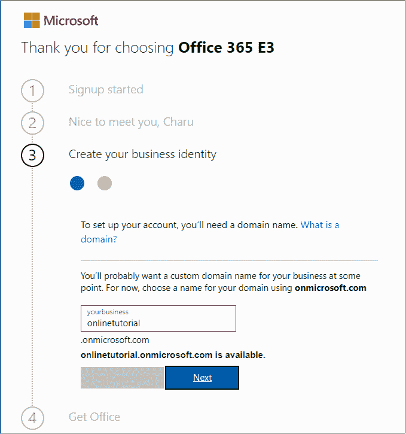

**第 8 步:**创建您的用户 ID 和密码登录您的账户，点击**注册**。

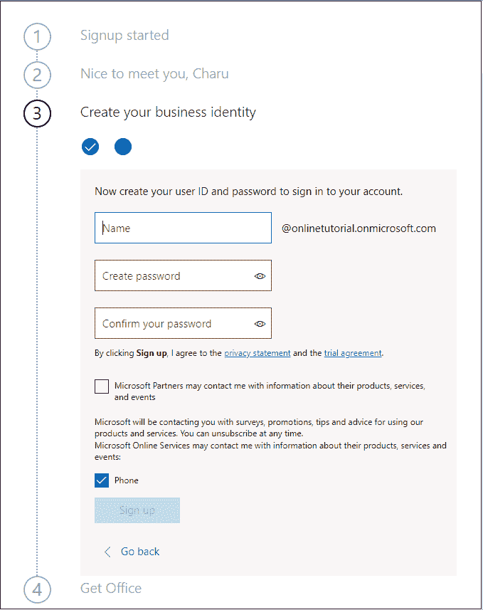

下面的截图显示了您的登录页面 id 和您的用户 ID，点击进入设置。

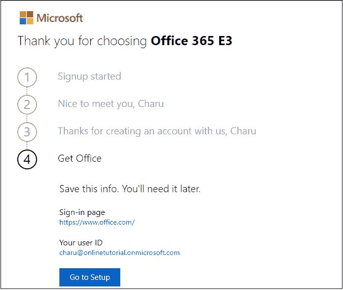

**步骤 9:** 打开 Internet Explorer、Chrome 或任何其他浏览器，键入链接[https://www.office.com](https://www.office.com)进入登录页面。

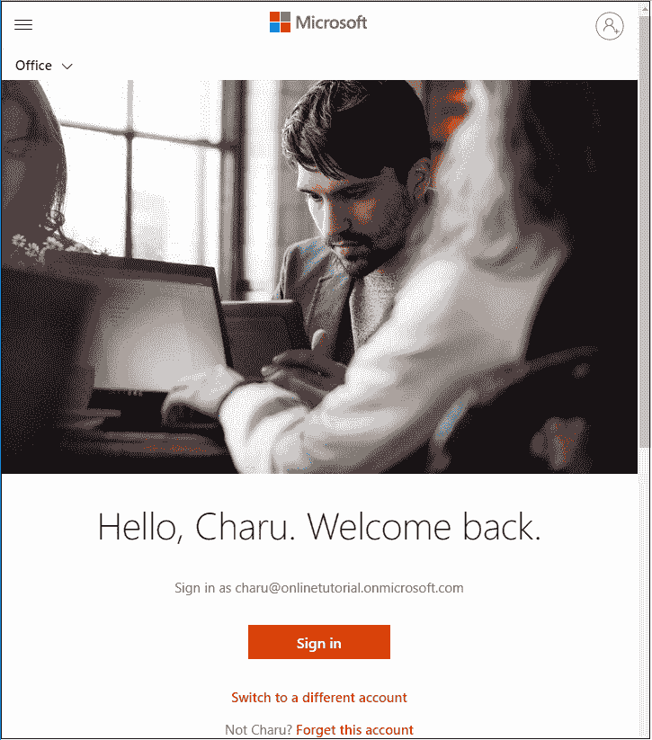

**第十步:** **输入密码**然后点击**登录**。

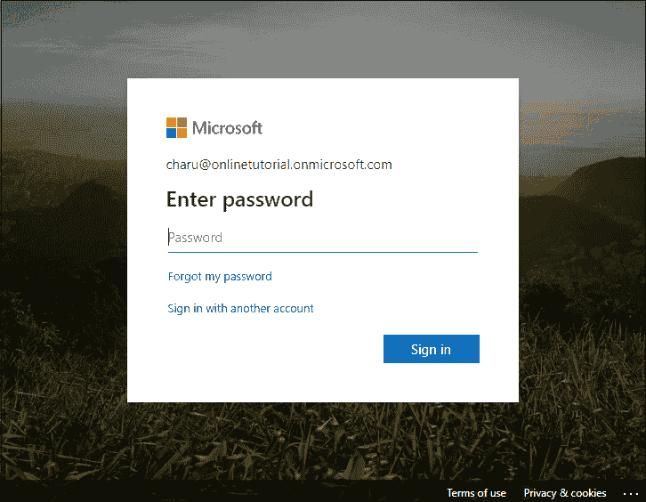

**第 11 步:**一旦登录成功，您将出现在 Office 365 主页。

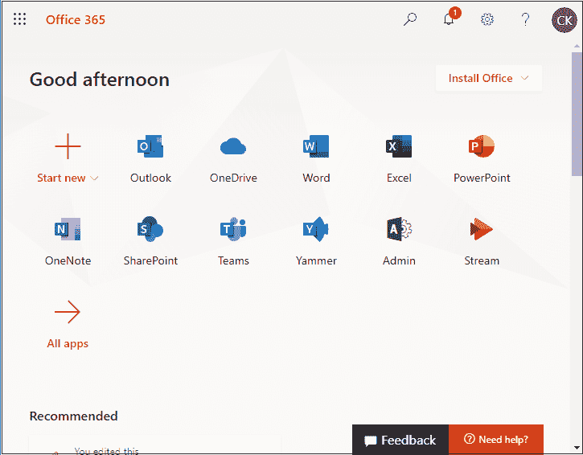

#### 注意:企业级 SharePoint 包括各种软件，如 SharePoint OneDrive、Office 套件(微软 word、微软 Excel、微软 PowerPoint)和许多其他软件。

* * *