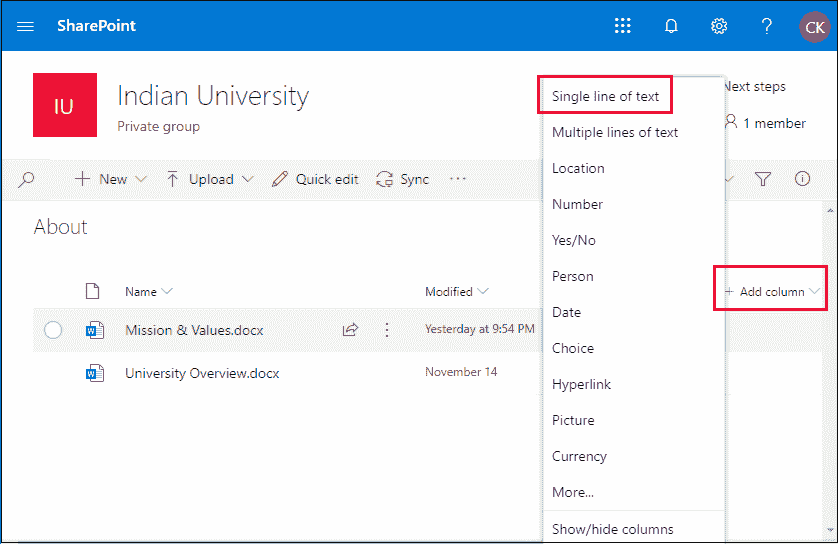
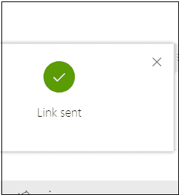
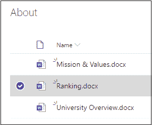
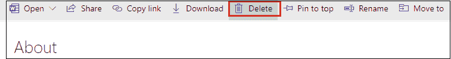

# SharePoint 库

> 原文:[https://www.javatpoint.com/sharepoint-libraries](https://www.javatpoint.com/sharepoint-libraries)

SharePoint 库与列表非常相似。它在站点中提供了一个地方，您可以**创建**、**更新**、**上传**、**与团队成员共享文件**。SharePoint 库主要用于显示文件列表和文件的相关信息，如谁创建了文件，以及谁最后修改了一个文件等。

**示例:**文档库用于组织文档并与团队成员共享文档。

您可以在库中执行以下任务。

*   [创建文档库](#Creating)
*   [上传文件到文档库](#Upload-files-to-a-document)
*   [在文档库中添加列和编辑视图](#Add-column)
*   [编辑文档库中的文件](#Edit-file-in-document)
*   [在文档库中添加链接](#Add-link)
*   [创建图片库](#Creating-Picture)
*   [上传文件到图片库](#Upload-files)
*   [在文档库中搜索和过滤](#Search-and-Filter)
*   [文档库中的协作](#Collaboration)
*   [SharePoint 警报](#Alerts)
*   [从文档库中删除文件](#Delete-file)

* * *

## 创建文档库

文档库为存储文件提供了一个安全的地方，因此您和您的团队成员可以轻松地找到这些文件，并且可以随时从任何设备进行访问。

创建文档库有以下步骤-

**第一步:**进入你网站的首页。

**第二步:**点击 **+新建**，从下拉菜单中选择**文档库**。

**第三步:**输入要创建的文档库的名称，并输入关于该库的描述(描述是可选的)，然后点击**创建**。

现在，您看到创建了一个文档库“**“关于”**。

* * *

## 将文件上传到文档库

创建库后，您可以在其中上传文件、文件夹和模板。

将文件上传到库中有以下两种主要方法。

**方法 1:使用上传按钮**

使用上传选项，您可以上传单个文件或多个文件。

**第一步:**点击上传，从下拉菜单中选择**文件**。

**第二步:**浏览想要上传的文件，点击**打开。**

现在，你会看到文件**大学概述**上传到了图书馆。

**方法二:使用拖拽**

拖放是上传库中文件的最简单方法。

将您想要上传的文件拖放到 SharePoint 库中。

给定的屏幕截图显示文件上传到了库中。

* * *

## 在文档库中添加列和编辑视图:

**添加列**

**第一步:**去你的工作库。在我们这里，工作库是**关于**。点击要添加栏的文件，下拉菜单打开，**选择单行文本**，然后点击**+添加栏**。

**第二步:**出现如下窗口，输入**列名**和描述(描述可选)，然后点击**保存。**

下面的屏幕截图显示创建了一个新的“注释”列。

**编辑视图**

编辑视图是文档库中最重要的操作之一，对视图进行编辑。首先点击**所有文档**，出现下拉菜单，点击**编辑当前视图**。

您可以看到一个**编辑视图**窗口出现，左侧为**列名**和**位置**。使用下拉菜单，您可以根据需要更改列的位置。

设置好位置后，点击屏幕顶部的**确定**。

现在可以看到**音符**在第三位置，之前在第四位置。

* * *

## 编辑文档库中的文件

编辑文档库中的文件有以下步骤:

**第一步:**前往**首页** - > **站点内容。**

**第二步:**选择要编辑的文件。

**第三步:**如果选择的文件类型支持预览，则会以在线模式打开。如果没有，那么你会得到一个下载提示。文件在在线应用程序中打开或下载后，您可以编辑和保存文件。

#### 注意:在 Office 365 中编辑文件时，您的文件会自动保存。如果您脱机编辑文件，您需要将其上传回库中。

* * *

## 在库中添加链接

要在文档库中添加链接，请执行以下步骤:

**第一步:**转到要添加链接的库。

**第二步:**点击**+新建**，从下拉菜单中选择“**链接”**。

**第三步:**弹出**创建链接至**窗口，**进入链接**并在**文件名**选项中输入想要添加的名称，点击**创建**。

下面的截图显示该链接已成功添加到文档库中。

* * *

## 创建图片库

SharePoint 图片库允许您存储和上传可在网站中使用或与其他人共享的图片。

创建图片库有以下步骤–

**第一步:**进入你网站的**首页**，点击**+新增**，从下拉菜单中选择 **App** 。

**第二步:**搜索一个**图片库**，找到图片库后点击。

**第三步:**提供图片库名称，点击**创建**。

现在，可以看到创建了图片库“**大学”**。

* * *

## 将文件上传到图片库

图片库创建后，您需要上传其中的文档。

在图片库上传文件有以下两种方法–

**1)使用拖放**

拖放是上传图片库文件最简单的方法。将您想要上传的文件拖放到图片库。

现在，您可以看到一个文件被上传到图片库。

**2)使用上传按钮**

上传按钮是上传图片库中多个文件和文档最常用的方法。

点击屏幕顶部的**上传**，从下拉菜单中选择**文件**。

浏览文件的存储位置。选择想要上传的文件，点击**打开**。

现在，您可以看到一个文件被上传到图片库。

* * *

## 搜索和过滤文档库中的文件

**搜索文件**

一个库可能包含许多不同的项目，并且您可能无法在一个屏幕上看到库中的所有这些项目。SharePoint 搜索工具允许您根据文件的名称、修改时间和修改文件者的姓名轻松搜索文件。

在文档库中，屏幕左上角有一个搜索栏。在搜索框中键入要搜索的术语，然后按键盘上的回车键进行搜索。

**过滤文件**

要筛选文件，首先，转到文档库，并选择要筛选的列。单击要排序的文件名，将打开一个下拉列表，在其中选择要对文件排序的顺序。

下面的截图显示文件被过滤成 **Z 到 A** 的顺序。

* * *

## 文档库中的协作

众所周知，SharePoint 旨在简化协作。它允许您的团队成员与其他人创建、编辑和共享文档。

**共享文件**

SharePoint 允许您与非 SharePoint 网站成员共享文件。

**第一步:**转到文档库，选择要共享的文件，点击屏幕顶部的共享。

**第二步:**点击共享后，会弹出一个小窗口，点击“**(>)”**箭头。

单击“下拉箭头(>)后，屏幕上会打开以下选项。

**任何拥有此链接的人–**任何人都可以在登录或不登录 office 356 的情况下访问此链接。

**JavaTpoint 中有此链接的人–**只有在 JavaTpoint 工作过的人才可以访问此链接。

**已有访问权限的人–**向已有访问权限的人发送链接。

**特定人员–**输入您想要授予其访问文件权限的特定人员的电子邮件地址。

**第三步:**从下拉菜单中选择一个选项，勾选**允许编辑框**，点击**应用**按钮，如上图截图所示。

**第 4 步:**输入电子邮件地址，点击发送。

下面的截图显示链接共享成功。

* * *

## SharePoint 警报

SharePoint 通知是允许您监视网站上所做更改的通知。

在文件上设置提醒会在特定文件发生更改时向您的手机发送**电子邮件消息**或**文本消息**。

在文件上设置警报有以下三个步骤–

**第一步。**选择要设置警报的文件。

**第二步。**在工具栏上，点击省略号(…)按钮，选择**提醒我**。

**第三步:当物品发生变化时提醒我**窗口出现在屏幕上。根据您的要求选择以下信息

i) **提醒标题:**输入提醒标题。

ii) **发送提醒至:**输入您要向其发送提醒的人的用户名或电子邮件地址。

iii) **发送方式:**指定使用哪种方式发送警报。

iv) **变更类型:**指定您希望收到警报的变更类型。

v) **发送这些更改的警报:**指定是否根据指定的标准过滤警报。

vi) **何时发送提醒:**显示您希望发送提醒的频率。

**第四步:**根据您的要求选择项目**和**点击屏幕底部的确定。

现在，当您创建新文件或进行任何更改时，会向您的 outlook 发送一封提醒电子邮件。

* * *

## 从文档库中删除文件

**第一步:**点击要删除的文件。

**第二步:**点击屏幕顶部的删除。

**第 3 步:**现在，您会看到一个确认弹出消息，**“您确定要将项目发送到网站回收站吗？”**如果是，则点击**删除**，否则点击**取消**。

* * *