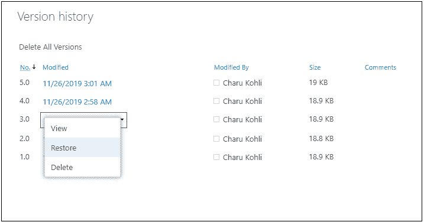

# SharePoint 版本控制

> 原文:[https://www.javatpoint.com/sharepoint-versioning](https://www.javatpoint.com/sharepoint-versioning)

每当进行更改时，SharePoint 版本控制都提供了一种在列表或库中存储、跟踪和恢复文件的极好方法。SharePoint 版本化还用来**跟踪一个版本的历史，还原一个以前的版本，查看一个项目或文件以前的版本**。

版本控制可用于列表项，如日历、问题跟踪列表、自定义列表和库，包括 web 部件页。

#### 注意:默认情况下，在 SharePoint 中，对 SharePoint 库启用版本控制，对 SharePoint 列表禁用版本控制。

在 SharePoint 版本控制中，您可以执行以下操作-

*   [查看文件历史记录](#history)
*   [查看上一版本文件内容](#previous)
*   [恢复以前的版本文件](#Restore)
*   [从版本历史中删除版本](#Delete)

## 查看文件的历史记录

查看文件历史有以下步骤-

**第一步:**进入你网站的**首页**，选择你想要查看历史的文件。

**第二步:**打开文档库页面，根据您的需求选择文档。

**第三步:**现在，可以看到打开了一个文档文件。

**第四步:**根据你的要求编辑内容。它会自动保存文件。一旦文件被**保存**，回到**上一页**。

**第五步:**勾选**文档文件**，点击**显示动作**(三点)，屏幕上打开动作列表，从列表中选择**版本历史**。

现在，当在您的站点上启用版本控制时，您可以看到文档何时被修改，谁修改了文档，以及文档的大小。

## 查看以前版本的文件内容

SharePoint 版本控制允许您在更改文档后查看以前版本的文件内容。

要查看以前版本的文件内容，请点击您想要查看的任何**修改日期&时间**文件。

点击文件后，会弹出一个小窗口，显示消息“**打开 Office(桌面)？**，如果要打开文件则点击**打开办公(桌面)**，否则点击**取消**。

点击**打开 Office(桌面)**后，可以看到你之前的版本文件打开有两个选项:**对比**和**恢复**。

如果你想比较你之前的文件和原始文件，那么点击窗口顶部的**比较**。为此，请考虑上面提到的截图。

下面的截图显示了您以前的版本文件和原始文件。

## 还原以前版本的文件

SharePoint 版本控制允许您将以前的版本文件作为当前版本文件。

进入**版本历史页面**，选择想要恢复的版本，点击与所选版本关联的下拉图标，弹出下拉菜单，点击恢复。

一旦你点击恢复，一个弹出窗口打开，显示消息，“**你将要用选择的版本**替换当前版本。”如果你想恢复文件，那么点击确定，否则点击取消。

现在，您可以看到版本号 8 变成了您当前的版本，之前是版本号 3。

## 从版本历史记录中删除版本

进入**版本历史页面**，选择想要删除的版本，点击与所选版本关联的下拉图标，打开下拉菜单，点击**删除**。

点击删除后，弹出一条消息，“**你确定要把这个版本发到网站回收站吗？**“如果要删除一个版本，点击**确定**。

下面的截图显示版本从版本历史中删除。

* * *