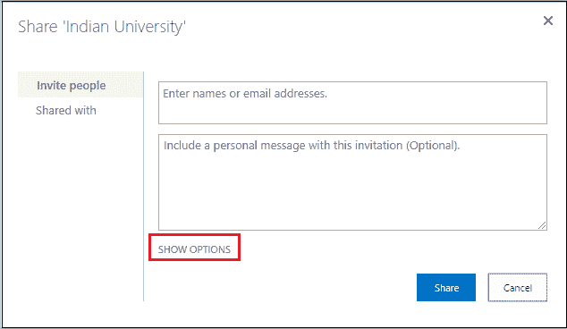

# 管理 SharePoint 中的权限

> 原文：<https://www.javatpoint.com/managing-permissions-in-sharepoint>

作为网站所有者，您可以管理可以访问您的 SharePoint 网站的用户的权限。

您可以执行以下操作来管理 SharePoint 权限-

*   [查看与列表或库相关联的用户和组的权限](#permission)
*   [将用户添加到库或列表中](#user)
*   [从库或列表中删除用户](#remove)
*   [新建权限组](#new)
*   [为库或列表创建唯一权限](#unique)

## 查看与列表或库关联的用户和组的权限

在 SharePoint 中，您可以查看与列表或库关联的用户和组的权限。

**步骤 1:** 转到要查看用户和组的列表或库。

**第二步:**点击屏幕右上角的**设置图标**，从下拉菜单中选择一个**库设置**或**列表设置**。

**步骤 3:** 出现**库设置**窗口，**从右侧窗格选择该文档库的权限**。

**第 4 步:**现在，您可以看到 SharePoint 自动创建了三个组，分别是:印度大学成员、印度大学所有者和印度大学访问者。

## 将用户添加到库或列表

在 SharePoint 中，您可以向特定的库或列表添加和分配用户权限。

**步骤 1:** 转到要添加用户的列表或库。

**第二步:**点击屏幕右上角的**设置图标**，从下拉菜单中选择**库设置**或**列表设置**。

**步骤 3:** 打开一个库设置窗口，从右侧窗格选择该文档库的**权限**或该列表的**权限**。

**第四步:**点击印度大学会员。

**第 5 步:**出现以下窗口。在其中单击新建，从下拉菜单中选择添加用户。

**第六步:**出现一个弹出窗口，输入你要添加的人的名字，添加一条信息(可选)，点击**显示选项**。单击“显示选项”后，您会看到一个带有消息“发送电子邮件邀请”的复选框勾选该复选框，然后单击共享。

**第 7 步:**现在，可以看到一个用户被添加到印度大学成员组。用户还会在 outlook 中收到一封电子邮件。

## 从库或列表中删除用户

要从列表或库中删除用户，请按照上述步骤操作，然后单击要删除的用户。

转到**操作，选择从组中删除用户，从该 SharePoint 组中删除所选用户**。

一个小的弹出窗口打开，显示消息“**您想删除这些成员吗？**点击**确定**。

现在，您可以看到用户已从库中移除。

## 创建新的权限组

创建网站时会自动创建 SharePoint 默认组。但是在 SharePoint 中，管理员也可以根据自己的需要创建权限组。

按照以下步骤创建新的权限组-

**第一步:**点击屏幕右上角的**设置**图标，选择**站点权限**。

**第二步:**点击屏幕下方的**高级权限设置**。

**第三步:**下面的截图显示了三个默认的权限组，但是要创建新的特定组，请从屏幕左上角的权限窗格中点击**创建组**。

**第四步:**进入**名称**和**描述**为组，**根据您的要求选择权限**，点击**创建**。

现在，你可以看到一个新的组**教员**被创建。

## 为库或列表创建唯一权限

在 SharePoint 中，库的管理员或所有者可以为授权用户分配唯一的权限。它们还可以限制未经授权的用户访问相同的数据。默认情况下，网站中的所有网站、列表和库都从上面的网站层次结构继承权限。这意味着网站从根网站集继承权限，子网站从其父网站继承权限。

要为库或列表分配唯一权限，首先要中断权限继承，然后分配唯一权限。

创建库的唯一权限有以下步骤-

**第一步:**进入你所在站点的**首页**，点击**新增**，从下拉菜单中选择文档**库**。

**第二步:**右上角弹出窗口，输入**库名**，点击**创建**。

**第 3 步:**创建库后，转到设置图标，将打开一个下拉菜单，选择库设置。

**第 4 步:**选择**对此文档库的权限**。

**第五步:**可以看到，在创建库的时候，这个库自动继承了大学网站的权限，分别是:

*   印度大学会员-会员有权编辑网站。
*   印度大学所有者-所有者拥有完全控制权。
*   印度大学访问者-访问者可以阅读。
*   教员-教员有设计游乐设施。

在此页面，转到屏幕顶部的**权限选项卡**，从功能区选择**停止继承权限**。

**第六步:**弹出一个小窗口，点击**确定**即可。

**第 7 步:**转到管理父级。

**第 8 步:**选择可以分配或删除权限的组，点击**编辑用户权限**。

**第 9 步:**下面的截图显示了编辑权限页面，选择您想要为特定组分配的权限，然后点击屏幕底部的**确定**。

下面的截图显示权限已被更改。现在，教职员工有权设计，所有者拥有完全控制权，会员和访客都有权阅读。

* * *