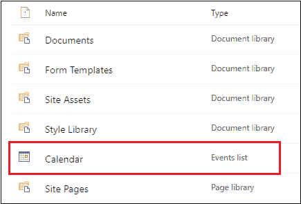

# 在 SharePoint 中创建日历

> 原文:[https://www.javatpoint.com/create-calendar-in-sharepoint](https://www.javatpoint.com/create-calendar-in-sharepoint)

SharePoint 日历允许我们轻松访问**个人事件、假日、团队事件、**和**公司日程安排**。它还允许经理将会议通知给同事。

## 创建日历应用程序

创建日历应用程序有以下步骤-

**第一步:**去你网站的**首页**。点击 **+新增**，从下拉菜单中选择 **App** 。

**第二步:**你的应用窗口出现在屏幕上，向下滚动窗口，搜索**日历**。一旦你找到日历应用，点击它，或者你可以直接在搜索框中输入日历。

**第三步:**点击日历 app 后，会弹出一个小窗口，**输入想要创建的日历名称**，点击**创建**选项。

**第四步:**现在，在网站内容页面，可以看到新建了一个 app 日历。点击日历。

**第五步:**下面的截图显示创建了一个日历。

## 启用版本控制

**第一步:**转到屏幕左上角的日历选项卡。出现一个功能区，在其中选择**列表设置**。

**第二步:**屏幕出现**设置页面**，点击**版本化设置**。

**第三步:**在版本设置窗口中，选择**是**单选按钮为**每次编辑列表中的项目时创建一个版本？，**点击屏幕下方的**确定**。

## 在日历中添加新事件

**在日历中添加事件**允许您维护和管理站点内的事件列表。

要在日历中添加事件，请将鼠标悬停在 **上的********上的** **日期**或**上双击** **单击要添加事件的日期。选择日期出现**+添加**的链接，点击**+添加**。**********

**屏幕上出现日历-新项目**窗口。根据您的要求填写信息，点击屏幕下方的**保存**。

下面的截图显示事件被添加到日历中。

* * *