# 在 SharePoint 中创建调查

> 原文：<https://www.javatpoint.com/create-survey-in-sharepoint>

该调查提供了一种有效的方式来收集对组织有价值的反馈，例如用户对特定产品或服务的意见。

您可以在调查中执行以下操作-

*   [创建调查](#Create)
*   [添加调查问题](#Add)
*   [回复调查](#Respond)
*   [管理调查结果](#Manage)
*   [将响应导出到电子表格](#Export)

## 创建调查

在 SharePoint 中创建调查有以下步骤-

**第一步:**进入你网站的**首页** **页面**，从下拉菜单中点击 **App** 。

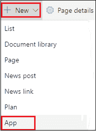

**第二步:**屏幕上出现应用列表窗口，向下滚动窗口，点击**调查**。

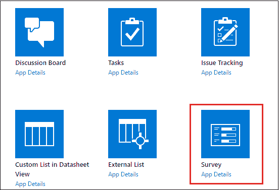

**第三步:**屏幕出现**弹出的**窗口，**输入******名称** **为** **测量**，点击**创建**。**

**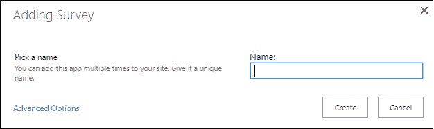

以下屏幕截图显示调查列表已创建。

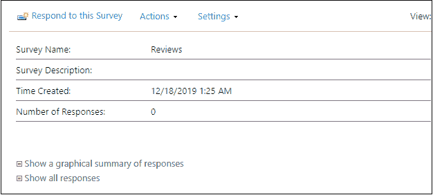

## 添加调查问题

创建调查列表后，您可以在上面添加问题。要添加调查问题，点击**设置**并选择**添加** **问题**。

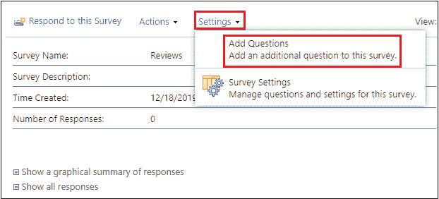

屏幕上将出现“新问题”窗口。

在**问题******类型** **部分**中，输入您要在调查中添加的问题，**选择** **的** **类型** **回答问题**。**

**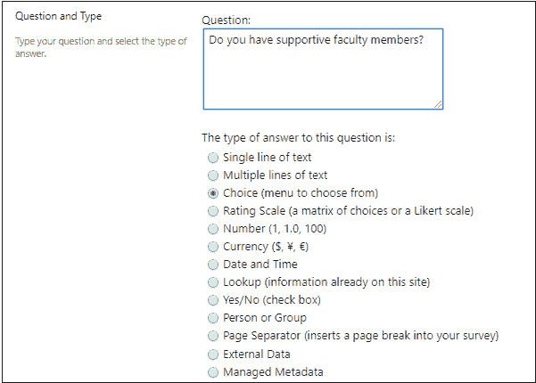

在**附加问题设置部分**中，根据您的要求指定设置选项。

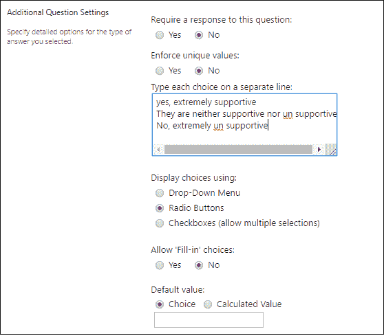

要添加其他问题，向下滚动窗口，点击**下一个** **问题**，然后输入下一个问题。重复该过程，直到您添加了调查中的所有问题。

添加调查问题后，点击**完成**。

### 添加链接

要添加链接，点击屏幕顶部的**编辑** **链接**。点击**圈起来的** + **链接**，出现弹出窗口，输入要显示的文本名称，复制页面网址，粘贴到地址中，点击**确定**。

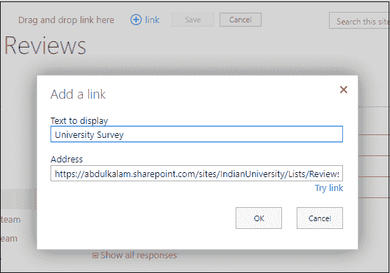

点击屏幕顶部的保存。

## 回复调查

要回复调查，您必须拥有访问调查的权限。它只允许您回复一次调查。

按照以下步骤回复调查-

**第一步:**进入你的调查页面，点击**回复** **至** **本次** **调查**。

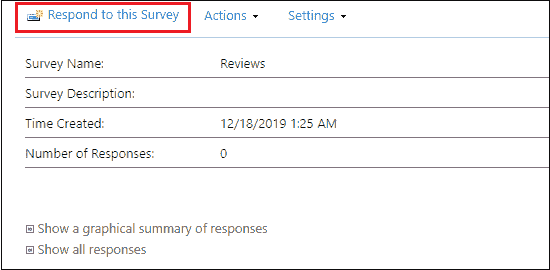

**第二步:**回答调查中的问题，点击**完成**。

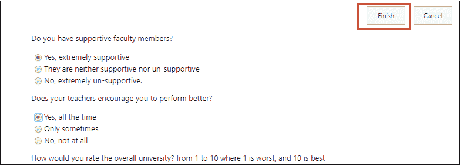

## 管理调查结果

创建 SharePoint 调查后，您可以查看和管理调查结果。

**查看所有响应的图形摘要**

单击快速启动上的调查名称。

出现以下窗口，点击**显示响应的图形摘要**。

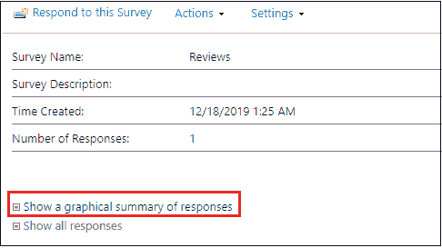

下面的截图显示了响应的图形摘要。

**查看调查回复**

单击快速启动上的调查名称。

出现以下窗口，单击显示所有响应。

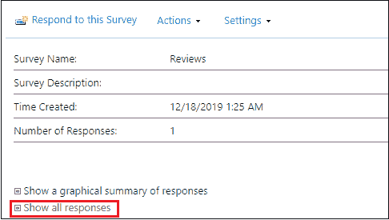

下面的截图显示了所有用户的结果。

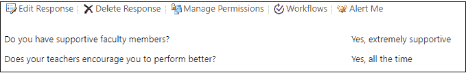

## 将响应导出到电子表格

要导出响应，您必须需要与 Windows SharePoint Services 兼容的电子表格。

要导出响应，首先，转到调查页面，单击操作菜单，然后从下拉菜单中选择导出到电子表格。

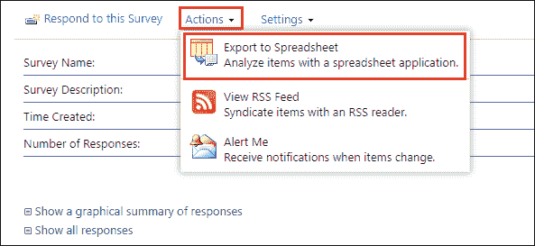

将出现一个弹出窗口，其中包含消息-要导出列表，您必须有一个与微软基金会兼容的应用程序，您只需在此窗口中单击“确定”。

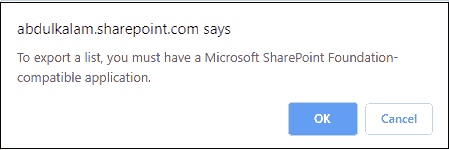

下面的截图显示，响应被导出到电子表格中。

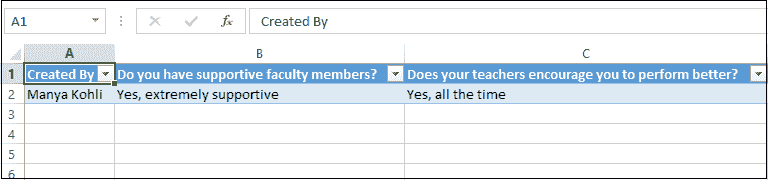

* * *****