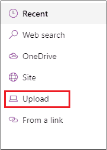
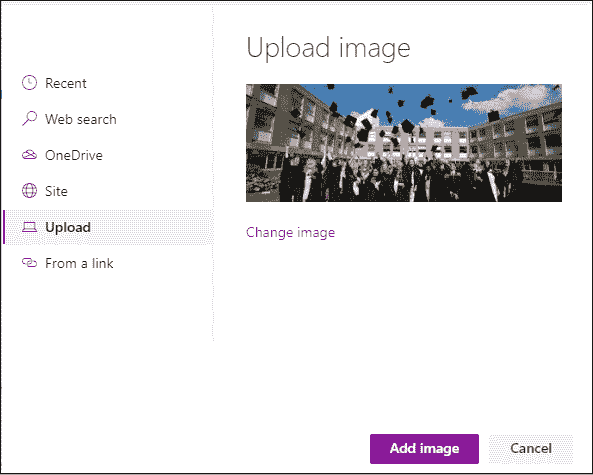
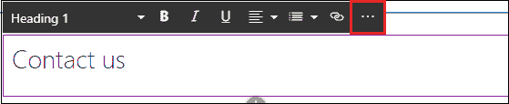
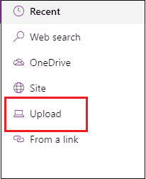

# SharePoint 网页和网页组件

> 原文:[https://www.javatpoint.com/sharepoint-pages-and-web-part](https://www.javatpoint.com/sharepoint-pages-and-web-part)

## SharePoint 页面

SharePoint 页面提供了使用图像、Excel 工作表、Word、PowerPoint 文档、视频等分享想法的最佳方式。SharePoint 2019 允许您快速轻松地创建和发布页面。

在这一页，我们将讨论以下主题-

*   [SharePoint 页面类型](#Types)
*   [创建页面](#Create)
*   [在页面上传图片](#Upload)
*   [网页组件简介](#Introduction)
*   [向页面添加网页组件](#Add-web)
*   [在页面](#Add-HERO)添加英雄网页组件
*   [如何将页面显示为首页](#How)

### SharePoint 页面的类型

下表显示了 SharePoint 页面的类型-

| 页面类型 | 描述 |
| 应用程序页面 | ASP.NET 网页中的应用程序页面，用于构建 SharePoint 网站。 |
| 网站页面 | SharePoint 网站页面允许您将页面添加到 SharePoint 库中，使您能够自定义页面。 |
| 母版页 | 母版页提供了 SharePoint 网站上页面的界面和布局。它主要用于存储站点的结构、元素和设计。 |
| 页面布局 | SharePoint 页面布局允许您为页面创建模板。 |

### 创建页面

按照以下步骤创建页面-

**第一步:**前往项目的**首页** **页面**。

**第二步:**点击 **+新建，**一个下拉菜单打开，在其中点击**页面**。

**第三步:**页面模板窗口打开，根据您的要求选择页面，点击**创建页面**。

**第四步:**现在，你可以看到一个新的页面被创建了，根据你的要求输入你的页面的**名称。**

### 在页面上上传图像

**第一步:**点击屏幕左上角的**图像** **图标**。

**第二步:**出现一个小菜单，点击**上传**。

**第三步:**浏览文件所在位置，点击**打开**。

**第四步:**点击添加图片。

现在，您可以看到页面上传了一张图片。

### 网页组件简介

SharePoint web 部件是一小块用户界面，允许您使用浏览器修改 SharePoint 网站中页面的内容、外观和行为。

### 向网站添加网页组件

**第一步:**一旦你的页面创建完毕，将鼠标悬停在已有的网页中，你会看到一行带有**圈起来的** **+** **的符号**，点击圈起来的+符号，一个小的**特色的** **窗口** **弹出** - **向上，**在其中根据你的需求选择 web 部件。要轻松找到该 web 部件，还可以开始在搜索框中键入该 web 部件的名称。在我们的例子中，我们想要添加**文本**，所以点击特色窗口中的文本。

**第二步:**根据你的要求输入文字。您还可以对文本执行操作，如**粗体**、**斜体**、**下划线**、**更改******字体** **大小**。要查看更多功能，点击**更多**【三点(…)】，如下图截图所示:**

**

**第三步:**点击 more (…)后，出现如下窗口，为您提供了一种在文本中添加更多功能的方法，就像您可以更改**字体** **颜色**、**高亮** **颜色**、**添加** **段落**、**插入** **链接**、**添加** **表格**。

**第四步:**一旦根据需求添加了 web 部件，点击屏幕右上角的**发布**。

### 在页面中添加英雄网页组件

英雄网页组件允许你添加**图片**、**文字**和**链接**到页面，让页面更有吸引力。

在页面中添加英雄网页组件有以下步骤-

**第一步:**转到要添加**英雄网** **部分**的页面。点击页面右上角的**编辑**。将鼠标悬停在已有页面，会看到一条带有**圆圈的直线+** ，如下图截图所示。

**第二步:**点击**圈起来的** **+，**你会看到一个小窗口出现，里面有网页组件列表。向下滚动搜索**英雄，**或者直接在搜索框输入英雄。找到英雄网页组件后，点击它。

**第三步:**下面的截图显示页面上出现了一个 Hero web 部件。

**第四步:**可以根据自己的需求编辑英雄 web 部件。点击屏幕右上角的编辑。

**第五步:**屏幕上出现英雄布局选项。根据您的场地要求选择**瓷砖**和**布局**。

**第六步:**下面的截图显示屏幕上出现了一个双瓦片窗口。

**第七步:**点击选择链接，左下角出现一个小弹出，选择**上传**。

**第八步:**浏览文件所在位置，选择想要上传的文件，点击**确定**。

**第九步:**图片上传后，点击屏幕下方的**添加项**。

**步骤 10:** 现在，下面的截图显示图像被添加到英雄网页组件中

同样，你可以根据自己的需求在英雄 web 部件中添加更多的图片。

下面的截图显示，使用英雄网页组件，两个图像被添加到页面。

**移动或移除网页组件**

您也可以移动或移除 SharePoint 网页组件。

要移动网页组件，点击屏幕右上角的**编辑**。

选择要移动的 web 部件，然后单击屏幕左上角的移动图标。

将网页组件拖放到你想要移动的地方，点击屏幕右上角的**重新发布**。

要删除 web 部件，请选择要删除的 web 部件，然后单击屏幕左上角的删除图标。

一旦点击删除，会弹出一个小的删除确认窗口，并显示消息**“您确定要删除此网页组件吗？”，**如果要删除，点击是，否则点击否

单击“是”后，选定的 web 部件将从页面中删除。要显示页面，请单击屏幕右上角的重新发布。

#### 注意:使用 web 部件，您还可以在页面中添加更多的 web 部件，如地图、突出显示的文本等。

### 如何将页面显示为主页

您可以将页面显示为主页。有以下步骤可以将您的页面显示为您网站的主页-

**第一步:**前往首页- >网站内容- >网站页面。

**第二步:**屏幕上出现一个网站页面，选择要显示为首页的页面。点击椭圆(三个点)，屏幕上出现一个选项列表，其中选择**“制作主页”**

现在，你可以看到，University.aspx 已经成为你网站的主页。

* * ***