# SharePoint 模板

> 原文:[https://www.javatpoint.com/sharepoint-templates](https://www.javatpoint.com/sharepoint-templates)

SharePoint 允许您根据自己的需求创建模板。创建模板有助于用户根据需要轻松访问页面。

## 页面模板

SharePoint 页面模板允许您创建一个很棒的页面，并使它可供其他网站用作相同的页面模板。创建页面模板后，其他用户可以从模板库中选择它，并将其用于自己的网站。您也可以在不影响之前创建的模板的情况下对模板进行更改。

### 创建页面模板

创建页面模板有以下步骤-

**第一步:**进入你网站的**首页** **页面**，点击 **+** **新增**，从下拉菜单中选择【页面】。

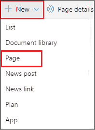

**步骤 2:** 屏幕上出现以下页面窗口。您将看到系统已经创建了三个页面模板(空白、可视和基本文本)。要创建自己的模板，请选择空白，然后单击创建页面。

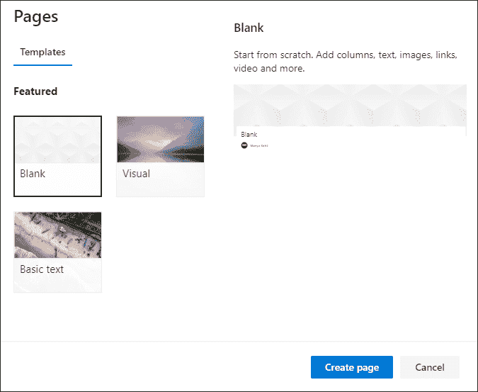

**第三步:**一旦你的页面创建完成，你就可以根据自己的需要和要求添加和删除网页组件、图片、内容等。

创建模板后，点击**将** **另存为** **草图**并从下拉菜单中选择**将** **另存为** **模板**。

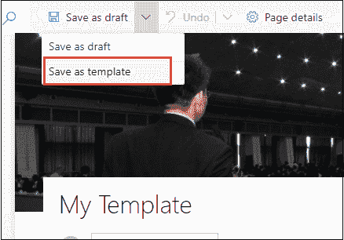

**第四步:**点击屏幕右上角**保存** **页面** **模板**。

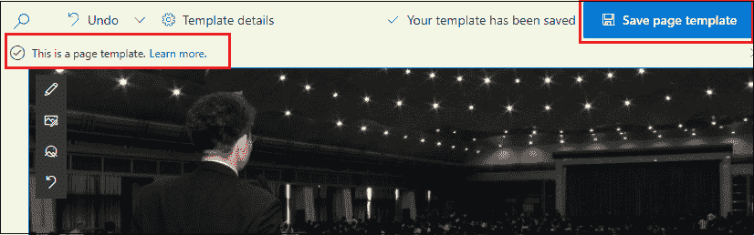

## 查看、编辑和删除页面模板

**查看模板**

要找到页面模板，进入你网站的**首页** **页面**，点击**+新建**，选择**页面**。

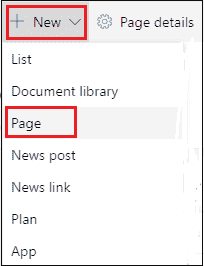

下面的截图显示了在模板页面上查看最近创建的模板(公司的模板)。

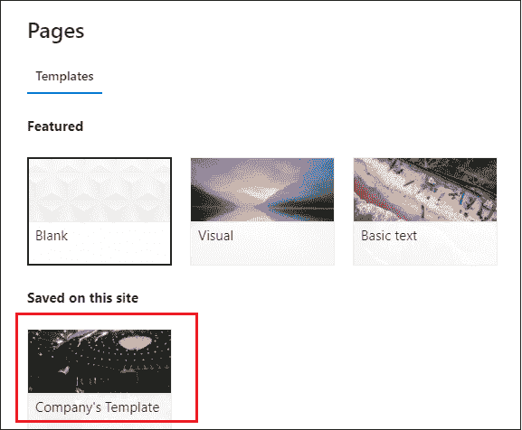

**编辑模板**

要编辑模板，请选择要编辑的模板，单击屏幕顶部的编辑。

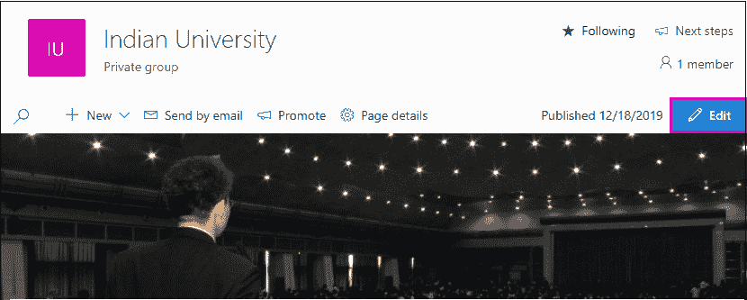

选择要编辑的部分。删除时，点击要删除的网页组件，点击**删除**。

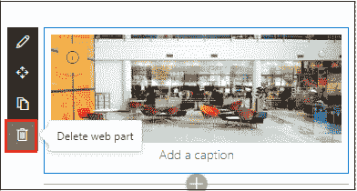

要添加网页组件，点击****+，**选择要添加的网页组件。编辑页面后，点击屏幕右上角的重新发布。**

**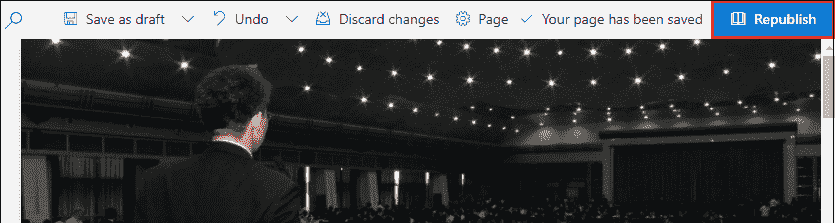

**删除模板**

要删除模板，请转到网站内容->网站页面->单击模板文件夹。

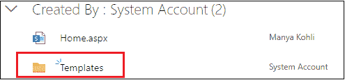

右键点击模板，出现弹出窗口，点击删除。

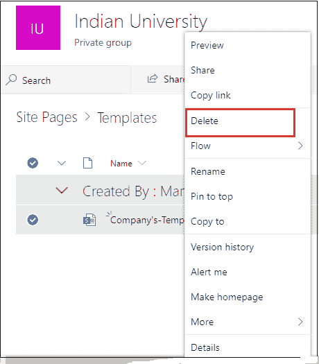

* * ***