# 在 SharePoint 中创建 Microsoft FORMS

> 原文：<https://www.javatpoint.com/create-microsoft-forms-in-sharepoint>

Microsoft 表单允许您在 SharePoint Online 页面中创建、添加和查看表单结果。它主要用于提供存储想法和反馈的最佳方式。

在 SharePoint 中创建 Microsoft FORMS 有以下两种方法-

*   [使用网页组件](#Web-Part)
*   [使用微软表单](#Microsoft-Form)

## 方法 1 -使用网页组件

**第一步:**进入你所在站点的**首页** **页面**，点击**+新建**，从下拉菜单中选择**页面**。

**第二步:**进入想要创建的****页面**的**名称** **。****

 ****第三步:**将鼠标悬停在已有页面，会看到**一条** **线** **带** **圆圈** **+，**如下图:

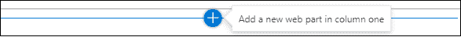

**第四步:**点击**圆圈+** 查看网页组件列表。点击**微软表格**，或者直接在**搜索框**输入微软表格。

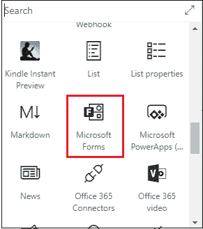

**第 5 步:**屏幕出现以下窗口。要创建新表单，点击**新表单**。

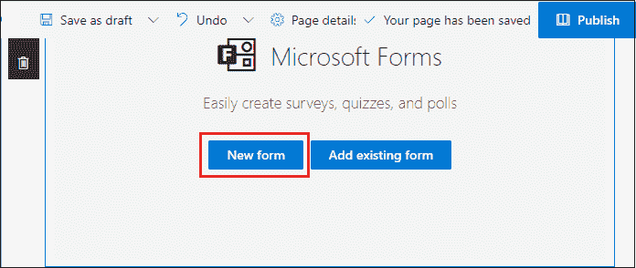

**第 6 步:**您将在**右窗格**看到一个微软表单窗口。**输入新表格**的名称，点击**创建**。

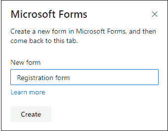

**第七步:**下面的截图显示了一个注册表单的布局被创建，要在注册表单中输入文本点击 **+** **添加** **新建**。

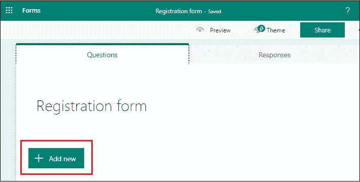

**第 8 步:**一旦点击 **+添加新项，一些来自微软表单模板**的推荐出现在屏幕上。根据您的需求选择模板，点击**添加选中，**如下图所示。

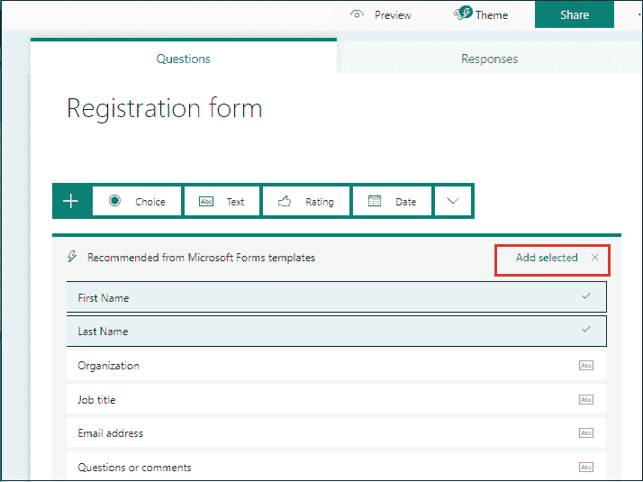

**第九步:**根据您的要求添加模板，点击 **+添加新的**，出现如下选项卡，其中点击**文本**。

**第十步:**输入文字，根据你的要求。

完成表单后，点击屏幕顶部的**预览**。

## 添加主题

SharePoint 表单主题用于使您的表单更具吸引力。

要更改主题，点击屏幕顶部的**主题**。屏幕上会出现主题列表。根据您的需求选择主题，点击**预览**。

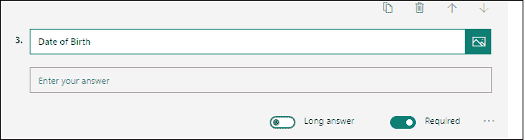

下面的截图显示主题被添加到表单中。

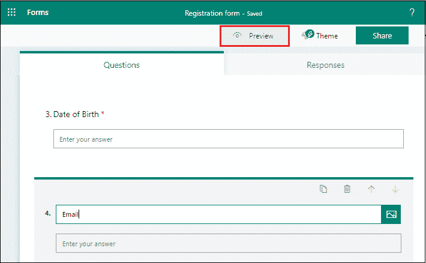

## 方法 2 -使用微软表单

使用 Office 365 创建表单有以下步骤。

**步骤 1:** 在任意浏览器中键入并复制粘贴[www.offfice.com](http://www.offfice.com)。一个 Office 365 的**主页**出现在屏幕上。点击**所有应用。**

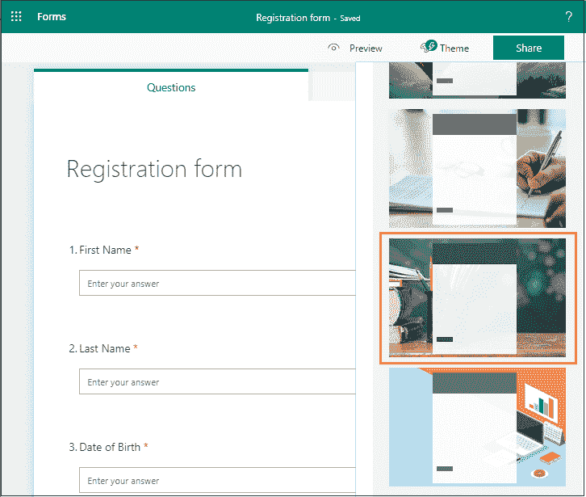

**第二步:**所有应用窗口出现在屏幕上，点击**表单**。

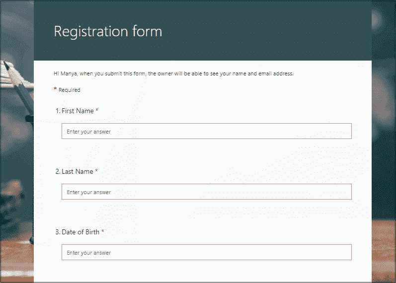

**第三步:**我的表单窗口出现，有两个选项:**新增** **表单**和**新增** **测验**。根据您的要求选择选项。

#### 注意:在我们的案例中，我们选择了测验。

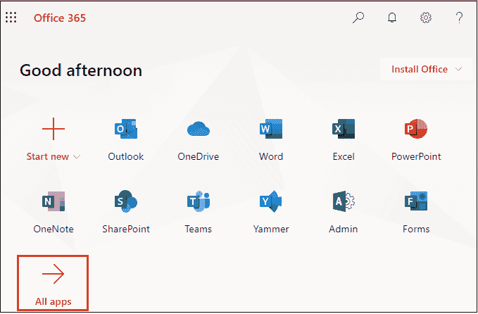

**第四步:**屏幕出现以下页面，输入**标题**和**描述**进行测验。点击 **+添加新的**。

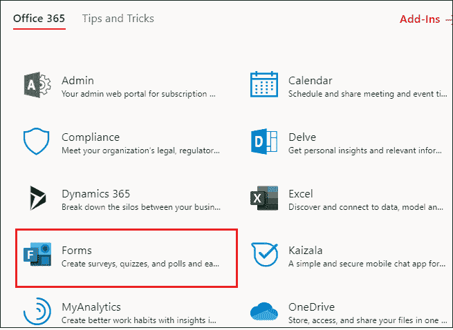

**第 5 步:**点击+添加新项后，出现以下选项卡，要创建测验，点击选择。

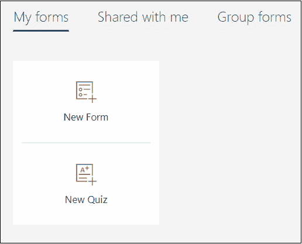

**第 6 步:**输入带有所需选项的问题。

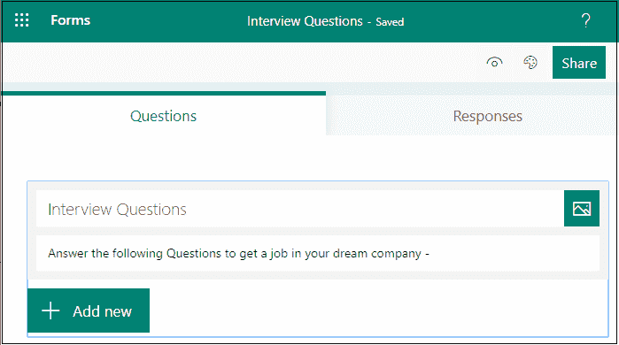

**为正确答案-**

将光标放在正确答案上。屏幕上出现三个图标，其中点击**答对**图标，如下图截图所示。

**回答不正确-**

将光标放在错误的答案上。屏幕上出现三个图标，点击**显示消息给选择此答案的回答者**图标，如下图截图所示。

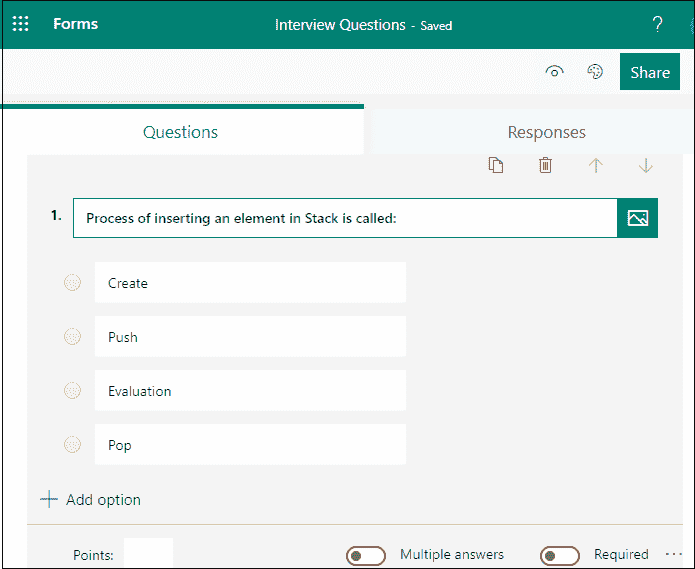

添加类似**的信息“正确答案是推送。”**

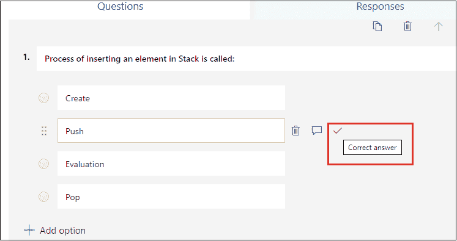

同样，将此文本添加到所有不正确的答案中。

**第 7 步:**在小考中添加所有问题后，点击屏幕顶部的预览。

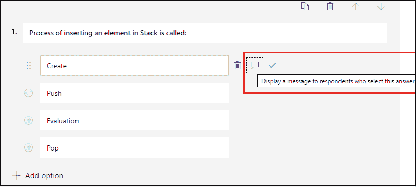

现在，你可以解决这个问题了。

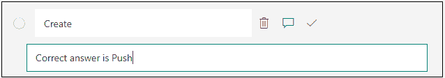

完成测验后，点击屏幕下方的**提交**。

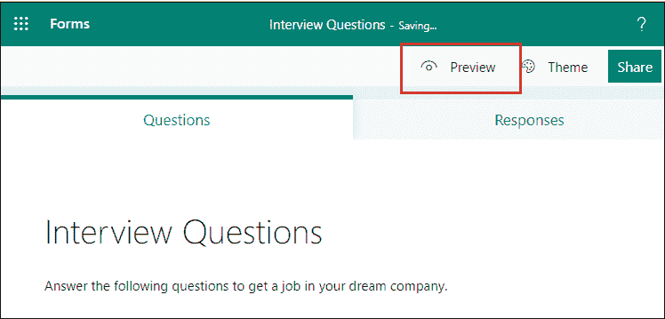

点击提交后，屏幕上出现如下**感谢页面**。点击**查看结果，点击**查看结果，如下图所示。

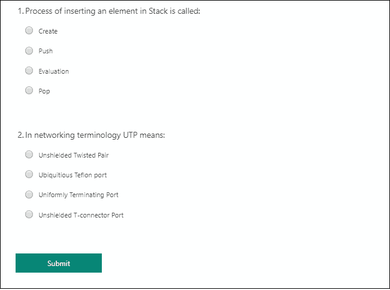

下面的截图显示了您的测验结果。

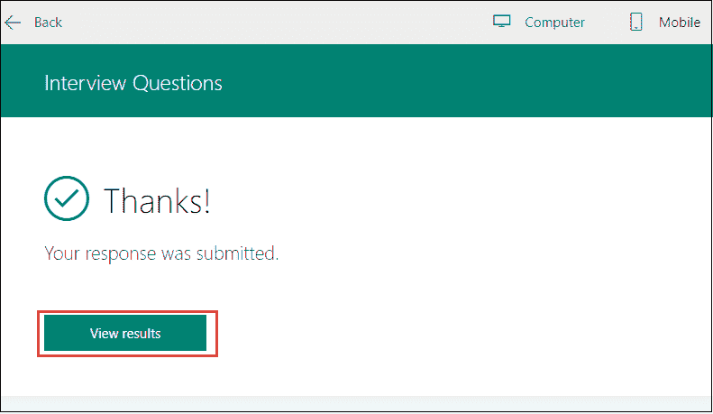

要查看测验在移动界面中的外观，请单击屏幕顶部的移动图标。

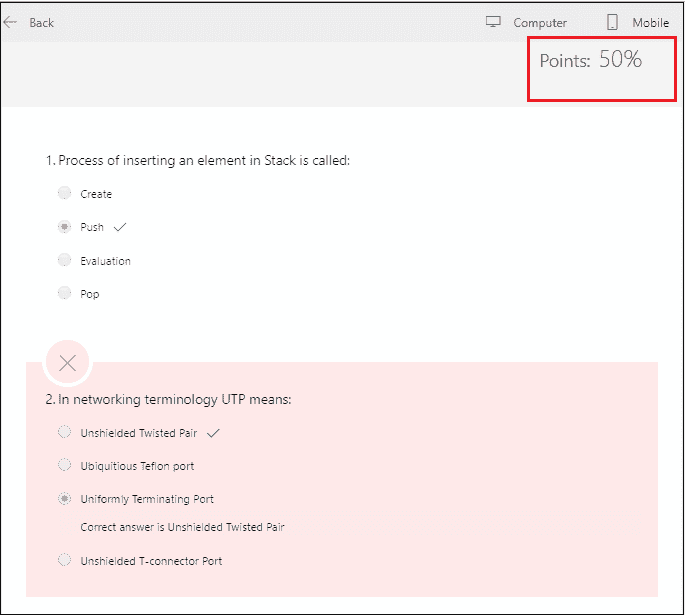

## 更改测验的主题

要更改主题，进入测验页面，点击屏幕右上角的**主题**。屏幕上会出现预定义主题的列表。点击 **+** 图标添加新主题。

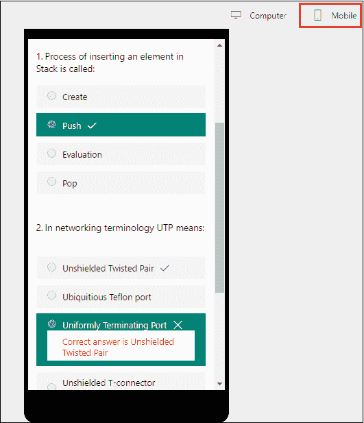

屏幕上出现以下窗口，在搜索框中输入图像的名称，点击搜索。屏幕上出现图像列表，根据您的要求选择图像，点击**添加**。

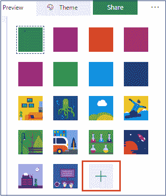

下面的截图显示主题被添加到测验中。

## 分享测验/表格

以下是分享测验的方法-

**1。使用链接**

如果您没有想要发送表格或测验的人的电子邮件地址，则该链接是发送测验/表格的最佳方式。

**第一步:**打开想要分享的表格或小测验。

**第二步:**点击屏幕右上角的共享。

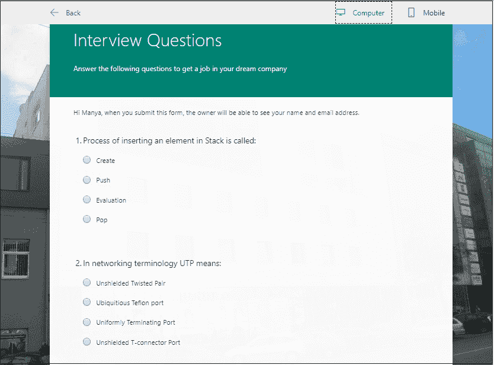

**第 3 步:**默认情况下，只有组织内的人员可以提交对表格或测验的回答。如果你想允许每个人提交他们的回复，那么点击**任何有链接的人都可以从下拉菜单中回复**。单击链接，然后单击复制，随后是显示测验网址的文本框。

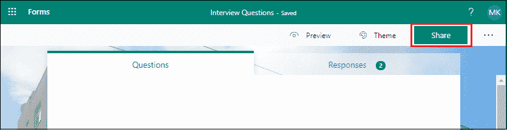

现在，您可以将此链接复制粘贴到您想要访问的位置。

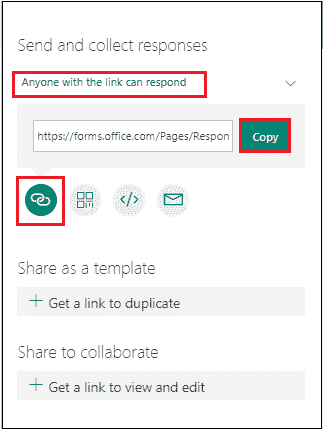

**2。使用二维码**

要使用二维码发送表格或测验，请单击二维码按钮查看二维码。

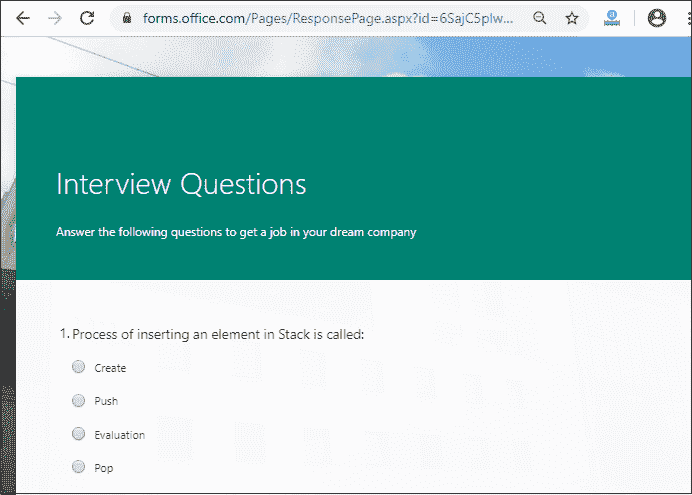

点击**下载**并粘贴此链接，您可以使用二维码扫描仪(如移动设备)访问该链接。

**3。使用嵌入网页**

点击**嵌入**按钮。点击复制。

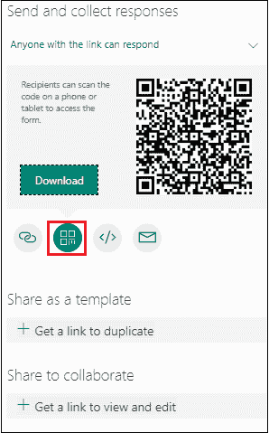

将此代码键入或粘贴到网页中，以便将表单嵌入到文档中。单击要添加 web 部件的位置。

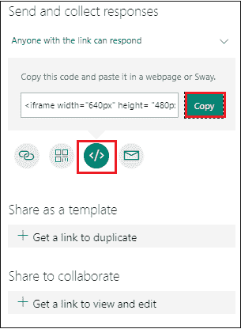

单击微软表单后，屏幕上会出现以下窗口。点击**添加现有表单**。

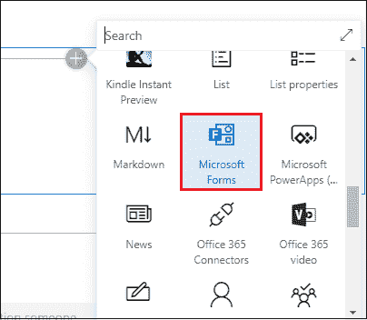

将页面网址粘贴到右窗格中。选择收集响应，然后单击确定。

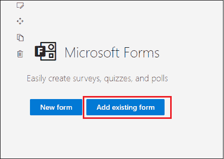

下面的截图显示了网页上添加的测验。

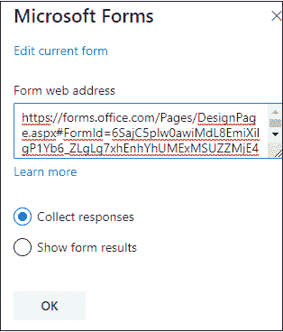

**4。使用电子邮件**

点击电子邮件按钮。

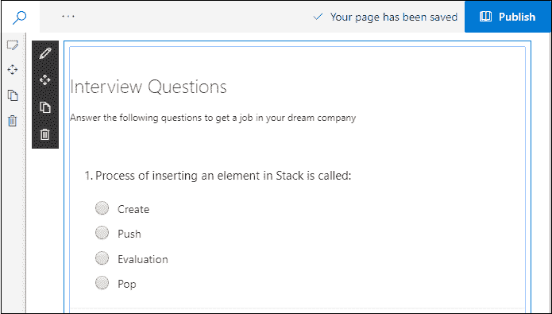

将显示默认的电子邮件编辑，输入查看您表单的人的电子邮件地址，然后单击发送。

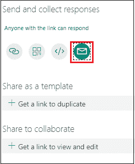

## 查看响应

分享测验后，您还可以查看回答。要查看回答，请转到测验页面并单击屏幕顶部的回答。

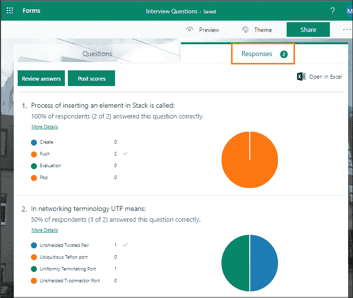

## 在 Excel 中分析测验结果

要在 Excel 中分析测验结果，点击 **Excel** 选项**中的**打开** **。****

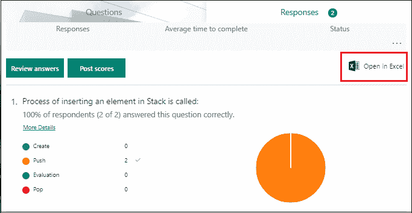

下面的截图显示了以 excel 形式分析的测验结果。

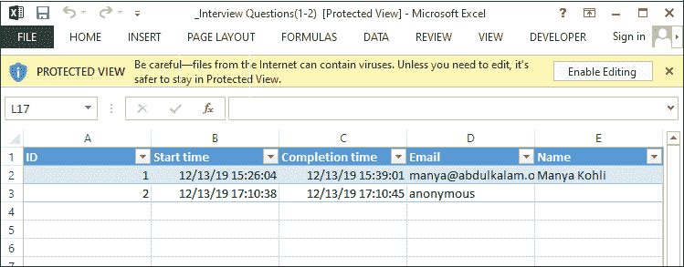

* * ***