# SharePoint 工作流

> 原文:[https://www.javatpoint.com/sharepoint-workflow](https://www.javatpoint.com/sharepoint-workflow)

SharePoint 工作流通过在 SharePoint 网站中的文档上实施业务流程，帮助人们协作处理文档和管理项目任务。它还通过管理任务来提高组织效率和生产率。

您可以在 SharePoint 工作流上执行以下任务-

*   查看可用于文档或项目的工作流列表。
*   对文档或项目启动工作流。
*   查看、编辑或重新分配工作流任务。
*   完成工作流任务。

## 创建工作流

创建工作流有以下步骤-

**第一步:**进入你网站的主页。点击**添加一个应用。**

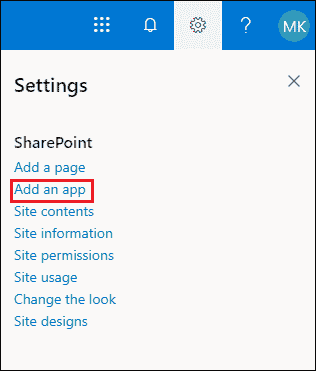

**第二步:**屏幕出现**应用列表**页面，根据您的需求选择应用。

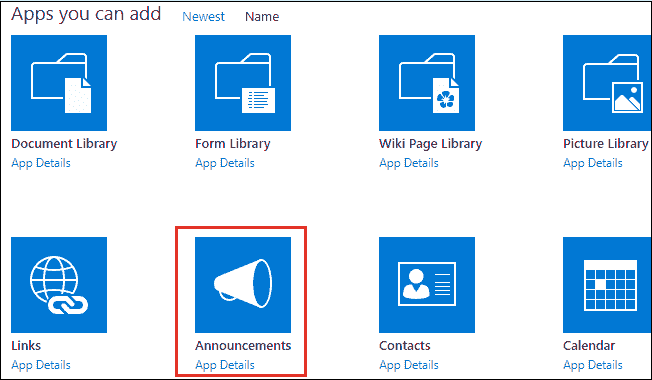

#### 注意:在我们的情况下，我们选择公告。

**第三步:**出现一个小的**弹出窗口**，其中**输入** **想要添加的** **名称**，点击**创建**。现在，去**网站** **内容**搜索你最近创建的文件。找到文件后，点击它。

下面截图显示新建**节假日公告列表**。

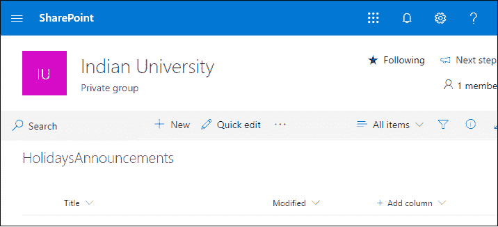

**第四步:**转到屏幕右上角的**设置图标**，从下拉菜单中选择**列表设置**。一旦列表设置窗口出现在屏幕上，向下滚动窗口并点击**创建栏**。

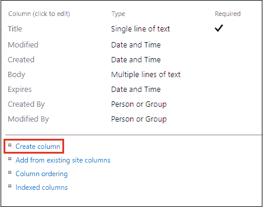

**第五步:a)。**输入要创建的列的名称，并选择该列的信息类型。

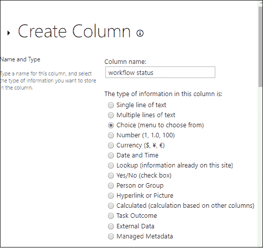

b)。在附加栏设置中，**输入类型选择**，点击屏幕下方的**确定**。

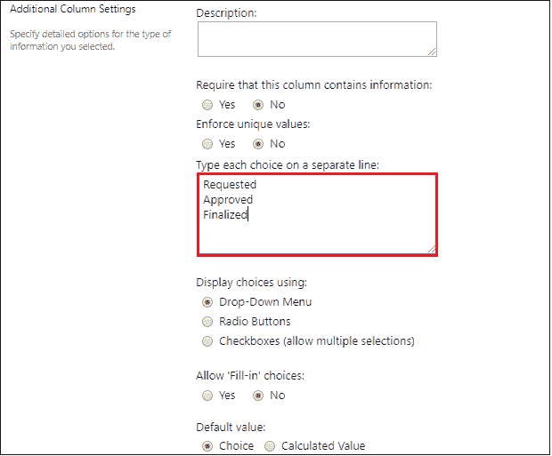

**第六步:**从列表设置页面点击**工作流程设置**。

**第七步:**工作流设置页面出现在屏幕上，在其中点击**添加一个工作流**。

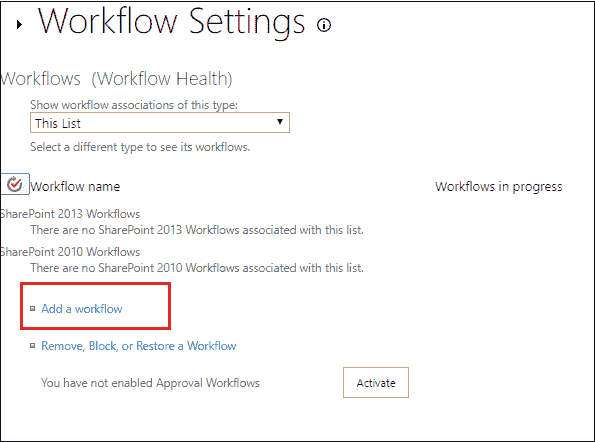

**第 8 步:**在添加工作流页面，输入工作流的名称，在我们这里是**“假日工作流。”**

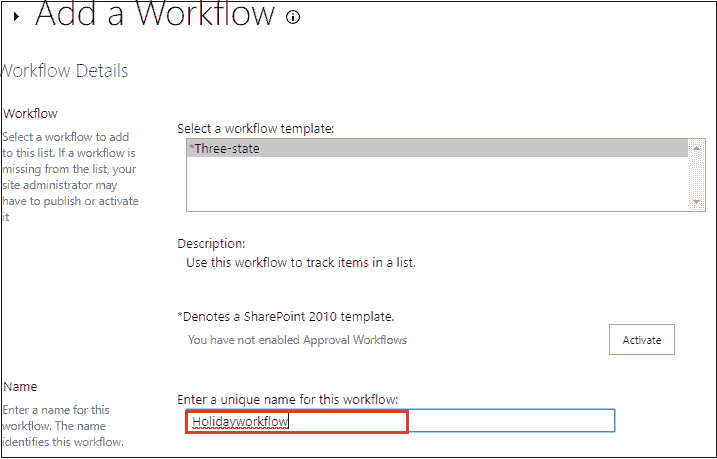

**第九步:**选择一个**任务列表**，在**上打勾新建一个项目将** **开始这个工作流程**，点击**下一步**。

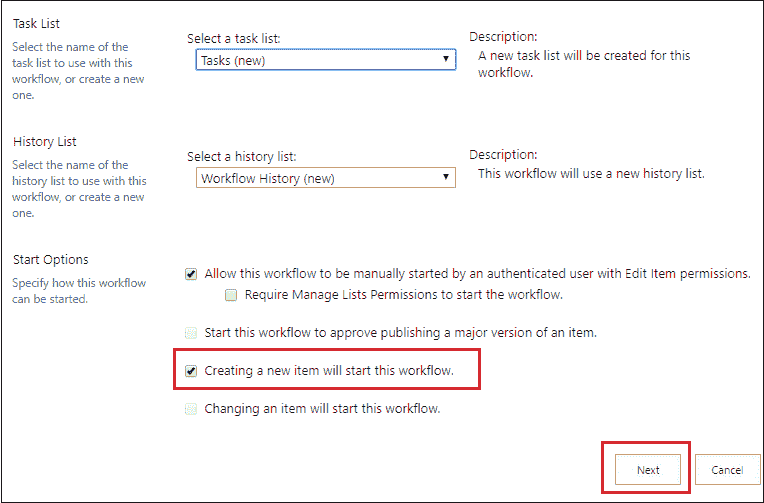

**步骤 10:** 自定义**三态工作流**窗口出现在屏幕上，向下滚动窗口，在任务详细信息中，选择任务分配给:自定义，并输入要为其分配任务的用户名。

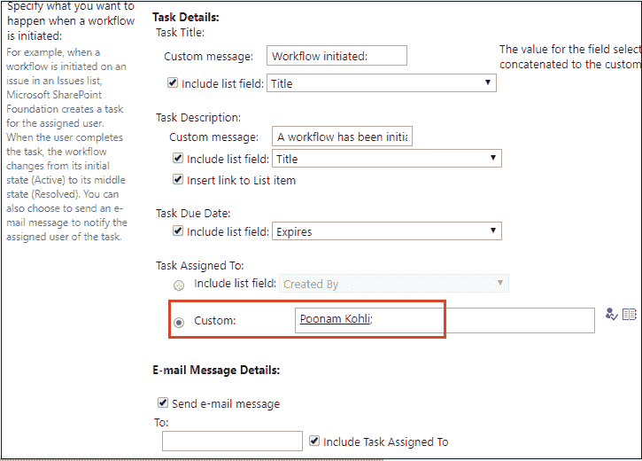

**第 11 步:**选择自定义并输入用户名，点击屏幕下方的**确定**。

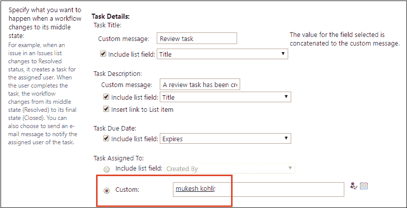

**第 12 步:**点击**+新建**，屏幕右上角出现新建项目窗口，输入所需信息，点击**保存**。

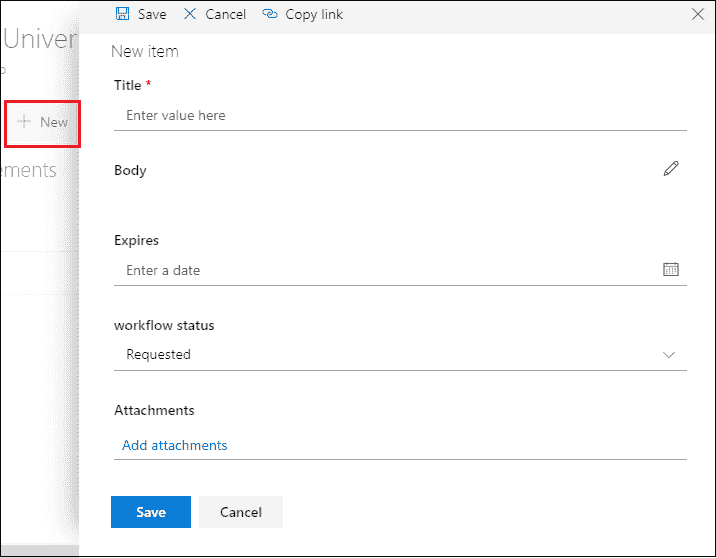

**第 13 步:**现在，刷新页面，可以看到一个度假工作流正在**进行中**。点击**进行中**。

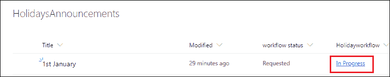

单击“进行中”后，屏幕上会出现“工作流状态”窗口。此窗口向您显示任务和工作流历史记录，为此，请考虑下面的截图。

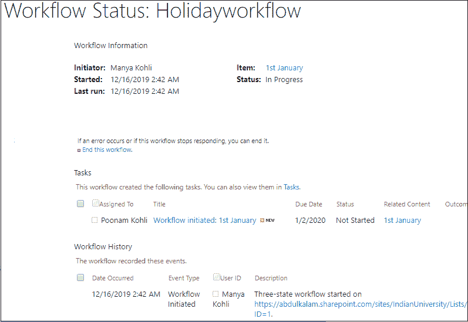

## 工作流如何生成任务？

转到站点内容，您可以看到系统生成了一个任务列表。单击任务列表。

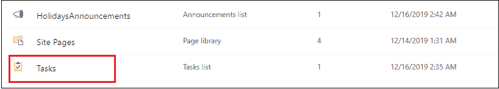

点击**更多选项** ( **三点**，从下拉菜单中选择**编辑项**。

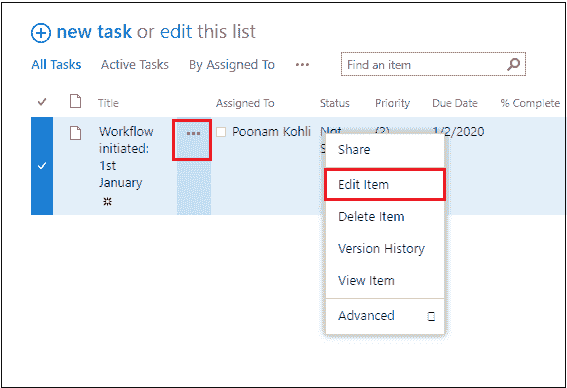

点击**显示更多**，从下拉菜单中选择状态为**完成**，点击**保存**。

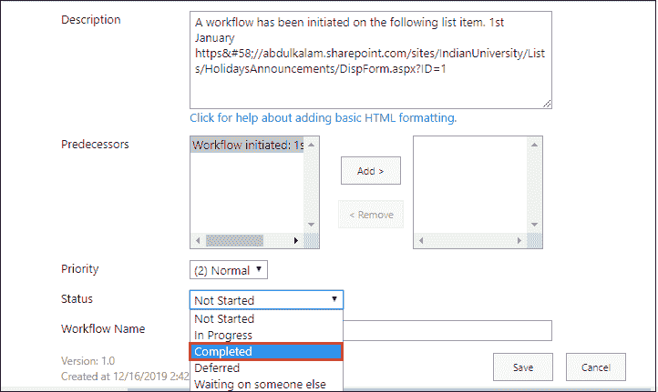

现在，转到**假期通知**页面，您将看到您的假期工作流状态为**已批准**。

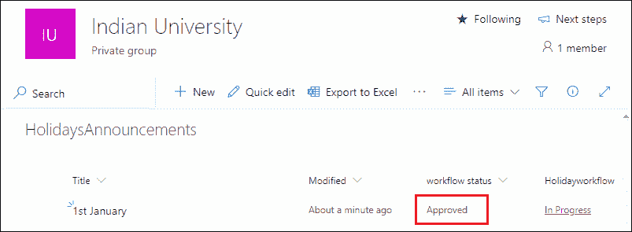

当您单击进行中时，您可以看到一个新条目“任务已完成”。

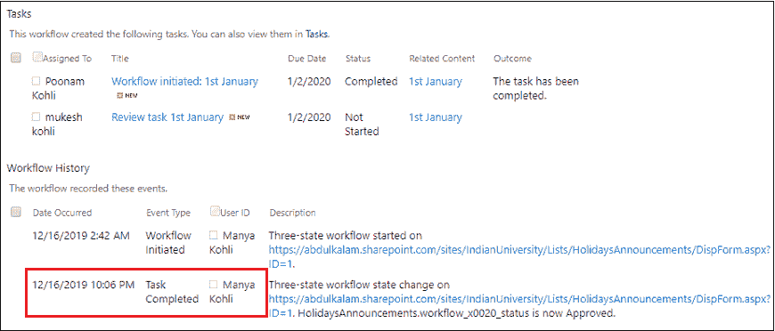

## 通知用户任务已完成

转到网站内容->任务，然后单击屏幕左上角的编辑项目。

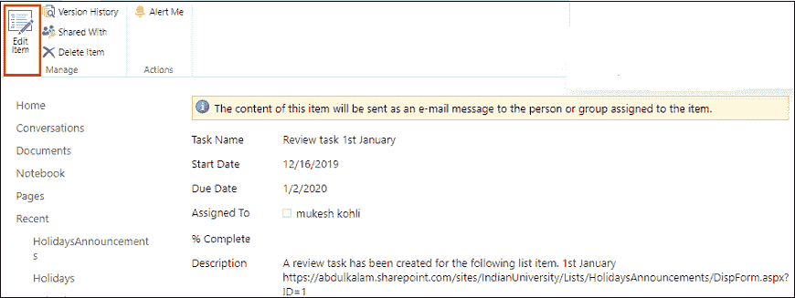

屏幕上出现以下窗口，点击更多显示，从下拉菜单中选择状态**完成**，点击保存。

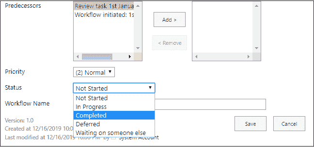

现在，转到假日通知，您可以看到工作流状态为“已完成”，工作流状态为“已完成”。

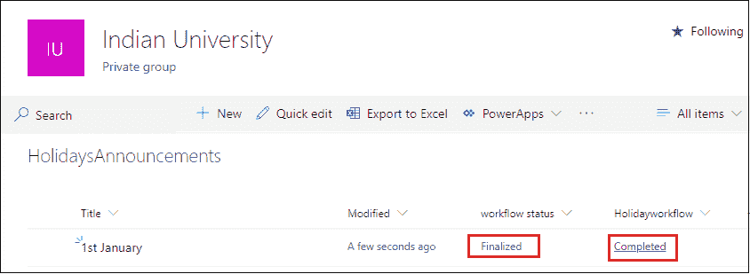

考虑上面的截图，点击完成查看所有任务和工作流历史的列表。

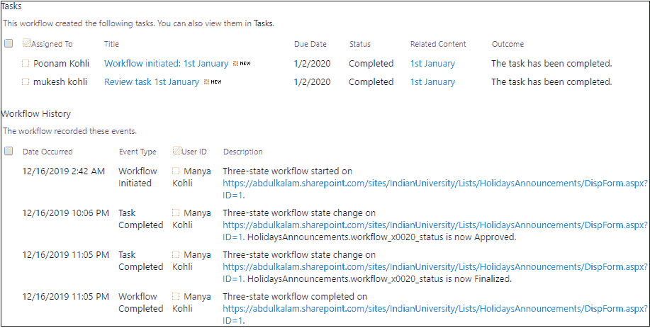

* * *