# SharePoint 文档集

> 原文：<https://www.javatpoint.com/sharepoint-document-sets>

SharePoint 文档集是一种特殊的内容类型，允许用户将他们可以作为单个实体管理的相关文档分组。在 SharePoint 中，您可以轻松地一步创建文档集，还可以定义其特征和元数据(数据中的数据)。

SharePoint 文档集有以下功能-

*   **权限-** 文档集有权限设置自己的权限。文档集中的内容类型可以继承这些权限。
*   **可用内容类型-** 这些是文档集中允许的预定义内容类型。
*   **工作流-** 工作流允许您围绕整个文档组而不是单个文档构建流程。
*   **信息管理策略-** 它允许您围绕文档集指定默认保留、条形码和标签策略。
*   **元数据-** 文档集包含自己的元数据。
*   **欢迎页面-** 显示标题和元数据，对文档集的内容进行概述。

## 创建文档集

创建文档集有以下步骤-

**步骤 1:启用文档集**

默认情况下，SharePoint 中不启用文档集内容类型。所以要创建文档集，第一步是启用文档集。

一、进入屏幕右上角**设置图标**，选择**站点信息**。

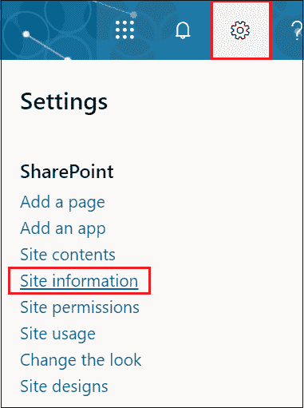

二.屏幕右上角出现**编辑站点信息**窗口。向下滚动窗口，点击**查看所有站点设置**。

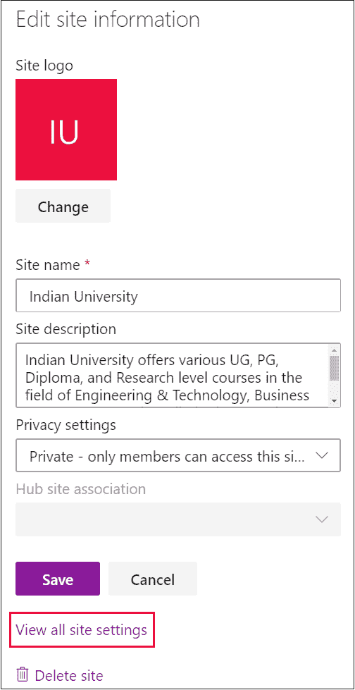

三.出现站点设置窗口，在其中搜索**站点集合功能**。获得网站集功能后，单击它。

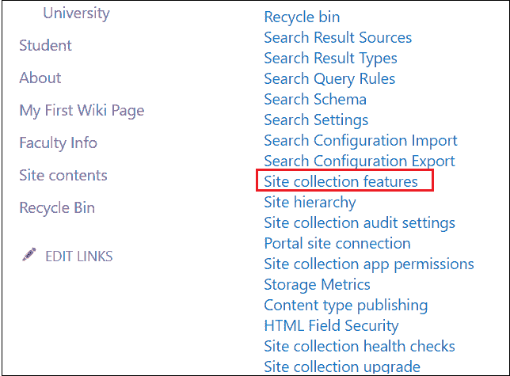

四.出现以下屏幕。向下滚动窗口并搜索文档集。单击与文档集关联的激活。单击激活后，屏幕上会出现一个蓝色小按钮激活。

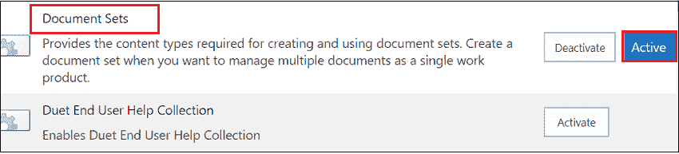

**步骤 2:创建文档集内容类型**

**i** 。要创建内容类型，请转到**设置图标** - > **站点设置**。

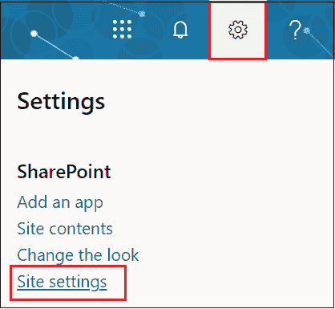

**ii** 。在网站设置页面，点击**网站内容类型**。

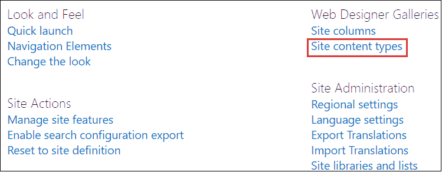

**三**。在网站内容页面，点击屏幕顶部的**创建**。

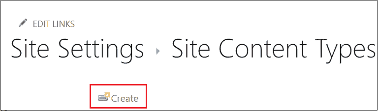

**iv** 。在以下窗口中，输入内容类型的名称。

**父内容类型:**

从以下内容中选择父内容类型:文档集内容类型

父内容类型:文档集

如果您在“新网站内容类型”中填写信息，请单击“确定”。

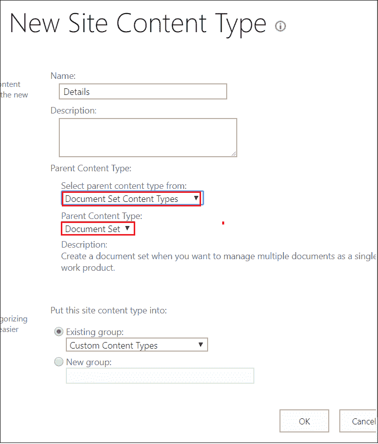

下面的截图显示创建了一个名为**细节**和父**文档集**的内容类型。

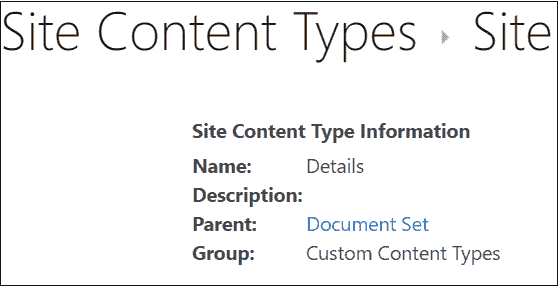

**第三步:向文档库添加内容类型**

要将内容类型添加到文档库中，首先需要创建库。

**一、**进入**首页**，选择**网站内容**。

**二。**点击**+新建**，选择**文档库**。屏幕的右上角出现一个弹出窗口，其中**输入库名**并点击**创建**。

**三。**文档库创建后。转到**设置图标** - > **库设置**

**iv。**设置页面出现在屏幕上，点击高级设置。

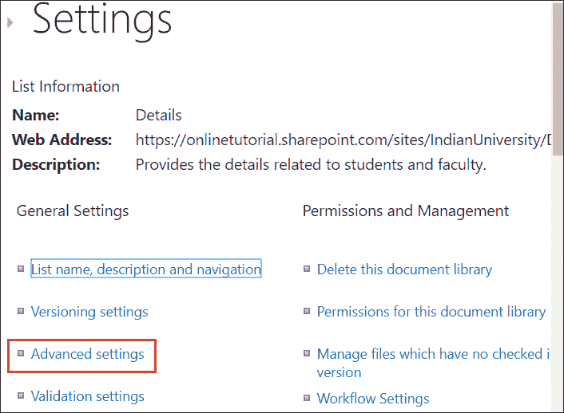

**v.** 在**高级设置上，**屏幕出现一个窗口，根据您的要求选择设置选项，点击屏幕下方的**确定**。

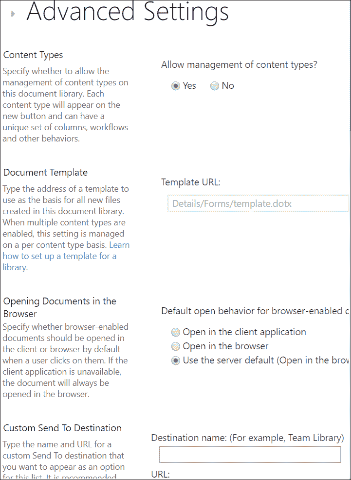

**vi .**现在，转到**库设置**，向下滚动屏幕，您将看到内容类型。在此页面，只需点击**从现有网站添加内容类型**。

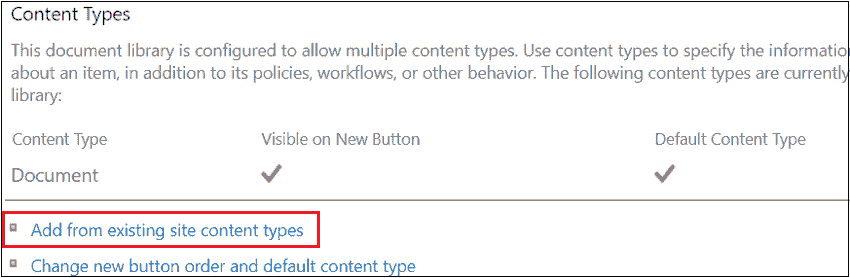

从下拉菜单中选择**自定义内容类型表单**，屏幕上出现**可用网站内容类型**，选择您想要添加的内容类型。单击添加后，内容将添加到右侧窗格中。点击屏幕下方的**确定**。

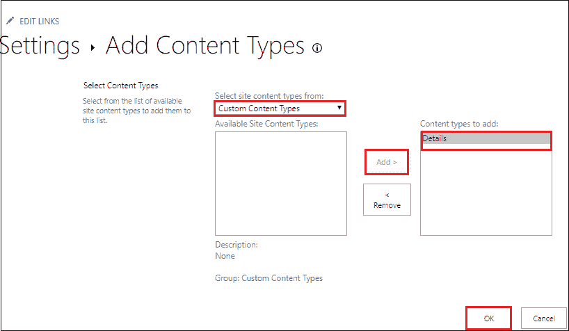

## 删除默认内容类型

要删除默认内容类型，向下滚动窗口，在列表设置页面点击**文档**。

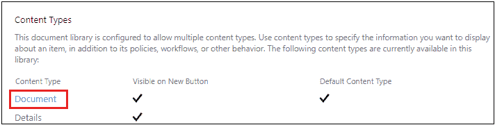

点击**删除该内容类型。**

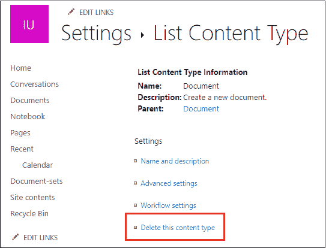

出现一个小弹出窗口，点击确定。

**第 4 步:创建元数据列**

要创建元数据，请转到**设置** - > **库** **设置**。向下滚动窗口，点击**内容** **类型**。

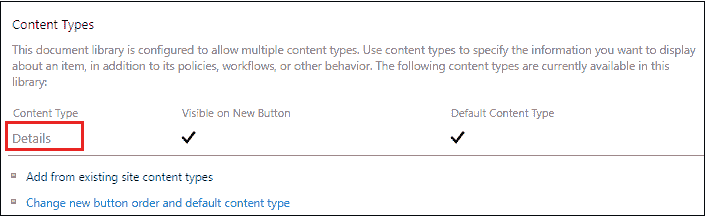

在列表内容类型中，可以看到只有三列，分别是:**标题、名称和描述**。要添加新栏，点击**从现有网站添加**或**列表栏**。

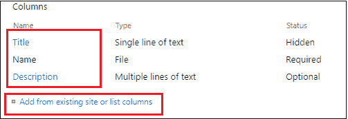

屏幕上出现添加列页面，根据您的要求选择列，点击添加，然后点击屏幕底部的**确定**。

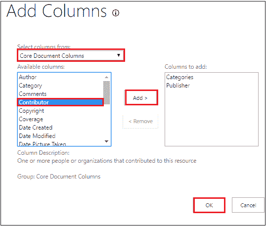

**第五步:配置文档集设置**

在设置页面中，单击文档集设置。

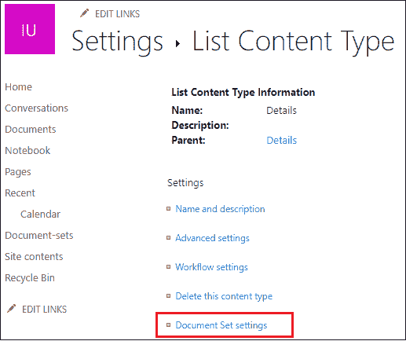

在内容类型中，根据您的要求选择文档集设置。

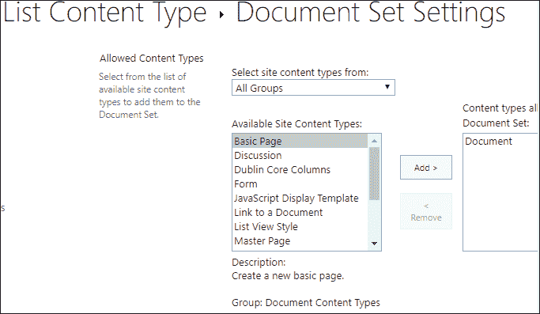

## 自定义欢迎页面

向下滚动文档集设置页面，点击**自定义欢迎** **页面**。

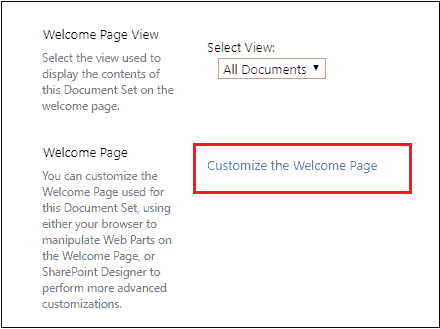

出现如下窗口，点击**页面**，选择**编辑页面**。

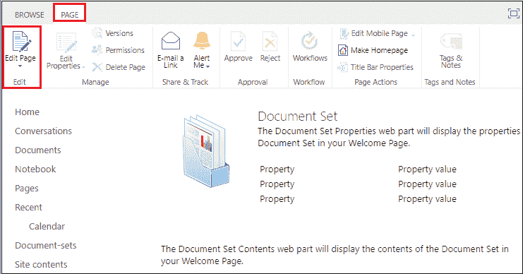

根据您的要求编辑页面。编辑完成后，点击屏幕左上角的**停止编辑**，关闭窗口。

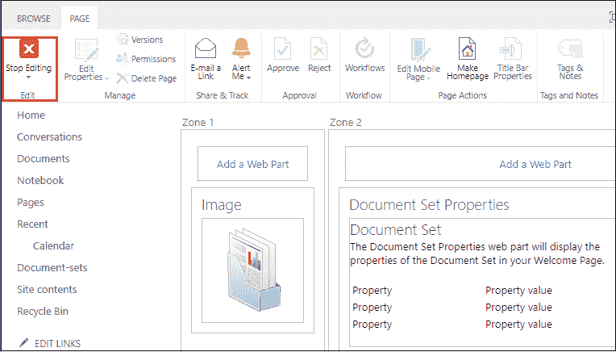

在文档集设置页面点击**确定**。

现在，转到**快速启动菜单**中的文档集。屏幕上出现“文档集”窗口。点击+ **新建**并从下拉菜单中选择您的**库名**。

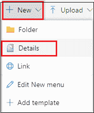

屏幕上将出现“新建文档集:详细信息”页面。填写所需信息，然后单击保存。

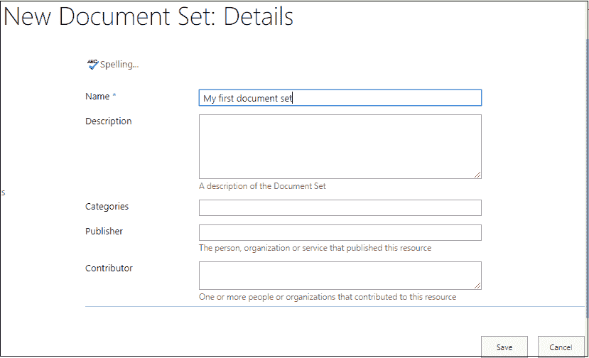

下面的截图显示一个新的文档集被创建。

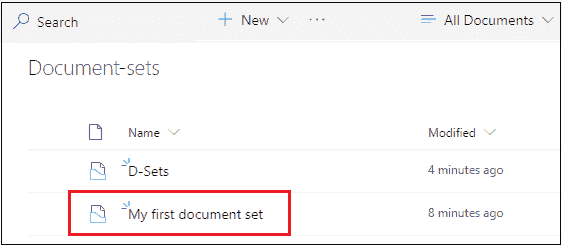

* * *