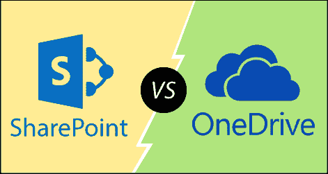

# SharePoint 与 OneDrive

> 原文：<https://www.javatpoint.com/sharepoint-vs-onedrive>

众所周知，SharePoint 和 OneDrive 都是基于云的平台，允许您在不同的设备上存储、共享和同步文件。SharePoint 和 OneDrive 允许企业改进工作方式。

下表显示了 SharePoint 和 OneDrive 之间的区别-

| 平台 | OneDrive |
| 它在团队站点中存储团队的业务文档。 | 它存储业务文档供您自己使用。 |
| SharePoint 用于存储文件，还包括一些附加功能，如**协作、CMS、**和**仪表盘**。 | OneDrive 基本上用于存储文件。 |
| SharePoint 允许您在网站上发布内容。 | OneDrive 不允许您在网络上发布内容。 |
| 也被称为“**队部**” | 它也被称为“**存储位置**” |
| SharePoint 允许您创建网站。 | 使用 OneDrive，您无法创建网站。 |

* * *