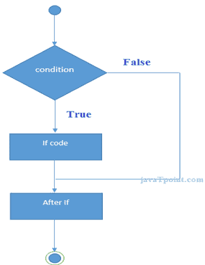

# F#条件表达式

> 原文：<https://www.javatpoint.com/f-sharp-conditional-expressions>

在 F#编程中， *if 语句*用于测试条件。F#中有各种类型的 if 表达式。

*   如果那么表达
*   如果是别的表情
*   如果是，那么 elif 阶梯表达式

## F#如果-那么表达式

F# if 表达式测试条件。如果条件为真，它将执行代码。

```
if boolean-expression then 
   expression  	// code to be executed

```



* * *

## F# If-then 示例

```
let num = 10
if (num%2=0) then
printfn "It is even number"

```

输出:

```
It is even number

```