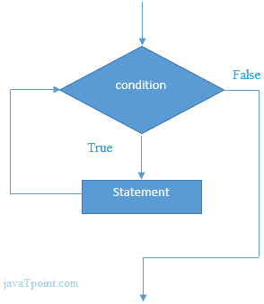

# 当循环时

> 原文：<https://www.javatpoint.com/f-sharp-while-loop>

在 F# 中，while 循环用于多次迭代程序代码。如果您不知道之前的迭代次数，建议使用 while 循环。

```fs
while test-expression do
    body-expression

```

**流程图:**



## F# 嵌套边循环

F# 允许在另一个 while 循环中有一个 while 循环，这就是所谓的嵌套循环。当外部循环执行一次时，内部 while 循环完全执行。

让我们看一个嵌套 while 循环的例子。

```fs
let mutable a=1;    
while(a<=3) do  
  let mutable b = 1;  
  while (b <= 3)  do
    printfn "%d %d" a b   
    b<- b+1
  a<- a+1

```

输出:

```fs
1 1
1 2
1 3
2 1
2 2
2 3
3 1
3 2
3 3

```

## 无限循环示例

使用**真**文字作为测试条件，可以创建无限 while 循环。建议安全地使用无限循环，否则可能会导致内存溢出错误，或者您的系统可能会暂停。

```fs
while(true) do
 printfn "Infinitive While Loop"

```

输出:

```fs
Infinitive While Loop
Infinitive While Loop
Infinitive While Loop
Infinitive While Loop
Ctrl+Z

```