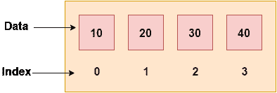

# F# 数组

> 原文：<https://www.javatpoint.com/f-sharp-arrays>

数组是同一类型数据的可变集合。它从 0 索引开始，到 n-1。这里，n 是数组的长度。F# 阵列支持系统中所有可用的功能。数组.NET 框架。



### F# 数组类型

F# 主要提供两种类型的数组

1.  一维数组
2.  多维数组

* * *

## F# 一维数组

可以通过添加由分号(；)分隔的[|和|]之间的值来创建数组。).

```
let arr  =  [| 1; 2; 3; 4; 5; |]

```

您也可以使用表达式序列来创建数组。下面的示例创建一个值在 1 到 10 之间的整数数组。

```
let arr = [| for i in 1..10->i |]

```

* * *

## F# 创建数组的内置方法

System.Array 中有各种内置方法，有助于根据需求创建数组。您可以使用这些方法在 F# 中创建数组。

| 方法 | 描述 |
| Array.empty Ex。让 arr = Array .空 | 它创建一个不包含元素的新数组。 |
| 数组。创建 Ex。让 arr = Array .创建 10 ^ 2 | 它创建一个指定大小的数组，并将所有元素设置为提供的值。 |
| Array.init Ex。让 arr = array . init 10(fun index-> index) | 它通过使用给定的维度和函数生成元素来创建数组。 |
| Array.zeroCreate Ex。让 arr = Array.zeroCreate 10 | 它创建一个数组，其中所有元素都初始化为零。 |

* * *

## F# 一维数组示例

```
let arr = [| 1; 2; 3; 4; 5; |]               // Creating and initializing array
for i = 0 to arr.Length-1 do           		// Traversing of array
  printfn "%d" arr.[i]

```

输出:

```
1
2
3
4
5

```

* * *

## 使用表达式序列的 F# 一维数组

```
let arr = [| for i in 1..10 -> i |]
for i = 0 to arr.Length-1 do  		
 printfn "%d" arr.[i]

```

输出:

```
1
2
3
4
5
6
7
8
9
10

```

* * *

## F# 使用数组创建一个数组。使用 For-In 循环创建方法和遍历

方法创建一个指定长度的数组，并按指定的值设置整个数组。您可以使用 Array.set 方法，后跟索引和值，来分配或设置新值。

```
let arrayName = Array.create 5 0
Array.set arrayName 1 12      		// Set element to given index using set function
for i in [0..arrayName.Length-1] do
 printfn "%d" arrayName.[i]

```

输出:

```
0
12
0
0
0

```

* * *

## F# 将数组传递给函数:打印数组元素

```
let printArray(arr:int[]) =
  printfn "Printing array elements:"
  for i = 0 to arr.Length-1 do
    printfn "%d" arr.[i]

let arr1 = [|25; 10; 20; 15; 40; 50; |]  
let arr2 = [| 12; 23; 44; 11; 54; |] 
printArray arr1
printArray arr2

```

输出:

```
Printing array elements:
25
10
20
15
40
50
Printing array elements:
12
23
44
11
54

```

* * *

## F# 将数组传递给函数:打印最小数量

```
let printArray (arr:int[]) =
  let mutable min = arr.[0]
  printf "Minimun element is: "
  for i = 1 to arr.Length-1 do
   if(min>arr.[i])then
    min 
```

输出:

```
Minimun element is: 10
Minimun element is: 11

```

* * *

## F# 将数组传递给函数:打印最大数量

```
let printArray (arr:int[]) =
  let mutable max = arr.[0]
  printfn "Maximum element is: "
  for i = 1 to arr.Length-1 do
   if(max<arr.[i])then
    max <- arr.[i]
  printfn "%d" max  

let arr1 = [|25; 10; 20; 15; 40; 50;|]
let arr2 = [|12; 23; 44; 11; 54;|]
printArray arr1

```

输出:

```
Maximum element is: 50
Maximum element is: 54

```

* * *

## F# 多维数组

F# 允许我们创建多维数组。多维数组也称为数组的数组。它可以是二维的，三维的或者更多。

在 F# 中，可以创建多维数组，但是没有用于编写多维数组的语法。F# 使用 array2D 运算符从数组元素序列中创建二维数组。序列可以是数组或列表。

* * *

## F# 多维数组

这里，我们使用 array2D 运算符创建一个 2D 数组。

```
let arr = array2D [ [ 1; 0]; [0; 1] ]
for i = 0 to 1 do
 for j = 0 to 1 do
   printf "%d " arr.[i,j]
 printf "\n"

```

输出:

```
1 0
0 1

```

* * *

## F# 不使用循环打印数组矩阵

可以在 printf 函数中使用% **A** (格式说明符)打印数组矩阵。

```
let arr = array2D [| [| 1; 0 |]; [| 0; 1 |] |]
printf "%A" arr

```

输出:

```
[[1; 0]
 [0; 1]]

```