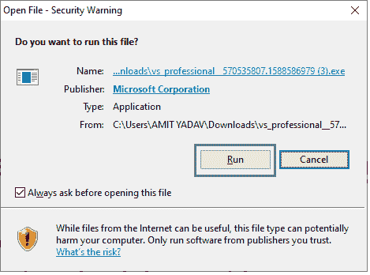
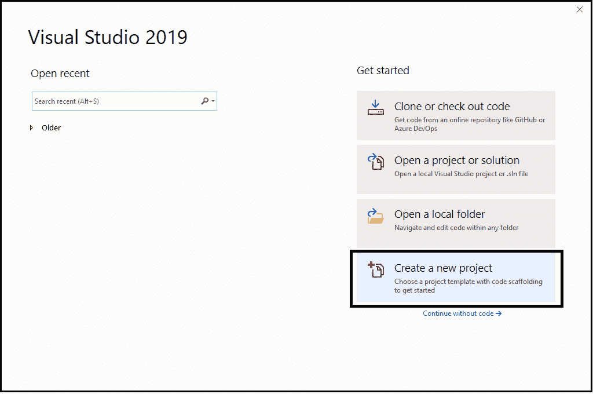

# 如何下载和安装 Visual Studio

> 原文：<https://www.javatpoint.com/vb-net-download-and-install-visual-studio>

在本主题中，我们将了解 Visual Studio 的介绍、版本、**以及如何为 about 下载和安装 Visual Studio** 。

Visual Studio 是微软提供的集成开发环境(IDE)，开发人员可以在其中编写和执行程序，轻松开发各种类型的应用程序，如 Windows、基于 Web、基于控制台、Windows 窗体和移动应用程序。它有丰富的工具集合，用于编写和修改程序，也有助于检测和纠正程序中的错误。它不是一个特定语言的 IDE，它意味着 Visual Studio 不仅仅是针对 VB.NET 语言的，你可以用它在 [C#](https://www.javatpoint.com/c-sharp-tutorial) 、visual basic、 [C++](https://www.javatpoint.com/cpp-tutorial) 、 [Python](https://www.javatpoint.com/python-tutorial) 、 [JavaScript](https://www.javatpoint.com/javascript-tutorial) 以及 Visual Studio 支持的更多语言中编写代码。它支持 36 种用于开发应用程序的不同语言。它有一个内置的编译器来运行应用程序，它也适用于[窗口](https://www.javatpoint.com/windows)和苹果操作系统。

**版本的 Visual Studio**

*   Visual Studio 于 1997 年推出了 First 版本，并将其命名为 Visual Studio 97。
*   Visual Studio 6.0 版本号于 1998 年推出，发音为 Visual Studio 6.0
*   视觉 Studio.NET 于 2002 年发布，版本号为 7.0。
*   视觉 Studio.NET 于 2003 年发布，版本号为 7.1。
*   Visual Studio 2005 于 2005 年发布，版本号为 8.0。
*   Visual Studio 2008 于 2007 年发布，版本号为 9.0。
*   Visual Studio 2010 于 2010 年发布，版本号为 10.0。
*   Visual Studio 2012 于 2012 年发布，版本号为 11.0。
*   Visual Studio 2013 于 2013 年发布，版本号为 12.0。
*   Visual Studio 2015 于 2015 年发布，版本号为 14.0。
*   Visual Studio 2017 于 2017 年发布，版本号为 15.0。
*   Visual Studio 2019 于 2019 年发布，版本号为 16.0。

### 如何为 VB.NET 下载和安装 Visual Studio？

现在我们将按照程序下载 Visual Studio IDE，这样我们就可以简单地在 VB.NET 开发程序了。

**第一步。**要下载 [Visual Studio IDE](https://www.javatpoint.com/install-visual-studio) ，请通过以下链接:

[https://www.visualstudio.com/downloads](https://www.visualstudio.com/downloads)

**选择一个下载 IDE**

*   Visual Studio 2019 社区版
*   Visual Studio 2019 专业版(90 天免费试用)
*   以及 Visual Studio 2019 企业版(90 天免费试用)

在本教程中，我们将使用 Visual Studio 2019 专业版

**第二步。**点击下载链接，开始下载。如下图所示。

**第三步。**点击。然后，它显示一个弹出窗口。

**第四步。**点击**运行**按钮，出现下图。

**第五步。**点击**继续**按钮

**第六步。**点击继续后，Visual Studio 将开始下载其初始文件，如下图所示。

**第七步。**如下图，点击安装按钮。

**第八步。**点击安装按钮后，您的 Visual Studio IDE 将开始下载，然后显示屏幕，如下所示。

**第九步。**从上图中，选择**。NET 桌面开发**点击安装打开可能需要一段时间在你的系统中下载 Visual Studio，如下图所示。

**第十步。**成功下载并安装 Visual Studio 的支持文件后，它会在您的系统中显示以下屏幕。

**第 11 步。**点击启动按钮，屏幕上会出现下图，表示 Visual Studio 已经在你的机器上成功启动。

然后它显示一个下面的屏幕来选择 Visual Studio 主题。默认情况下，它采用蓝色主题，如果您想更改，可以通过单击其他主题轻松更改 Visual Studio 主题。

**第 12 步。**选择主题后，点击**启动 Visual Studio** ，然后它会在您的系统屏幕中显示一个下图，用于创建新项目。

**第十三步。**点击**新建项目**后，出现下图，选择你要在 Visual studio 中构建什么类型的应用。在这种情况下，您可以选择基于控制台的应用程序或基于窗口表单的应用程序，如下图所示。这里我们选择了基于控制台的应用程序，然后点击**下一步**按钮。

**第 14 步。**点击**下一步**按钮，显示下图定义项目名称，同时提醒是否要将解决方案和项目放在同一个目录下。

**第 15 步。**最后，您的新项目将成功创建。

* * *