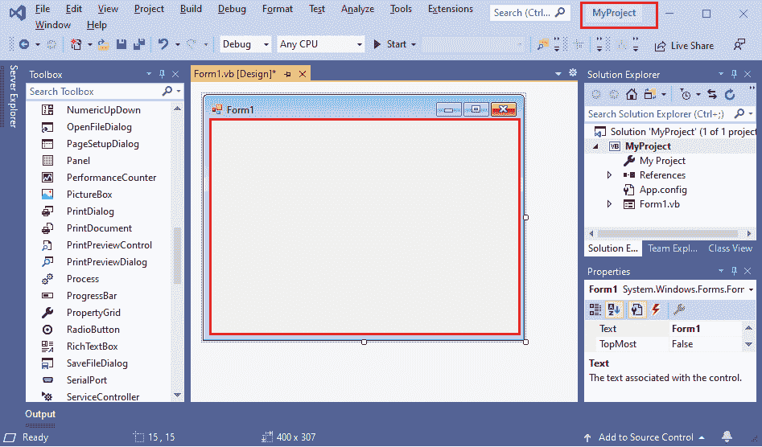

# VB.NET 你好世界计划

> 原文：<https://www.javatpoint.com/vb-net-hello-world-program>

在前一个主题中，我们已经安装了 Visual Studio 2019，并创建了一个名为**myonsolapp1**的基于控制台的项目。现在在这个项目中，我们将创建我们的**你好世界 VB.NET 项目。**

VB.NET 定义以下结构来创建程序:

*   命名空间声明
*   过程可以是多个
*   定义一个类或模块
*   变量
*   主要程序
*   陈述和表达
*   评论

在 MYConsoleApp1 项目中创建一个 **Hello_Program.vb** 文件，并编写以下代码:

**Hello_Program.vb**

```

Imports System 'System is a Namespace
Module Hello_Program

    Sub Main()

        Console.WriteLine("Hello, Welcome to the world of VB.NET")
        Console.WriteLine("Press any key to continue...")
        Console.ReadKey()

    End Sub

End Module

```

让我们通过按 F5 键编译并运行上面的程序，我们得到如下输出。

**输出:**


## 编译和执行 VB.NET 程序的另一种方法

我们还可以使用命令提示符来编译和执行 VB.NET 程序，而不是使用 Visual Studio IDE。

**第一步:**在 MYConsoleApp1 项目中创建并保存 **Hello_Program.vb** 文件后，打开命令提示符并执行命令，如提示符中所示。

你可以写你的项目名来代替我的个人主页。


**第二步:**之后，写 **vbc Hello_Program.vb** ，如下图。


**第三步:**如果编译时没有发现错误，则转移下一行的控制，生成 **Hello_Pogram.exe** 文件。

**第四步:**输入 **Hello_Program** 运行程序。我们得到以下输出。

**输出:**

```
Hello, Welcome to the world of VB.NET. 

```

现在我们将了解 VB.NET 计划的基本结构:

*   在 VB.NET 编程中，程序的第一行是“ **Import System** ”，其中 Imports 是继承系统命名空间的语句。一个**系统是一个命名空间**，包含基本类、引用数据类型、事件、属性和各种帮助运行程序的内置函数。
*   第二行定义了**模块**，它指定了 VB.NET**文件名**。我们知道，VB.NET 语言是一种完全面向对象的语言，所以每个程序都必须包含一个模块或类，您可以在其中编写包含模块内数据和过程的程序。

```

Module Module1
End Module

```

*   您可以在类和模块中定义多个过程。通常，该过程包含要运行的可执行代码。程序可能包含以下功能:
    *   功能
    *   操作员
    *   潜水艇
    *   得到
    *   一组
    *   阿德玛
    *   定义
*   每个程序必须包含一个 Main()方法。在 VB.NET，有一个 main()方法或过程代表执行程序的起点，正如我们在 C 语言中看到的，它们的入口点是 Main()函数。
*   注释(')符号用于对程序中被编译器忽略的行进行注释，为了更好地理解程序，使用注释是一种很好的做法。
*   控制台。WriteLine()是控制台类的一个方法。它用于打印应用程序中的任何文本或消息。和控制台。ReadKey()用于将单个字符从键盘读回 Visual Studio IDE。

### 使用 Windows 窗体创建一个 VB.NET 程序

如果要在 Visual Studio 中创建新的基于窗口的项目，请按照下面给出的步骤操作:

**第一步。**启动 [Visual Studio IDE](https://www.javatpoint.com/vb-net-download-and-install-visual-studio) 。

**第二步。**创建项目，点击**文件- >选择- >新建- >项目**


屏幕上出现以下[窗口](https://www.javatpoint.com/windows)。

**步骤 3:** 选择**窗口表单应用程序(.NET Framework)** 点击下一步按钮。


**第 4 步:**使用位置中的浏览按钮，提供项目名称和存储项目文件的位置。


**第五步:**点击**创建**按钮。屏幕上会出现以下窗口。



**第六步:**现在双击 Form1.vb (Design)文件的中间区域，显示如下代码。


**Form1.vb**

```

Public Class Form1
    Private Sub Form1_Load(sender As Object, e As EventArgs) Handles MyBase.Load
        MsgBox("Welcome to the JavaTpoint")
    End Sub
End Class

```

**步骤 7:** 将文件另存为 **Form1.vb** 。

**第八步:**编译运行 **Form1.vb** 文件，在 Visual Studio 中按 F5 键或 Start 键。它显示了以下输出。


* * *