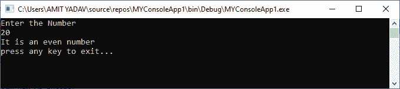
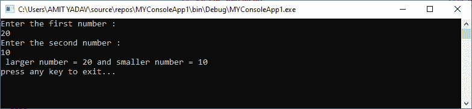
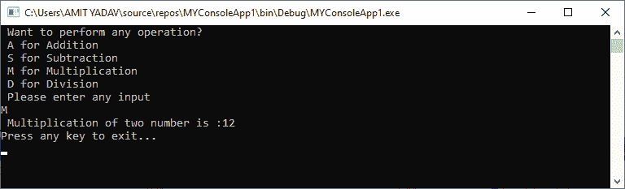

# VB.NET 控制报表

> 原文:[https://www.javatpoint.com/vb-net-control-statements](https://www.javatpoint.com/vb-net-control-statements)

在**VB.NET**中，**控制语句**是根据指定条件控制程序执行的语句。这对于确定条件是否成立很有用。如果条件为真，则执行单个语句或语句块。在控制语句中，我们将使用 **if- Then，if Then Else，if Then ElseIf** 和 **Select case** 语句。

我们可以用语句定义程序要评估的多个条件。如果定义的条件为真，则根据该条件执行语句或块，如果条件为假，则执行另一条语句。

下图显示了用于验证和执行语句的决策控制语句的常见格式:


上图显示如果定义的条件为真，将执行 statement_1，如果条件为假，将执行 statement_2。

VB.NET 提供以下有条件的或决策性的陈述。

*   如果-那么陈述
*   如果-那么其他陈述
*   如果-那么其他语句
*   选择案例陈述
*   嵌套选择案例语句

### 如果-那么陈述

**If-Then** 语句是定义一个或多个条件的控制语句，如果满足特定条件，它将执行一条信息或语句。

**语法:**

```

If condition Then
[Statement or block of Statement]
End If

```

在 **If-Then** 语句中，**条件**可以是布尔、逻辑或关系条件，该语句可以是条件为真时将执行的单个或一组语句。

**例 1:** 写一个简单的程序，在 print 打印一份对账单。

**Module1.vb**

```

Module Module1
	' Declaration of variable str
    Dim str As String = "JavaTpoint"
    Sub Main()
        ' if str equal to "JavaTpoint", below Statement will be executed.
        If str = "JavaTpoint" Then
            Console.WriteLine("Welcome to the JavaTpoint")
        End If
	Console.WritLine("press any key to exit?")
	Console.ReadKey()
    End Sub
End Module

```

现在通过点击开始或 F5 按钮编译并执行上述程序，它显示以下输出:


从上例中我们可以看到，如果 **str** 的值等于 **JavaTpoint** ，则条件为**真**，打印出对账单。

**例 2:** 在 print 写一个程序打印一个大于另一个数的数。

**if _ statement 2 . VB**

```

Module if_statement2
    Sub Main()
        ?Definition of variables
        Dim no1, no2 As Integer
        Console.WriteLine("Enter any two number:")
        no1 = Console.ReadLine() ?read no1 from user
        no2 = Console.ReadLine() ?read no2 from user
        If no1 > no2 Then
            Console.WriteLine("First number is greater than second number")
        End If
        If no1 < no2 Then
            Console.WriteLine("Second number is greater than First number")
        End If
        Console.WriteLine("press any key to exit...")
        Console.ReadKey() 
End Sub
End Module

```

现在通过点击开始或 F5 按钮编译并执行上述程序，它显示以下输出:


在上面的程序中，我们使用关系运算符输入两个数字来查找更大的数字。如果第一个数字大于另一个，则执行第一条语句；否则，将执行第二条语句。

### 如果-那么-否则语句

当条件为真时， **If-Then** 语句可以执行单个或多个语句，但是当表达式计算为 **false** 时，它什么也不做。因此，这里出现了**如果-那么-否则**声明。IF-Then-Else 语句告诉 **If** 条件做什么当 IF 语句为假时，它执行 Else 语句。VB.NET 的 If-Then-Else 语句语法如下:

**语法:**

```

If (Boolean_expression) Then
'This statement will execute if the Boolean condition is true
Else
'Optional statement will execute if the Boolean condition is false
End If

```

**流程图**


上图表示如果布尔表达式(条件)为**真**，则执行 if 语句，如果布尔表达式为假，则执行 **Else 代码或语句**。之后，控制转移到下一个语句，紧接在 If-Then-Else 控制语句之后。

**例 1:** 写程序检查数字是偶数还是奇数。

**If _ Else _ statement . VB**

```

Module If_Else_statement
    Sub Main()
        Dim num As Integer
        Console.WriteLine("Enter the Number")
        num = Console.ReadLine() 'read data from console

        If (num Mod 2 = 0) Then ' if condition is true, print the if statement
            Console.WriteLine("It is an even number")

        Else 'otherwise, Else statement is executed.
            Console.WriteLine("It is an odd number")
        End If

	Console.WriteLine("press any key to exit...")
        Console.ReadKey()
    End Sub
End Module

```

现在通过点击开始或 F5 按钮编译并执行上述程序，它显示以下输出:



**例 2:** 写一个程序打印两个数字中较大的和较小的。

**if _ else _ statement 2 . VB**

```

Module if_else_statement2
    Sub Main()
        Dim a As Integer
        Dim b As Integer
        Console.WriteLine("Enter the first number : ")
        a = Console.ReadLine()

        Console.WriteLine("Enter the second number : ")
        b = Console.ReadLine()

        If a > b Then
            Console.WriteLine(" larger number = {0} and smaller number = {1} ", a, b)
        Else
            Console.WriteLine(" larger number = {0} and smaller number = {1} ", b, a)
        End If

        Console.WriteLine("press any key to exit...")
        Console.ReadKey()
    End Sub
End Module

```

现在通过点击开始或 F5 按钮编译并执行上述程序，它显示以下输出:



### VB.NET If-Then-else If 语句

**If-Then-ElseIf** 语句提供了从多个语句中只执行一个条件或语句的选择。执行从上到下开始，并检查每个“如果”条件。如果条件满足，则执行 if 语句块。而**如果没有一个**条件为真，则执行最后一个**块**。以下是 VB.NET 的 If-Then-ElseIf 语句的语法，如下所示:

**语法**

```

If(condition 1)Then
   ' Executes when condition 1 is true 
ElseIf( condition 2)Then
   ' Executes when condition 2 is true 
ElseIf( boolean_expression 3)Then
   ' Executes when the condition 3 is true 
Else 
   ' executes the default statement when none of the above conditions is true. 
End If

```

**流程图**

下图显示了 VB.NET 编程语言中 If-Else-If 语句的功能。


如果在 If-else-if 语句的流程图中该条件为真，则在 if 块中执行该语句。如果条件不为真，它将控制传递给下一个 ElseIf 条件，以检查条件是否匹配。如果所有条件都不匹配，则执行 else 块。

**例 1:** 写一个程序来展示 If 的用法...ElseIf 语句。

**if_elseIf.vb**

```

Module if_elseIf
    Sub Main()
        Dim var1 As Integer

        Console.WriteLine(" Input the value of var1: ")
        var1 = Console.ReadLine()
        If var1 = 20 Then
            'if condition is true then print the following statement'
            Console.WriteLine(" Entered value is equal to 20")
        ElseIf var1 < 50 Then
            Console.WriteLine(" Entered value is less than 50")

         ElseIf var1 >= 100 Then
            Console.WriteLine(" Entered value is greater than 100")
        Else
            'if none of the above condition is satisfied, print the following statement
            Console.WriteLine(" Value is not matched with above condition")
        End If
        Console.WriteLine(" You have entered : {0}", var1)
        Console.WriteLine(" press any key to exit...")
        Console.ReadKey()
    End Sub
End Module

```

现在通过点击开始或 F5 按钮编译并执行上述程序，它显示以下输出:


**例 2:** 编写一个程序，使用 If-Then-ElseIf 语句计算学生得到的除法。此外，从键盘上记下学生在 5 个不同科目中获得的分数。

**if_elseIf2.vb**

```

Module If_elseIf2  
    Sub Main()      ' execution start from Main() method
        Dim m1, m2, m3, m4, m5, per As Integer
        Console.WriteLine("Enter marks in five subjects ")
        ' Read the marks of five subject
        m1 = Console.ReadLine()
        m2 = Console.ReadLine()
        m3 = Console.ReadLine()
        m4 = Console.ReadLine()
        m5 = Console.ReadLine()
        per = (m1 + m2 + m3 + m4 + m5) / 5
        If (per >= 70) Then
            'if condition is true, print the first division
            Console.WriteLine(" First division")
        ElseIf (per >= 60) Then
            'if ElseIf condition is true, print the second division
            Console.WriteLine(" Second division")
        ElseIf (per >= 50) Then
            'if ElseIf condition is true, print the third division
            Console.WriteLine(" Third division")
        ElseIf (per >= 40) Then
            'if ElseIf condition is true, print only pass with grace 
            Console.WriteLine(" Only Pass with Grace")
        Else
            'if none of the condition is true, print the Failed
            Console.WriteLine(" Failed")
        End If
        Console.WriteLine("press any key to exit...")
        Console.ReadKey()
    End Sub

End Module

```

现在通过点击开始或 F5 按钮编译并执行上述程序，它显示以下输出:


### 选择案例陈述

在 VB.NET，选择案例语句是多个案例语句的集合，允许从语句列表中执行单个案例语句。选定的案例语句使用一个变量来测试程序中多个案例或语句的相等性。如果变量与任何测试用例相匹配，那么该语句将被执行。如果条件与任何情况都不匹配，它将执行默认语句。

在 VB.NET 编程中使用 select case 语句，您可以替换程序中多个 If-Then-Else If 语句的使用，以获得更好的可读性和易用性。

**语法**

以下是 VB.NET 的 Select Case 语句的语法，如下所示:

```

Select Case [variable or expression]
Case value1 'defines the item or value that you want to match.
// Define a statement to execute

Case value2 'defines the item or value that you want to match.
// Define a statement to execute

Case Else
// Define the default statement if none of the conditions is true.
End Select 

```

此外，您还可以在一个 case 语句中设置多个条件，例如:

```

Select Case Variable / expression
Case value1
Statement1

Case value2, value3
Statement2

Case Else
// define the default statement if none of the condition is true
End Select 

```

**选择案例陈述流程图**

下面的流程图代表了 VB.NET 编程语言中 Select case 语句的功能。


在流程图中，选择案例语句表示从上到下对流程开始的评估。如果表达式或值与第一个 select case 匹配，则执行语句-1，否则控制转移到下一个 case，以检查表达式是否匹配。同样，它会检查所有选择案例语句以进行评估。如果没有匹配的案例，将执行 Else 块语句，最后，选择案例语句将结束。

**示例 1:** 编写一个程序，使用 VB.NET 的 select case 语句显示 Days 名称。

**选择 _case.vb**

```

Imports System
Module Select_case
    Sub Main()
        'define a local variable. 
        Dim Days As String
        Days = "Thurs"
        Select Case Days
            Case "Mon"
                Console.WriteLine(" Today is Monday")
            Case "Tue"
                Console.WriteLine(" Today is Tuesday")
            Case "Wed"
                Console.WriteLine("Today is Wednesday")
            Case "Thurs"
                Console.WriteLine("Today is Thursday")
            Case "Fri"
                Console.WriteLine("Today is Friday")
            Case "Sat"
                Console.WriteLine("Today is Saturday")
            Case "Sun"
                Console.WriteLine("Today is Sunday")
            Case Else
                Console.WriteLine(" You have typed Something wrong")

        End Select
        Console.WriteLine("You have selected : {0}", Days)
        Console.WriteLine("Press any key to exit...")
        Console.ReadLine()
    End Sub
End Module

```

现在通过点击开始或 F5 按钮编译并执行上述程序，它显示以下输出:


在选择案例语句中，天数**“周四”**的值将比较程序中所有可用的**选择案例**的值。如果某个值与任何条件匹配，它将打印特定的语句，如果该值与任何 select case 语句都不匹配，它将打印默认消息。

**例 2:** 在 VB.NET 用 Select case 语句编写一个执行算术运算的程序。

**Operation.vb**

**Operation.vb**

```

Imports System
Module Operation
    Sub main()
        'declaration of the variables
        Dim num1, num2, sum As Integer
        Dim def As Char
        'initialization of num1 and num2 variable
        num1 = 2
        num2 = 6
        Console.WriteLine(" Want to perform any operation?")
        Console.WriteLine(" A for Addition")
        Console.WriteLine(" S for Subtraction")
        Console.WriteLine(" M for Multiplication")
        Console.WriteLine(" D for Division")
        Console.WriteLine(" Please enter any input")
        def = Console.ReadLine()
        Select Case def
            Case "A"
                'perform Addition
                sum = num1 + num2
                Console.WriteLine(" Addition of two number is :{0}", sum)
            Case "S"
                'perform Subtraction
                sum = num2 - num1
                Console.WriteLine(" Subtraction of two number is :{0}", sum)
            Case "M"
                'perform Multiplication
                sum = num1 * num2
                Console.WriteLine(" Multiplication of two number is :{0}", sum)
            Case "D"
                'Peform Division
                sum = num2 / num1
                Console.WriteLine(" Division of two number is :{0}", sum)
            Case Else
                'If none of the operation matched, call default statement
                Console.WriteLine(" Please enter only define operation With Capital letter")
        End Select
        Console.WriteLine("Press any key to exit...")
        Console.ReadKey()
    End Sub
End Module 

```

现在通过点击开始或 F5 按钮编译并执行上述程序，它显示以下输出:



在上面的例子中，我们用多个 case 语句定义了 Select，如果**用户定义的**输入与任何定义的 case 语句匹配，它就会执行该语句。如果条件与任何情况都不匹配，它将在 VB.NET 执行默认语句。

这里，我们提供**‘M’**作为输入，它检查所有的 case 语句，如果有任何一个 case 与 M 匹配，它就执行相应 Case 语句内的语句。

### VB.NET 嵌套选择案例语句

当一个**选择案例**语句被写入另一个**选择案例语句**的正文中时，称为一个**嵌套选择案例语句**。

**语法:**

```

Select Case "num"
' code to be executed if num = 1
Case 1
' nested Select case
 	 Select Case n

                                 ' code to be executed if n = 5
                                  Case 5
                                 Statement 1

                                ' code to be executed if n = 10
                                 Case 10
                                 Statement 2

                                  ' code to be executed if n = 15
                                  Case 15
                                 Statement 3

                               ' code to be executed if n doesn't match with any cases.
                               Case Else
                                Statement

           ' code to be executed if num = 2
            Case 2
            Statement 2

            ' code to be executed if num = 3
            Case 3
           Statement 3

            ' code to be executed if num doesn't match with any cases.
            Case Else
           Statement

```

**示例 1:** 在 VB.NET 编写一个使用嵌套 select case 语句的程序。

**Module1.vb**

```

Module Module1

    Sub Main()

        Dim x As Integer = 10, y As Integer = 5
        Select Case x

            Case 10
                Console.WriteLine("X Value: 10")

                Select Case y
                    Case 5
                        Console.WriteLine("Nested Switch Value: 5")

                        Select Case y - 2
                            Case 3
                                Console.WriteLine("Another Nested Switch Value: 3")

                        End Select
                End Select

            Case 15
                Console.WriteLine("X Value: 15")

            Case 20
                Console.WriteLine("X Value: 20")

            Case Else
                Console.WriteLine("Not Known")

        End Select
        Console.WriteLine("Press Enter Key to Exit..")
        Console.ReadLine()
    End Sub
End Module

```

现在通过点击开始或 F5 按钮编译并执行上述程序，它显示以下输出:


**示例 2:** 编写一个程序，在 VB.NET 使用嵌套的 select case 语句。

**nested_selectcase.vb**

```

Imports System
Module nested_selectcase
    Sub Main()
        Dim num As Integer
        Dim str As String
        str = "F"

        Console.WriteLine(" Enter only First three number like 1, 2, 3")
        num = Console.ReadLine() 'take input from the user
        Select Case num
            Case 1
                Console.WriteLine(" You are in block 1")
                Console.WriteLine("Only First two letter such as A and B")

                str = Console.ReadLine()
                Select Case str
                    Case "A", "a"
                        Console.WriteLine(" This is a VB.NET Tutorial")
                    Case "B", "b"
                        Console.WriteLine(" Welcome to the JavaTpoint")
                    Case Else
                        Console.WriteLine(" Something is wrong")
                End Select

            Case 2
                Console.WriteLine(" You are in block 2")
                Console.WriteLine("Only First two letter such as C and D")
                str = Console.ReadLine()
                Select Case str
                    Case "C", "c"
                        Console.WriteLine(" Welcome to the World!")
                    Case "D", "d"
                        Console.WriteLine(" Want to go in Heaven")
                    Case Else
                        Console.WriteLine(" Something is wrong")
                End Select

            Case 3
                Console.WriteLine(" You are in block 3")
                Console.WriteLine("Only First two letter such as E and F")
                str = Console.ReadLine()
                Select Case str
                    Case "E", "e"
                        Console.WriteLine(" VB.NET is a programming language to develop web, window, and console-based application. ")
                    Case "F", "f"
                        Console.WriteLine(" You have to basic knowledge of c and c++")
                    Case Else
                        Console.WriteLine(" Something is wrong")
                End Select
            Case Else
                Console.WriteLine(" Something is wrong")
        End Select
        Console.ReadLine()
    End Sub
End Module

```

现在通过点击开始或 F5 按钮编译并执行上述程序，它显示以下输出:


在上面的例子中，我们只定义了前三个数字 1-3，如果这个数字与任何 case 语句匹配，那么 select 语句就会被执行。这里，我们输入了与案例 2 匹配的 2，它执行如上所示的块。这个块执行语句“只有前两个字母，如 C 和 D”。因此，我们输入一个字母 D，字母 D 与嵌套的 select case 语句匹配，如果找到匹配，它将执行如上所示的 select case 语句。

* * *