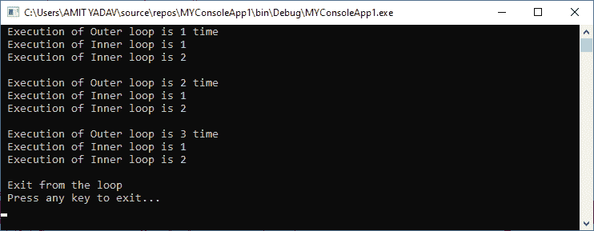

# 循环 VB.NET

> 原文:[https://www.javatpoint.com/vb-net-do-loop](https://www.javatpoint.com/vb-net-do-loop)

一个**循环**用于多次重复相同的过程，直到它满足程序中指定的条件。通过在程序中使用循环，程序员可以重复任意数量的语句，直到达到所需的重复次数。循环还为程序员提供了根据需求在程序中重复语句的合适性。一个循环也用来降低程序**的复杂度，容易理解**，也容易**调试**。

### VB.NET 环的优点

*   它在程序中提供代码迭代功能。
*   它执行语句，直到指定的条件为真。
*   它有助于减少代码的大小。
*   它减少了编译时间。

### 循环的类型

[VB.NET](https://www.javatpoint.com/vb-net)有五种类型的环路:

*   边循环边做
*   对于下一个循环
*   对于每个循环
*   当结束循环时
*   带结束循环

### 边循环边做

在 VB.NET，只要条件保持为真，Do While 循环用于执行程序中的语句块。与 [While End Loop](vb-net-while-end-loop) 相似，但略有不同。 **while** 循环**首先检查**定义的条件，如果条件变为真，则执行 while 循环的语句。而在 **Do** 循环中，与 while 循环相反，它意味着执行 Do 语句，然后检查条件。

**语法:**

```

Do
[ Statements to be executed]
Loop While Boolean_expression
// or
Do 
[Statement to be executed]
Loop Until Boolean_expression

```

在上面的语法中， **Do** 关键字跟在一个语句块后面，**而**关键字在第一个 Do 语句执行后检查**布尔表达式**。

**Do 循环流程图**


上面的流程图代表了边做边循环的流程。它用于**控制语句**的流程，使得它在检查 While 或直到条件之前至少执行一次语句。如果条件为真，将执行下一次迭代，直到条件变为假。

**实施例 1。**编写一个简单的程序，使用 print 的 Do While 循环打印一个从 1 到 10 的数字。

**Do_loop.vb**

```

Imports System
Module Do_loop
    Sub Main()
        ' Initializatio and Declaration of variable i
        Dim i As Integer = 1
        Do
            ' Executes the following Statement
            Console.WriteLine(" Value of variable I is : {0}", i)
            i = i + 1 'Increment the variable i by 1
        Loop While i <= 10 ' Define the While Condition

        Console.WriteLine(" Press any key to exit...")
        Console.ReadKey()
    End Sub
End Module

```

现在通过点击开始按钮编译并执行上述程序，它显示以下输出:


在上面的程序中，Do While 循环执行主体，直到给定条件变为 **false** 。当条件变为假时，循环将终止。

### 在直到循环语句中使用直到

在 VB.NET 循环中，有一个 **Do 直到循环**语句，类似于 **Do While 循环。**只要条件变为真，Do 语句就会执行。

**例:**写一个程序，了解 Do 直到 Loop 在 VB.NET 的用法。

**Do_loop.vb**

```

Imports System
Module Do_loop
    Sub Main()
        ' Initialization and Declaration of variable i
        Dim i As Integer = 1
        Do
            ' Executes the following Statement
            Console.WriteLine(" Value of variable i is : {0}", i)
            i = i + 1 'Increment variable i by 1
        Loop Until i = 10 ' Define the Until Condition

        Console.WriteLine(" Press any key to exit...")
        Console.ReadKey()
    End Sub
End Module

```

**输出:**


在上面的程序中，执行一个直到循环，直到给定的条件**直到(i =10)** 不满足。当**变量 i** 的计数值变为 10 时，定义的语句将为假，循环将终止。

### 嵌套的边循环边做语句

在 VB.NET，当我们在另一个 Do While 循环的主体中使用一个 Do While 循环时，它被称为嵌套 Do While 循环。

**语法**

```

Do
// Statement of the outer loop
Do
           // Statement of outer loop
While (condition -2)
// Statement of outer loop
While (condition -1)

```

**示例 2:** 编写一个简单的程序，在 VB.NET 使用 Do While 循环语句。

**Nest_Do_While.vb**

```

Imports System
Module Nest_Do_While
    Sub Main()
        ' Declare i and j as Integer variable
        Dim i As Integer = 1
        Do
            ' Outer loop statement
            Console.WriteLine(" Execution of Outer loop is {0}", i & " times")

            Dim j As Integer = 1

            Do
                'Inner loop statement
                Console.WriteLine(" Execution of Inner loop is {0}", j)
                j = j + 1 ' Increment Inner Counter variable by 1
            Loop While j < 3

            Console.WriteLine()
            i = i + 1 ' Increment Outer Counter variable by 1
        Loop While i < 4
        Console.WriteLine(" Exit from the loop")
        Console.WriteLine(" Press any key to exit...")
        Console.ReadKey()
    End Sub
End Module

```

**输出:**



在上面的例子中，外循环的每次迭代也重复执行内循环，直到内条件变为假。当外循环的条件变为假时，外循环和内循环的执行将被终止。

* * *