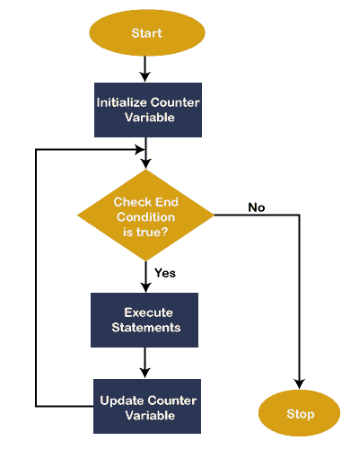
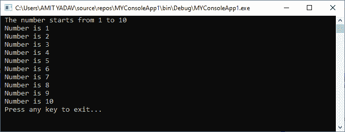
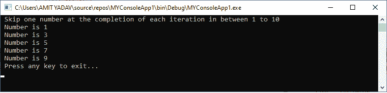
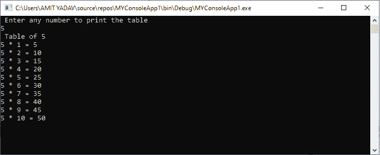
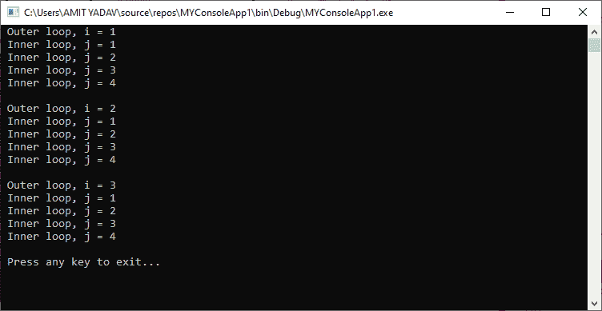
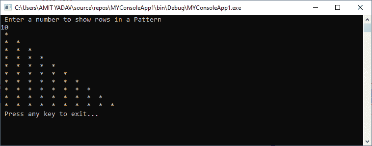

# 对于下一个循环

> 原文：<https://www.javatpoint.com/vb-net-for-next-loop>

下一个循环的**用于重复执行一个代码序列或一个代码块，直到满足给定的条件。当我们知道一个代码块需要执行多少次时，For 循环在这种情况下非常有用。在 VB.NET，For 循环也被称为 For Next 循环。**

**语法**

```

For variable_name As [ DataType ] = start To end [ Step step ]
[ Statements to be executed ]
Next

```

让我们详细了解下一个循环。

*   **对于**:是定义开头出现的关键词。
*   **变量名**:是一个变量名，在 For 循环语句中是必需的。变量值决定何时退出**下一个循环**，并且该值只能是一个数字。
*   **【数据类型】**:代表**变量名称**的数据类型。
*   **开始到结束**:**开始**和**结束**是代表**变量名**的初始值和最终值的两个重要参数。这些参数在执行开始时很有帮助，变量的初始值由 start 设置。在每次重复完成之前，将变量的当前值与结束值进行比较。如果变量的值小于结束值，则继续执行，直到变量的当前值大于结束值。如果超过该值，循环终止。
*   **步长**:步长参数用于确定程序中每次迭代后变量的**计数器**值增加或减少的幅度。如果未指定计数器值；它使用 1 作为默认值。
*   **语句**:一条语句可以是单个语句，也可以是一组语句，在循环中的每次迭代完成时执行。
*   **下一个**:在 VB.NET 一个**下一个**是一个代表 **For loop 的**结束的关键词

### 下一个循环的流程图

下面的流程图代表了[VB.NET 编程语言](https://www.javatpoint.com/vb-net)中的下一个循环的功能。



在上面的流程图中，第一步是用起始值初始化变量名。然后，变量的值将与**结束表达式**或值进行比较。如果条件为真，控件将进入循环体并执行语句。之后，变量的值将由编译器自动递增**。每次迭代**完成**后，变量的当前值将再次**与结束表达式进行比较**。如果条件不成立，受控**从回路中退出**。**

 ****实施例 1。**编写一个简单的程序，使用 For Next 循环打印从 1 到 10 的数字。

**Number.vb**

```

Imports System
Module Number
    Sub Main()
        ' It is a simple print statement, and 'vbCrLf' is used to jump in the next line.
        Console.Write(" The number starts from 1 to 10 " & vbCrLf)
        ' declare and initialize variable i
        For i As Integer = 1 To 10 Step 1
            ' if the condition is true, the following statement will be executed
            Console.WriteLine(" Number is {0} ", i)
            ' after completion of each iteration, next will update the variable counter
        Next
        Console.WriteLine(" Press any key to exit... ")
        Console.ReadKey()
    End Sub
End Module

```

**输出:**



在上面的例子中，我们用初始值 1 初始化了一个整型变量 **i** 。For 循环将持续执行其主体，直到 **i** 的值小于或等于 10。每次迭代后， **i** 的值自动增加“**步** 1”。如果 I 值达到 10，循环将被**终止**，控制转移到**主**()功能。

此外，我们可以在下一个循环中更改**步骤**。编写以下程序跳过的数字是 2。

**Number.vb**

```

Imports System
Module Number
    Sub Main()
        ' declaration of variable i
        Dim i As Integer
        Console.Write(" Skip one number at the completion of each iteration in between 1 to 10 " & vbCrLf)
        ' initialize i to 1 and declare Step to 2 for skipping a number
        For i = 1 To 10 Step 2
            ' if condition is true, it skips one number
            Console.WriteLine(" Number is {0} ", i)
            ' after completion of each iteration, next will update the variable counter to step 2
        Next
        Console.WriteLine(" Press any key to exit... ")
        Console.ReadKey()
    End Sub
End Module 

```

**输出:**



正如我们在上面的输出中所看到的，变量 **i 的值被初始化为 1，I 的值在每次迭代**的循环中被“**步骤 2”跳过**，以打印从 1 到 10 的跳过数。

**例 2:** 编写一个简单的程序，在 print 打印一张表格。

**表格 vb**

```

Imports System
Module Table
    Sub Main()
        'declaration of i and num variable
        Dim i, num As Integer
        Console.WriteLine(" Enter any number to print the table")
        num = Console.ReadLine() ' accept a number from the user
        Console.WriteLine(" Table of " & num)
        'define for loop condition, it automatically initialize step to 1
        For i = 1 To 10
            Console.WriteLine(num & " * " & i & " = " & i * num)
        Next
        Console.ReadKey()
    End Sub
End Module

```

**输出:**



### 嵌套用于 VB.NET 的下一个循环

在 VB.NET，当我们在另一个 For Next 循环的主体中编写一个 For 循环时，它被称为**嵌套 For** **Next** 循环。

**语法:**

```

For variable_name As [Data Type] = start To end [ Step step ]
	For variable_name As [Data Type] = start To end [ Step step ]
		[ inner loop statements ]
	Next
	[ Outer loop statements ]
Next

```

下面是 VB.NET 的嵌套 For Next 循环示例。

**嵌套循环 vb**

```

Imports System
Module Nested_loop
    Sub Main()
        Dim i, j As Integer
        For i = 1 To 3
            'Outer loop
            Console.WriteLine(" Outer loop, i = {0}", i)
            'Console.WriteLine(vbCrLf)

            'Inner loop
            For j = 1 To 4
                Console.WriteLine(" Inner loop, j = {0}", j)
            Next
            Console.WriteLine()
        Next
        Console.WriteLine(" Press any key to exit...")
        Console.ReadKey()
    End Sub
End Module

```

**输出:**



在上面的例子中，在外部循环的每次迭代中，内部循环重复执行其整个循环，直到条件不满足。

**例 2:** 在 print 写一个打印图案的程序。

**模式 vb**

```

Imports System
Module Pattern
    Sub Main()
        Dim i, n, j As Integer
        Console.WriteLine(" Enter a number to show rows in a Pattern")
        ' take a number from user
        n = Console.ReadLine()

        'Outer loop
        For i = 1 To n
            'Inner loop
            'value of j should be less than i
            For j = 1 To i
                Console.Write(" * ")
            Next
            Console.WriteLine("")
        Next
        Console.WriteLine(" Press any key to exit...")
        Console.ReadKey()
    End Sub
End Module

```

**输出:**



* * ***