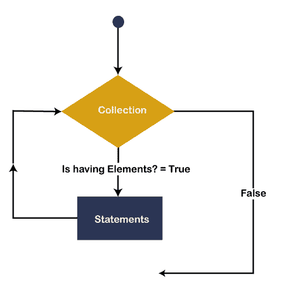
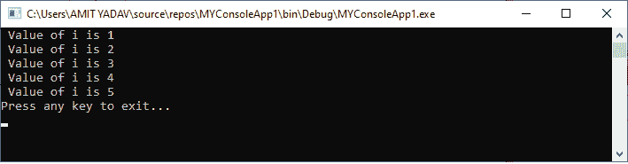
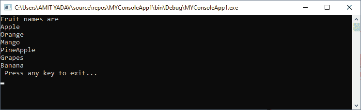

# 每个循环的 VB.NET

> 原文：<https://www.javatpoint.com/vb-net-for-each-loop>

在 VB.NET，每个循环的**用于迭代数组或集合对象中的语句块。使用 For Each 循环，我们可以轻松地处理集合对象，如列表、数组等。，以执行数组或集合中的每个元素。当数组或集合中每个元素的迭代完成时，控制转移到下一条语句以结束循环。**

**语法:**

```

For Each var_name As [ DataType ] In Collection_Object
[ Statements to be executed]
Next

```

**对于每个循环**用于从集合对象或数组中读取每个元素。**数据类型**代表变量的类型， **var_name** 是从**数组**或**集合对象**中访问元素的变量的名称，以便在 For Each 循环的主体中使用。

### 每个循环的流程图

下面的流程图代表了在[VB.NET 编程语言](https://www.javatpoint.com/vb-net)中迭代数组元素的 For Next 循环的功能。



第一步是初始化一个**数组**或集合对象，在 For Each 循环中的**变量**的帮助下执行数组的每个元素。每个循环中使用一个变量来检查**元素**是否可用。如果该元素在收集对象中可用，将执行针对每个块，直到**条件**保持为真。执行完数组的每个元素后，控制转移到 end 语句。

**每个循环的示例**

写一个简单的程序来理解在 VB.NET 每个下一个循环的用法。

**For _ every _ loop . VB**

```

Imports System
Module For_Each_loop
    Sub Main()
        'declare and initialize an array as integer
        Dim An_array() As Integer = {1, 2, 3, 4, 5}
        Dim i As Integer 'Declare i as Integer

        For Each i In An_array
            Console.WriteLine(" Value of i is {0}", i)
        Next
        Console.WriteLine("Press any key to exit...")
        Console.ReadLine()
    End Sub
End Module

```

**输出:**



在上面的例子中，我们创建了一个名为 **An_array ()** 的整数数组，并且在定义的**变量‘I’**的帮助下，For Each 循环用于迭代数组的每个元素。

**示例 2:** 编写一个简单的程序，使用 print 的 For Each 循环打印水果名称。

**For_each.vb**

```

Imports System
Module For_each
    Sub Main()
        'Define a String array
        Dim str() As String

        'Initialize all element of str() array
        str = {"Apple", "Orange", "Mango", "PineApple", "Grapes", "Banana"}

        Console.WriteLine("Fruit names are")

        'Declare variable name as fruit 
        For Each fruit As String In str
            Console.WriteLine(fruit)
        Next
        Console.WriteLine(" Press any key to exit...")
        Console.ReadKey()
    End Sub
End Module

```

**输出:**



在这个例子中， **str()** 是一个 String 类型的数组，定义了不同的水果名称。而**水果**是一个变量的名称，该变量用于在程序中的每个循环中使用**迭代 **str()** 数组的每个元素。如果所有元素都被读取，控制转到**主()**功能终止程序。**

* * *