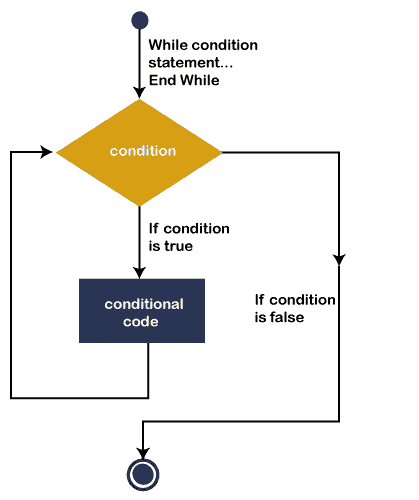
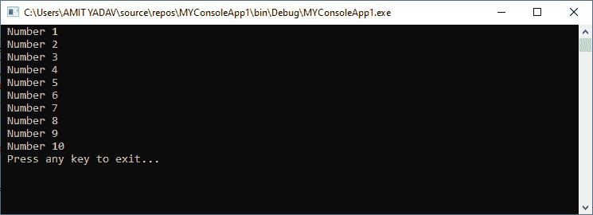
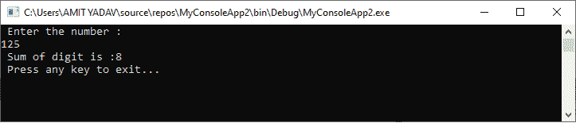
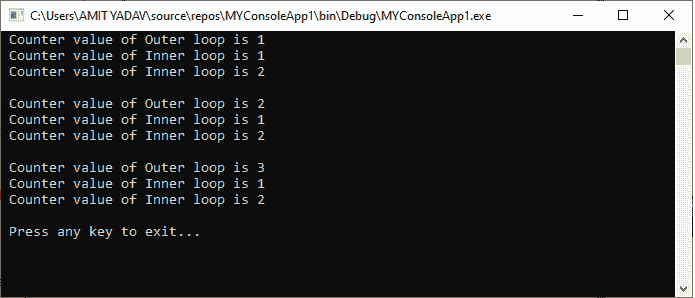

# VB.NET 同时结束循环

> 原文:[https://www.javatpoint.com/vb-net-while-end-loop](https://www.javatpoint.com/vb-net-while-end-loop)

**While End 循环**用于执行程序中的代码块或语句，只要给定的**条件**为真。当块的执行次数未知时，这很有用。它也被称为**入口控制循环**语句，这意味着它最初检查所有循环条件。如果条件为真，则执行 while 循环的主体。这个身体重复执行的过程一直持续到条件不为假。如果条件为假，控制转移到循环之外。

### 语法:

```

While [condition]
	[ Statement to be executed ]
End While

```

这里，**条件**表示任何**布尔条件，**并且如果逻辑条件为真，**单个或一组语句**在 while 循环的主体内部定义。

### VB.NET 侧端回路流程图



我们知道 **While End 循环**是一个**入口控制的**循环，用于判断条件是否为真，执行循环体中定义的语句，执行过程一直持续到满足**条件**为止。此外，在每次迭代之后，计数器变量的值递增。它再次检查定义的条件是否为真；如果条件再次为真，则执行 While 循环的主体。当条件不成立时，控制转移到循环的末尾。

**示例:**编写一个简单的程序，使用[VB.NET](https://www.javatpoint.com/vb-net)中的 while End 循环打印从 1 到 10 的数字。

**while_number.vb**

```

Imports System
Module while_number
    Sub Main()
        'declare x as an integer variable
        Dim x As Integer
        x = 1
        ' Use While End condition
        While x <= 10
            'If the condition is true, the statement will be executed.
            Console.WriteLine(" Number {0}", x)
            x = x + 1 ' Statement that change the value of the condition
        End While
        Console.WriteLine(" Press any key to exit...")
        Console.ReadKey()
    End Sub
End Module

```

**输出:**



在上面的例子中，while 循环执行其主体或语句直到定义的状态(i <= 10)。当变量 I 的值为 11 时，定义的条件为假；循环将被终止。

**例 2:** 编写一个程序，使用 print 的 while End 循环打印任意数字的位数总和。

**Total_Sum.vb**

```

Public Class Total_Sum ' Create a Class Total_sum
    Shared Sub Main()
        'Declare an Integer variable
        Dim n, remainder, sum As Integer
        sum = 0

        Console.WriteLine(" Enter the number :")
        n = Console.ReadLine()  ' Accept a number from the user

        ' Use While loop and write given below condition  
        While (n > 0)
            remainder = n Mod 10
            sum += remainder
            n = n / 10
        End While
        Console.WriteLine(" Sum of digit is :{0}", sum)
        Console.WriteLine(" Press any key to exit...")
        Console.ReadKey()
    End Sub
End Class

```

**输出:**



### 结束循环时嵌套

在 VB.NET，当我们在另一个 While End 循环的主体中编写 While End 循环时，它被称为嵌套 While End 循环。

**语法**

```

While (condition -1)
// body of the outer while loop
While (condition -2)
                     // body of inner while loop
End While
// body of the outer loop
End While

```

写一个程序来理解 VB.NET 编程中的嵌套 While End 循环。

**Nest_While.vb**

```

Imports System
Module Nest_While
    Sub Main()
        ' Declare i and j as Integer variable
        Dim i As Integer = 1

        While i < 4
            ' Outer loop statement
            Console.WriteLine(" Counter value of Outer loop is {0}", i)
            Dim j As Integer = 1

            While j < 3
                'Inner loop statement
                Console.WriteLine(" Counter value of Inner loop is {0}", j)
                j = j + 1 ' Increment Inner Counter variable by 1
            End While
            Console.WriteLine() 'print space
            i = i + 1   ' Increment Outer Counter variable by 1
        End While
        Console.WriteLine(" Press any key to exit...")
        Console.ReadKey()
    End Sub
End Module

```

**输出:**



在上面的例子中，在外部循环的每次迭代中，内部循环重复执行其整个循环，直到内部条件不满足。并且当外循环的条件为假时，外循环和内循环的执行终止。

* * *