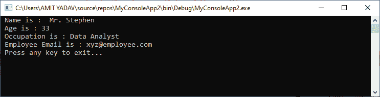
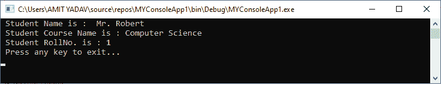

# 以声明结束的 VB.NET

> 原文:[https://www.javatpoint.com/vb-net-with-end-with-statement](https://www.javatpoint.com/vb-net-with-end-with-statement)

在 VB.NET， **With End** 语句与循环结构不同。它用于在指定的对象上访问和执行语句，而不用为每个语句指定对象的名称。在带有语句块的**中，您可以指定以句号**开头的对象成员。)**定义多个语句。**

### 语法:

```

With objExpression
	[ Statements to be Executed]
End With

```

**对象表达式:**定义**对象表达式**的数据类型。它可以是任何类或结构类型或基本数据类型，如整数。它可以在 With End 语句中执行一次。

**语句:**它用块定义了一个或多个在**内执行的语句。该语句引用与**对象表达式**链接的对象成员来执行 with 语句块。**

**结束于:**用于**结束**结束于块。

**示例:**编写一个程序来理解[VB.NET](https://www.javatpoint.com/vb-net)中 With End 语句的用法。

**员工. vb**

```

Public Class Employee
    ' definition of global variables
    Public Property name As String
    Public Property age As Integer
    Public Property Occupation As String
    Public Property email As String

    Shared Sub Main()
        ' Create an emp object 
        Dim emp As New Employee
        ' To define the member of an object
        With emp
            .name = " Mr. Stephen"
            .age = 33
            .Occupation = "Data Analyst"
            .email = "xyz@employee.com"
        End With
        With emp
            ' use emp as a reference
            Console.WriteLine(" Name is : {0}", .name)
            Console.WriteLine(" Age is : {0}", .age)
            Console.WriteLine(" Occupation is : {0}", .Occupation)
            Console.WriteLine(" Employee Email is : {0}", .email)
        End With
        Console.WriteLine(" Press any key to exit...")
        Console.ReadKey()
    End Sub
End Class

```

**输出:**



**示例:**使用 VB.NET 的 With End 语句编写一个显示学生详细信息的程序。

**With_Statement.vb**

```

Imports System
Module With_statement
    Sub Main()
        ' Create a stud object 
        Dim stud As Student = New Student()

        ' To define the member of an object using With Statement
        With stud
            .stud_name = " Mr. Robert"
            .stud_course = "Computer Science"
            .stud_rollno = "01"
        End With

        With stud
            ' use stud as a reference
            Console.WriteLine(" Student Name is : {0}", .stud_name)
            Console.WriteLine(" Student Course Name is : {0}", .stud_course)
            Console.WriteLine(" Student RollNo. is : {0}", .stud_rollno)
        End With
        Console.WriteLine(" Press any key to exit...")
        Console.ReadKey()
    End Sub

    ' Create a Class Student
    Public Class Student
        Public stud_name As String 'Define the variable of a class
        Public stud_course As String
        Public stud_rollno As Integer
    End Class
End Module

```

**输出:**



* * *