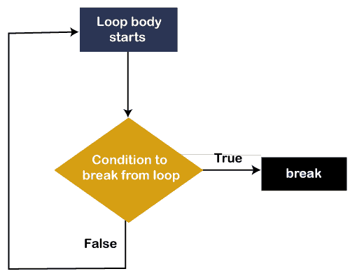
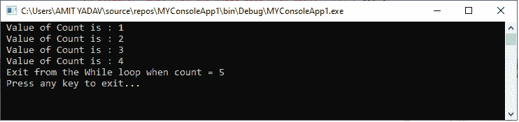
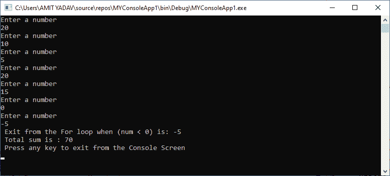
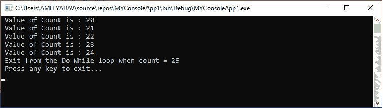

# VB.NET 退出声明

> 原文：<https://www.javatpoint.com/vb-net-exit-statement>

在 VB.NET，**退出语句**用于终止循环( **for、while、do、select case 等。**)或退出循环，并将控制立即传递给终止循环的下一条语句。此外，Exit 语句也可以在**嵌套循环**中使用，根据我们的要求，可以随时停止或终止内部或外部循环的执行。

### 句法

```

Exit { Do | For | Function |	Property | Select | Sub | Try | While }

```

### 退出声明的流程

以下是退出语句在[VB.NET 编程语言](https://www.javatpoint.com/vb-net)中的图示。



通常，Exit 语句是与条件一起编写的。如果循环内**退出**条件为**真**，则退出循环，控制转移到下一条语句，随后是循环。如果**退出**条件第一次失败**，则不会检查循环内的任何语句，**终止**程序。**

 **我们现在将看到如何在循环中使用 Exit 语句和 Select case 语句，以 VB.NET 编程语言完成程序的执行。

### 在 While End 循环中使用退出语句

**示例 1:** 编写一个简单的程序，在 [While End 循环](vb-net-while-end-loop)中使用 Exit 语句。

**退出 _While.vb**

```

Imports System
Module Exit_While
    Sub Main()
        ' Definition of count variable
        Dim count As Integer = 1

        ' Execution of While loop
        While (count < 10)
            ' Define the Exit condition using If statement
            If count = 5 Then
                Exit While ' terminate the While loop 
            End If
            Console.WriteLine(" Value of Count is : {0}", count)
            count = count + 1
        End While
        Console.WriteLine(" Exit from the While loop when count = {0}", count)
        Console.WriteLine(" Press any key to exit...")
        Console.ReadKey()
    End Sub
End Module

```

**输出:**



在上面的例子中，While End 循环被连续执行，它的主体直到给定的条件 **While(计数< 10)** 不满足。但是当**退出**条件**(计数= 5)** 落入 while 循环中时，循环的执行自动终止，控制移动到循环语句的下一部分。

### 在 For Next 循环中使用退出语句

**例 2:** 编写程序计算 10 个数之和，如果输入负数， [For Each loop](vb-net-for-each-loop) 结束。

```

Imports System
Module Exit_For
    Sub Main()
        'Definition of num variable
        Dim num As Integer
        Dim sum As Double = 0.0

        'Execution of For loop
        For i As Integer = 1 To 10
            'Accept a number from the user
            Console.WriteLine("Enter a number : ")
            num = Console.ReadLine()
            ' If the user enters a negative number, the loop terminates
            If num < 0 Then
                Exit For ' terminate the For loop 
            End If
            sum += num
        Next

        Console.WriteLine(" Exit from the For loop when (num < 0) is: {0}", num)
        Console.WriteLine(" Total sum is : {0}", sum)        
        Console.WriteLine(" Press any key to exit from the Console Screen")
        Console.ReadKey()
    End Sub
End Module

```

**输出:**



上述程序接受来自用户的数字，直到遇到负数或小于 0 **(num < 0)** 。当出现负数时， **Exit** 语句终止循环，控制转移到循环的下一部分。

### 在执行 While 循环中使用退出语句

**示例 3:** 编写一个简单的程序，在 Do While 循环中使用 Exit 语句。

**退出 _Do_While.vb**

```

Imports System
Module Exit_Do_While
    Sub Main()
        'Definition of the count variable
        Dim count As Integer = 20

        ' Definition of Do While loop
        Do
            'Define the Exit condition using If statement.

            If count = 25 Then
                Exit Do ' terminate the Do While loop 
            End If
            Console.WriteLine(" Value of Count is : {0}", count)
            count = count + 1
        Loop While (count < 50)
        Console.WriteLine(" Exit from the Do While loop when count = {0}", count)
        Console.WriteLine(" Press any key to exit...")
        Console.ReadKey()
    End Sub
End Module

```

**输出:**



在上面的例子中，Do While 循环被连续执行，其主体直到给定条件 **While(计数< 50)** 不满足。但是当遇到**退出**条件**(计数= 25)** 时，边做边循环自动终止。控制立即转移到下一条语句，后面是循环语句。

* * ***