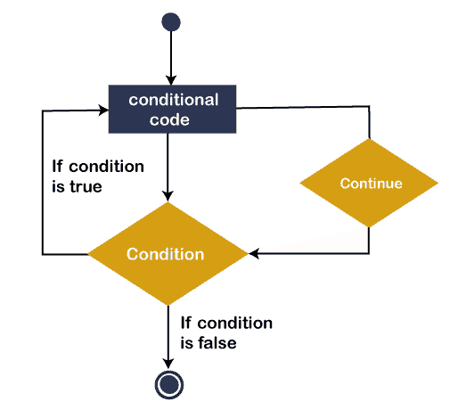
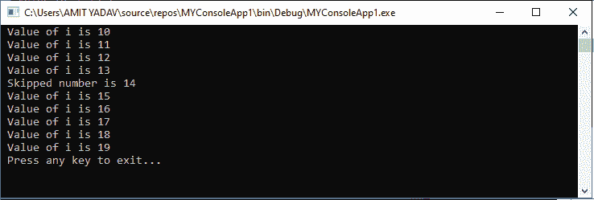
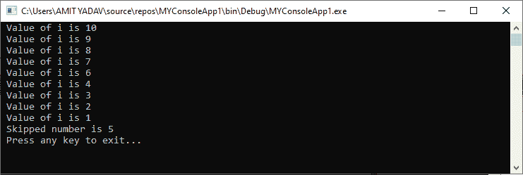
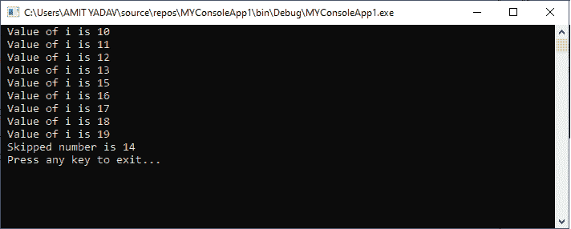

# VB.NET 继续声明

> 原文:[https://www.javatpoint.com/vb-net-continue-statement](https://www.javatpoint.com/vb-net-continue-statement)

在**VB.NET，****continue**语句用于跳过循环的特定迭代并继续下一次迭代。通常， **continue** 语句写在带有条件的 For、While 和 Do While 循环的主体中。在前一节中，我们了解了退出声明。**退出**和**继续**语句的主要区别在于[退出语句](vb-net-exit-statement)用于退出或终止循环的执行过程。相反，Continue 语句用于**跳过**特定迭代，**继续**下一次迭代**，而不**结束循环。

### 语法:

```

Continue { Do | For | While }

```

### 继续语句流程图

以下是 VB.NET 编程语言[中的继续语句的图示。](https://www.javatpoint.com/vb-net)



在上图中，一个 **Continue** 语句被放置在循环中，以跳过特定的语句或迭代。通常，continue 语句与**条件**一起使用。如果条件为**真**，则跳过特定的迭代，并立即将控制转移到循环的开始，以执行下一次迭代。

现在，我们将看到如何在循环中使用 Continue 语句跳过代码的执行，并将控件发送到循环的开头，以执行 VB.NET 编程语言中的其他语句。

### While End 循环中继续语句的使用

**示例 1:** 编写一个简单的程序，在 [While End 循环](vb-net-while-end-loop)中使用 Continue 语句。

**Continue_While.vb**

```

Imports System
Module Continue_While
    Sub Main()
        'Declaration and initialization of variable i
        Dim i As Integer = 10

        'Define the While Loop Condition
        While i < 20

            If i = 14 Then
                Console.WriteLine(" Skipped number is {0}", i)
                i += 1 ' skip the define iteration
                Continue While
            End If
            Console.WriteLine(" Value of i is {0}", i)

            i += 1 ' Update the variable i by 1
        End While
        Console.WriteLine(" Press any key to exit...")
        Console.ReadKey()
    End Sub
End Module

```

**输出:**



在上面的程序中，While 循环持续执行，直到满足给定的条件 **( i < 20)** 为止。但是当 I 的值等于 15 时，就会遇到 Continue 语句。它跳过当前执行，并将控制转移到循环的开始，以显示下一个迭代。

### 在 For Next 循环中使用 Continue 语句

**例 2:** 编写一个简单的程序，用[中的 Continue 语句打印从 10 到 1 的数字，用于下一个循环](vb-net-for-next-loop)。

**Continue_For.vb**

```

Imports System
Module Continue_For
    Sub Main()
        'Declaration and initialization of variable i, num
        Dim i As Integer = 10
        Dim num As Integer
        'Define the For Loop Condition
        For i = 10 To 1 Step -1

            If i = 5 Then ' if i = 5, it skips the iteration 
                num = i 'Assign the skip value to num variable
                Continue For ' Continue with Next Iteration
            End If
            Console.WriteLine(" Value of i is {0}", i)

        Next
        Console.WriteLine(" Skipped number is {0}", num)
        Console.WriteLine(" Press any key to exit...")
        Console.ReadKey()
    End Sub
End Module

```

**输出:**



在上面的程序中，For 循环不断递减，直到变量 I 为 **1** 。但是当 **i** 的值等于 **5** 时，会遇到继续语句。然后它跳过**当前的**执行，并将控制转移到循环的开始，以显示下一次迭代。

### 在边做边循环中继续语句的使用

**例 3:** 写一个简单的程序来理解 Do While 循环中 Continue 语句的用法。

**Continue_Do_While.vb**

```

Imports System
Module Continue_Do_While
    Sub Main()
        'Declaration and initialization of local variable
        Dim i As Integer = 10, num As Integer

        'Definition the Do While Loop
        Do
            If i = 14 Then
                num = i
                i += 1 ' skip the define iteration
                Continue Do
            End If
            Console.WriteLine(" Value of i is {0}", i)

            i += 1 ' Update the variable i by 1
        Loop While i < 20
        Console.WriteLine(" Skipped number is {0}", num)

        Console.WriteLine(" Press any key to exit...")
        Console.ReadKey()
    End Sub
End Module

```

**输出:**



在上面的程序中， [Do 循环](vb-net-do-loop)持续执行它们的身体，直到满足给定的条件 **( i < 20)** 。但是当 I 的值等于 15 时，就会遇到 Continue 语句。它跳过当前执行，并将控制转移到循环的开始，以显示下一个迭代。

* * *