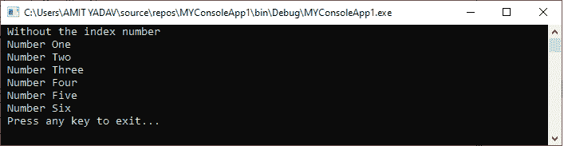
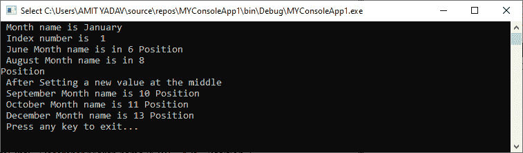
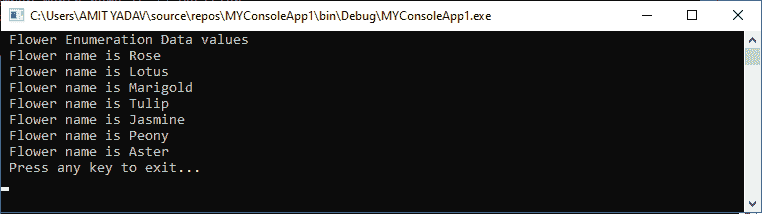

# VB.NET 枚举

> 原文：<https://www.javatpoint.com/vb-net-enum>

在 VB.NET， **Enum** 是一个被称为 Enumeration 的关键词。**枚举**是用户定义的数据类型，用于使用关键字**枚举**语句将一组相关的常量定义为列表。它可以与模块、结构、类和过程一起使用。例如，可以使用枚举对月份名称进行分组。

### 语法:

```

Enum enumeration name [ As Data type ]
' enumeration data_list or Enum member list
End Enum 

```

在上面的语法中，**枚举名称**是一个有效的标识符名称，必要时可以提到数据类型，枚举 **data_list** 或 **Enum 成员列表**表示枚举的相关常量成员的集合。

### 枚举数据的声明

以下是在[VB.NET 编程语言](https://www.javatpoint.com/vb-net)中使用 Enum 关键字对枚举数据的声明:

```

Enum Fruits
Banana
Mango
Orange
Pineapple
Apple
End Enum

```

这里，**水果**是枚举数据的名称，包含一个水果列表，叫做**枚举**列表。

当我们创建枚举数常量数据列表时，默认情况下，它会为枚举数的第一个索引赋值 0。枚举器列表中的每个连续项都增加 1。例如，在上面的枚举器列表中，香蕉值为 0，芒果值为 1，橙色值为 2，依此类推。

此外，如果我们想为枚举器项的默认值分配一个新值，请为列表的第一个索引设置一个新值，然后枚举器的值可以自动为枚举器列表中的后续对象提供一个新的增量值。

通过为枚举数列表的第一个元素设置新值来重写默认索引值。

```

Enum Fruits
Banana = 5
Mango
Orange
Pineapple
Apple
End Enum

```

这里，我们将 5 指定为枚举列表中第一项的新索引值。所以，列表的香蕉=5，芒果=6，橘子=7 的初始值，以此类推。此外，我们还可以在枚举器列表的中间提供新的值，然后它遵循前一项设置的顺序。

**例 1:** 编写一个程序，了解枚举数据在[VB.NET](https://www.javatpoint.com/vb-net)中的使用。

**枚举 _ 数据. vb**

```

Imports System
Module Enum_Data
    Enum Number 
    ' List of enumerated data
        One
        Two
        Three
        Four
        Five
        Six
    End Enum
    Sub Main()
        Console.WriteLine(" Without the index number")
      Console.WriteLine(" Number {0}", Number.One) 'call with enumeration and items name 
        Console.WriteLine(" Number {0}", Number.Two)
        Console.WriteLine(" Number {0}", Number.Three)
        Console.WriteLine(" Number {0}", Number.Four)
        Console.WriteLine(" Number {0}", Number.Five)
        Console.WriteLine(" Number {0}", Number.Six)
        Console.WriteLine(" Press any key to exit...")
        Console.ReadKey()
    End Sub
End Module

```

**输出:**



在上面的例子中，枚举器“ **Number** ”获取枚举数据的每个值，例如“ **Number”。一**等。打印列表。

### 从枚举中获取整数值

从 VB.NET 的列表中获取枚举数项的整数值。我们可以使用显式的 **CInt()** 方法来获取枚举数据索引值是否为整数。例如，以下语句显示了如何使用 CInt()将枚举项值从枚举转换为整数。

```

Dim x As Integer = CInt(Fruits.Orange)
Dim y As Integer = CInt(Fruits.Apple)

```

这里，**水果**是枚举器数据的名称，**橙色、**和**苹果**是枚举器列表中定义的元素名称，用于访问项目的索引号。

**示例 2:** 编写一个程序，使用 VB.NET 的 Enum 设置和访问索引号。

**Enum_month.vb**

```

Imports System
Module Enum_month
    Enum Monthname 'Enumeration name
        January = 1
        February
        march
        April
        May
        June
        July
        August
        September = 10 'Set value to 10
        October
        November
        December
    End Enum
    Sub Main()
        Dim x As Integer = CInt(Monthname.June)
        Dim y As Integer = CInt(Monthname.August)
        Dim p As Integer = CInt(Monthname.September)
        Dim q As Integer = CInt(Monthname.October)
        Dim r As Integer = CInt(Monthname.December)

        Console.WriteLine(" Month name is {0}", Monthname.January)
        Console.WriteLine(" Index number is  " & Monthname.January)
        Console.WriteLine(" June Month name is in {0}", x & " Position")
        Console.WriteLine(" August Month name is in {0}", y & vbCrLf & "Position")

        Console.WriteLine(" After Setting a new value at the middle")
        Console.WriteLine(" September Month name is {0}", p & " Position")
        Console.WriteLine(" October Month name is {0}", q & " Position")
        Console.WriteLine(" December Month name is {0}", r & " Position")
        Console.WriteLine(" Press any key to exit...")
        Console.ReadKey()

    End Sub
End Module

```

**输出:**



在上面的例子中，我们给枚举列表的第一个元素**(1 月= 1)** 分配了一个新的值，然后列表的连续值递增 1。在中间，我们再次为该项目设置了一个新值(**9 月= 10** )以获得枚举列表中定义的每个项目的索引值。

### VB.NET 枚举法

枚举类中提供了以下方法，这些方法包含使用枚举(Enum)的各种方法。

| 方法 | 描述 |
| **格式** | Format 方法用于将枚举类型值转换为指定的字符串格式。 |
| **获取名称** | 顾名思义，GetName 函数用于从枚举列表中获取指定项的名称。 |
| 取名字 | GetNames 方法用于从指定的枚举列表中检索所有可用的名称作为数组。 |
| 获取值 | 顾名思义，GetValues 方法用于以数组的形式从指定的枚举列表中获取所有值。 |
| **解析** | 解析方法用于将一个或多个枚举常数的名称或数值的字符串表示形式转换为枚举对象。 |
| **GetUnderlyingType** | 它用于返回指定枚举中基础项的类型。 |

### 枚举中循环的使用

在 VB.NET，我们可以在枚举中使用 For 或 [Foreach 循环](https://www.javatpoint.com/vb-net-for-each-loop)用枚举帮助器方法获取枚举器列表中每个项目的名称或值。

**示例 3:** 编写一个简单的程序，使用 enum helper 方法中的循环获取所有枚举项的名称和值。

**Enum_Flower.vb**

```

Imports System
Module Enum_Flower
    Enum Flower 'Enumeration name containing the list
        Rose
        Lotus
        Marigold
        Tulip
        Jasmine
        Peony
        Aster

    End Enum
    Sub Main()
        Console.WriteLine(" Flower Enumeration Data values")
        'Declaration of local variable i 
        For Each i As String In [Enum].GetNames(GetType(Flower)) 'use of GetNames method
            Console.WriteLine(" Flower name is {0}", i)

        Next
        Console.WriteLine(" Press any key to exit...")
        Console.ReadKey()
    End Sub
End Module

```

**输出:**



在上面的程序中，For Each 循环持续执行它们的枚举数据值，直到列表不为空。在每次迭代中，变量 **i** 的值递增，**getname**函数将从枚举列表中获取每个项目并打印枚举项目。

* * *