# VB.NET 弦

> 原文:[https://www.javatpoint.com/vb-net-string](https://www.javatpoint.com/vb-net-string)

在 VB.NET，字符串是字符的连续集合，称为文本。字符串关键字用于创建存储文本值的字符串变量。字符串类的名字是 **System。包含字符串各种功能的字符串**。

### 字符串的声明和初始化

以下是在[VB.NET 编程语言](https://www.javatpoint.com/vb-net)中使用 string 关键字声明和初始化字符串变量的不同方法。

```

'Declaration of the String variable
Dim str As String
Dim abc As String

' Initialization of String variable
Dim str As String = "Welcome to JavaTpoint."
Dim str1 As String = "Hello World!"

' Initialize a null string
Dim str2 As String = Nothing

' Initialization of an empty string
Dim name As String = String.Empty 

' Creating a String from char
Dim letter As Char() = {"H", "E",  "L", "L", "O" }

```

在上面的字符串声明中，我们用字符串[关键字](https://www.javatpoint.com/vb-net-keywords)定义了字符串变量，并根据我们的要求用值初始化了字符串变量。

### 创建字符串对象

在字符串中创建字符串对象有不同的方法。

1.  使用字符串类构造函数。
2.  通过使用属性或调用方法返回字符串。
3.  使用字符串文字定义字符串变量。
4.  使用字符串串联运算符(+)。
5.  通过使用格式化函数将值或对象转换为对象的字符串表示形式。

让我们创建一个示例来演示字符串对象的用法。

**String_object.vb**

```

Imports System
Module String_object
    Sub Main()
        Dim str, str2, fullname, data As String
        str = "Hello"
        str2 = "World!"
        fullname = str + " " + str2
        Console.WriteLine(" Message is {0}", str)
        Console.WriteLine(" Message is {0}", str2)
        Console.WriteLine(" Fullname is {0}", fullname)

        ' By using string constructor
        Dim str3 As Char() = {"H", "e", "l", "l", "o"}
        data = New String(str3)

        Console.WriteLine(" Your message is {0}", data)

        ' Use of returning string
        Dim arr() As String = {" Hello", "Welcome", "to", "JavaTpoint"}
        Dim msg As String = String.Join(" ", arr)
        Console.WriteLine(" You have defined these parameters as string array {0}", msg)

        'Use of Formatting method to convert a value to the string
        Dim time As DateTime = New Date(2020, 6, 18, 18, 48, 2)
        Dim sentmsg As String = String.Format(" Your message has been successfully sent at {0:t} on {0:D}", time)
        Console.WriteLine(" Your text is that {0}", sentmsg)
        Console.WriteLine(" Press any key to exit...")
        Console.ReadKey()
    End Sub
End Module

```

**输出:**

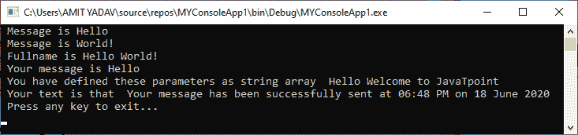

### 不可变字符串对象

在 VB.NET，字符串对象是**不可变的**。这意味着一旦我们创建了一个字符串对象，它就不能在执行过程中被修改。如果我们通过加减法修改字符串对象中的现有值，它**会丢弃内存中实例的旧值**，并创建一个**新实例**来保存新值。此外，如果我们想在字符串对象中执行任何操作，我们必须每次都定义一个对象来创建一个新的字符串对象。因此，在这种情况下，字符串提供了**系统。类在不创建新对象的情况下修改字符串。**

### 字符串类的属性

以下是字符串类的两个属性:

1.  **字符:**用于从当前字符串对象中获取字符。
2.  **长度:**用于返回当前字符串对象中的字符数。

### 在 VB.NET 从字符串中访问单个字符

在 VB.NET，我们可以使用索引值访问当前字符串对象中的单个字符。

让我们编写一个程序，通过定义索引位置来访问字符串中的各个字符。

**Get_Chars.vb**

```

Imports System
Module Get_Chars
    Sub Main()
        Dim i As Integer
        ' Declaration of String variable
        Dim name As String = "Hello World!"
        Console.WriteLine(" These are Characters in Hello World! String :")
        For i = 0 To name.Length - 1 ' Count from 0 to Length - 1
            Console.WriteLine(name(i))
        Next
        Console.WriteLine("Length is {0}", name.Length) ' Use of Length Properties
        Console.WriteLine(" Press any key to exit...")
        Console.ReadKey()
    End Sub
End Module 

```

**输出:**

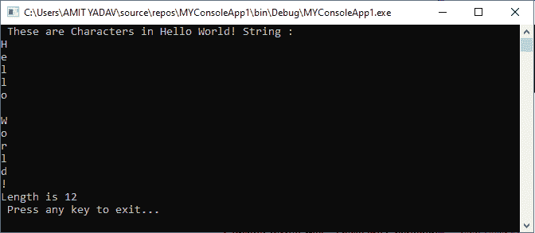

在上面的程序中，连续执行一个 For 循环，字符串变量的每个元素的值都是 **Hello World！**直到条件(**名。长度-1** )达到。这里， **Length** 函数用于统计字符串中的字符数。

字符串类有各种各样的函数来帮助操作字符串对象。

**1。Compare():** 用于比较两个指定的字符串对象，如果字符串小于另一个字符串对象，则返回一个整数值。

**语法:**

```

Public Shared Function Compare ( str1 As String, Str2 As String ) As Integer

```

返回的整数值表示两个指定字符串对象之间的关系。下表显示了字符串比较条件，该条件在比较两个指定的字符串项后返回整数值。

| 比较字符串条件 | 它返回一个整数值 |
| Str1 == Str2 | Zero |
| Str1 > Str2 | one |
| Str1 < Str2 | -1 |

**示例:**编写一个程序，了解 Compare()函数在 String Class 中的用法。

**String_cmp.vb**

```

Imports System.String
Module String_cmp
    Sub Main()
        'Definition of local String variable
        Dim Str1 As String = "Hello"
        Dim Str2 As String = "Cello"
        ' Use of String.compare() function
        Console.WriteLine(" Comparison of String {0} and {1} result is {2}", Str1, Str2, String.Compare(Str1, Str2))

        Dim Sdata As String = " WELCOME"
        Dim Sdata2 As String = " Welcome"
        ' Use of String.Compare() function
        Console.WriteLine(" Comparison result of String {0} and {1} result is {2}", Sdata, Sdata2, String.Compare(Sdata, Sdata2))

        Dim Sdata3 As String = "Hello"
        Dim Sdata4 As String = "Hello"
        ' Use of String.Compare() function
        Console.WriteLine(" Comparison result of String {0} and {1} result is {2}", Sdata3, Sdata4, String.Compare(Sdata3, Sdata4))

        Console.WriteLine(" Press any key to exit...")
        Console.ReadKey()
    End Sub
End Module

```

**输出:**

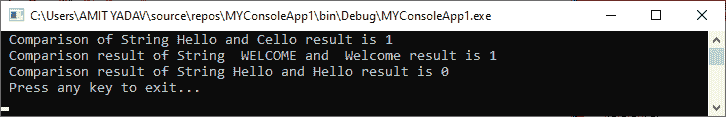

在上面的示例中，string compare()方法检查两个字符串变量的值并返回整数值。

**2 .Concat()**

Concat()函数在字符串类中用于连接两个或多个字符串，或者将一个字符串追加到另一个字符串的末尾。当我们需要组合两个或多个文本来组成一个句子，并且它返回一个新的字符串时，这很有用。

**语法:**

```

Public Shared Function Concat( Str1 As String, str2 As String ) As String

```

当我们使用三个以上的字符串参数进行组合时，我们必须这样定义:

**语法:**

```

Public Shared Function Concat( Str1 As String, Str2 As String, Str3 As String ) As String

```

让我们创建一个程序来理解使用 Concat()函数在 VB.NET 编程语言中追加或连接一个或多个字符串。

**String_concate.vb**

```

Imports System.String
Module String_concate
    Sub Main()
        ' Definition of local variables
        Dim str As String = "Learn"
        Dim Str2 As String = " " & "VB.NET Programming Language"
        'Use of Concat() function to combine two string variable
        Console.WriteLine("Your String is {0}", String.Concat(str, Str2))

        Dim val As String = "Want to"
        Dim val2 As String = " " & "Learn String methods"
        Dim str3 As String = " " & "in VB.NET language?"
        'Use of Concat() function to combine two or more string variable

        Console.WriteLine("Your Sentence is {0}", String.Concat(String.Concat(val, val2), str3))
        Console.WriteLine(" Press any key to exit...")
        Console.ReadKey()
    End Sub
End Module

```

**输出:**

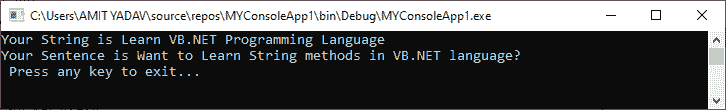

在上面的程序中，我们使用了一个 Concat()函数来组合一个或多个字符串以返回一个字符串。

**3。Contains():** 用于验证当前字符串中是否存在指定的文本或参数。如果字符串中存在文本，则返回真布尔值；否则，它返回 false。

**语法:**

```

Public Shared Function Contains ( text As String ) As Boolean

```

让我们创建一个程序来理解使用 Contains()函数来检查特定字符串是否存在于给定的字符串中。

**String_contain.vb**

```

Imports System.String
Module String_contain
    Sub Main()
        'Definition of local variables
        Dim msg As String = "Welcome to VB.NET Language."
        Dim txt As String = "VB.NET"

        ' Use of Contains() function
        Console.WriteLine("Does {0} String Contains {1}? :{2}", msg, txt, msg.Contains(txt))

        Dim str As String = "String is the collection of characters."
        Dim strtxt As String = "Collection"

        'Use of Contains function
        Console.WriteLine("Does {0} Sentence Contains {1}? :{2}", str, strtxt, str.Contains(strtxt))

        Console.WriteLine(" Press any key to exit...")
        Console.ReadKey()
    End Sub
End Module

```

**输出:**

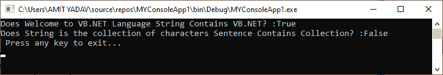

在上面的程序中，String **Contains()** 函数是判断给定的 string str 是否包含 **strtext** 的值，如果 str 中存在值**，则返回一个 **true** 值；否则，返回**假**。**

 ****4。String Copy():** 在 String 类中，有一个 Copy()函数，用于创建与原始字符串中指定的内容或值相同的新字符串对象。

**语法:**

```

Public Shared Function Copy (str1 As String ) As String

```

让我们创建一个程序来理解 VB.NET 编程语言中 Copy()函数的用法。

**String_copy.vb**

```

Imports System.String
Module String_Copy
    Sub Main()
        'Declaration and Initialization of local variable
        Dim str As String = " Welcome to JavaTpoint"
        ' Use String.Copy() function
        Dim str2 As String = String.Copy(str)
        Console.WriteLine(" Text in First String is {0}", str)
        Console.WriteLine(" Copy text is {0}", str2)

        ' Use String.Copy() function
        Console.WriteLine("Text in Copy String : {0}", String.Copy(str))
        Console.WriteLine(" Does the Object reference equal? {0}", Object.ReferenceEquals(str, str2))

        Console.WriteLine(" Press any key to exit...")
        Console.ReadKey()
    End Sub
End Module

```

**输出:**

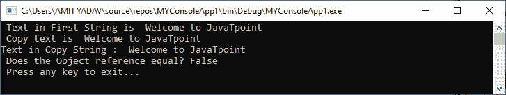

**5。copy to():**copy to()函数用于从原始字符串对象中复制指定数量的字符。

**语法:**

```

Public Sub CopyTo( sourceIndex As Integer, destination As Char(), destinationIndex As Integer, count As Integer )

```

创建一个简单的 CopyTo()函数程序，用 VB.NET 编程语言复制一个字符串。

**String_CopyTo.vb**

```

Imports System.String
Module String_CopyTo
    Sub Main()
      ' Declaration of String variable
        Dim data As String = "Welcometojavatpoint"
' Declaration of strcpy array
        Dim strcpy(25) As Char
        Console.WriteLine("Original String is: {0}", data)
	' use CopyTo() method
        data.CopyTo(9, strcpy, 0, 10)
        Console.WriteLine("Copied character is " + strcpy)
        Console.WriteLine(" Press any key to exit...")
        Console.ReadKey()
    End Sub
End Module

```

**输出:**

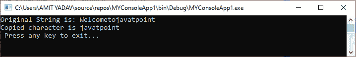

**6。end swith():****end swith()**功能用于检查原始字符串中指定的文本或参数是否以指定的文本结尾。

**语法:**

```

Public Function EndsWith( ByVal As String ) As Boolean

```

让我们创建一个程序来理解 VB.NET 编程语言中 EndsWith()函数的用法。

**String_With.vb**

```

Imports System.String
Module String_With
    Sub Main()
        'Definition of String variable
        Dim str As String
        str = " VB.NET is the best programming language"
        ' Use of EndsWith() function in String Class
        If str.EndsWith("language") = True Then
            Console.WriteLine(" The String statement EndsWith 'language'")
        Else
            Console.WriteLine(" The string is not EndsWith 'Language'")
        End If
        Console.WriteLine(" Press any key to exit...")
        Console.ReadKey()
    End Sub
End Module

```

**输出:**

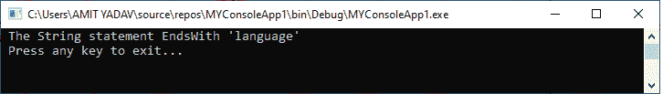

在上述程序中， **EndsWith()** 功能检查在原始字符串对象 str 中指定的定义文本**【语言】**是否以单词**语言**结尾。

**7。Equals():** 顾名思义，在字符串类中使用 Equals()函数来确定两个字符串对象是否具有相同的值。如果值相同，则 Equals()字符串方法为真；否则，它返回 false。如果两个对象都有空值，Equals()函数将返回一个真值。

**语法:**

```

Public Function Equals ( ByVal A As String, ByVal B As String ) As Boolean

```

让我们创建一个程序来理解 VB.NET 编程语言中 EndsWith()函数的用法。

**Equal_String.vb**

```

Imports System.String
Module Equal_String
    Sub Main()
        'Definition of local variable
        Dim str = "Welcome"
        Dim str2 = "welcome"
        'Use of Equals() function
        Console.WriteLine("Are string {0} and {1} equal? : {2}", str, str2, String.Equals(str, str2))
        Dim str3 = "Welcome"
        Console.WriteLine("Are string {0} and {1} equal? : {2}", str, str3, String.Equals(str, str3))
        Console.WriteLine(" Press any key to exit...")
        Console.ReadKey()
    End Sub
End Module

```

**输出:**

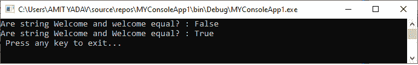

在上面的示例中，String Equals()方法检查指定的 strings 对象是否相等。如果是，则返回真值；否则，它返回 False。

**8。string Format():**Format()函数用于用指定的字符串对象替换一个或多个对象。通过使用 Format()函数，我们可以将变量值插入到另一个对象字符串中。

**语法:**

```

Public Function Format( Format_object As String, arg0 As Object ) As String

```

让我们创建一个程序来理解 Format()函数在 VB.NET 编程语言中的用法。

**字符串 _Format.vb**

```

Imports System.String
Module String_Format
    Sub Main()
        ' Declaration and Represntation of Format String
        Dim rep_string As String = " Tutorial: {0}, Topic: {1}, Method Name: {2} "

        'Use of String.Format() function
        Dim spec_string As String = String.Format(rep_string, "VB.NET", "String", "Format_String")

        Console.WriteLine(" Representation of String is {0}", spec_string)
        Console.WriteLine(" Press any key to exit...")
        Console.ReadKey()
    End Sub
End Module

```

**输出:**

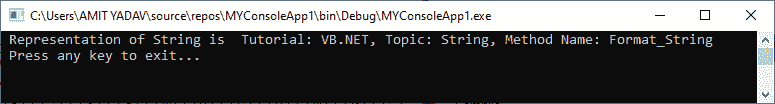

在上例中，字符串 **Format()** 方法已经用**VB 替换了格式对象{0}。NET"** ，{1}带**“字符串”**，{2}带**“Format _ String”**。

**9。index of():**String**index of()**函数用于返回指定字符或字符串在原始字符串对象中第一次出现的索引位置，后跟零(0)索引。此外，我们还可以定义指定字符或字符串在原始字符串中的起始索引位置。

**语法:**

```

'Getting a Char:
Public Function IndexOf( ByVal As Char ) As Integer

'For Getting a String:
Public Function IndexOf( ByVal As String ) As Integer

'Define the starting position of the character
Public Function IndexOf( ByVal As Char, StartIndex As Integer ) As Integer

'Define the starting position of the String
Public Function IndexOf( ByVal As String, StartIndex As Integer ) As Integer

```

让我们创建一个程序来理解 VB.NET 编程语言中 IndexOf()函数的用法。

**indexOf_String.vb**

```

Imports System.String
Module indexOf_String
    Sub Main()
        Dim Str As String = "JavaTpoint"
        Dim txt As String = "Welcome to JavaTpoint Site"
        ' Use of IndexOf() function to get specified character position
        Console.WriteLine(" Occurrence of character T index position {0}", Str.IndexOf("T"))

        ' Use of IndexOf() function to get the Specified String position of specified String
        Console.WriteLine(" Occurrence of String position {0}", txt.IndexOf("JavaTpoint"))

        'Starting position of p is 5
        Console.WriteLine(" Define the starting position of the Character p is {0}", Str.IndexOf("p", 5))

        'Starting position of JavaTpoint is 5
        Console.WriteLine(" Define the starting position of the String 'JavaTpoint' is {0}", txt.IndexOf("JavaTpoint", 11, 15))

        Console.WriteLine(" Press any key to exit...")
        Console.ReadKey()
    End Sub
End Module

```

**输出:**

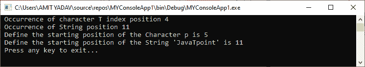

在上面的例子中，我们使用了一个 **IndexOf()** 函数从 VB.NET 编程中的原始字符串中获取一个字符或字符串的指定位置。

**10。Insert():**String 类的 Insert()函数用于在原始字符串对象的指定位置插入指定的字符串。

**语法:**

```

Public Function Insert (StartIndex As Integer, ByVal As String ) As String

```

让我们创建一个程序来理解 VB.NET 编程语言中 **Insert()** 函数的用法。

**String_Insert.vb**

```

Imports System.String
Module String_Insert
    Sub Main()
        Dim name = " Welcome to Site"
        Dim str_name = "JavaTpoint"
        'Use of Insert() function
        Console.WriteLine(" Inserted String {0} into Original string is {1}", str_name, name.Insert(11, " JavaTpoint"))
        Console.WriteLine(" Press any key to exit...")
        Console.ReadKey()
    End Sub
End Module

```

**输出:**

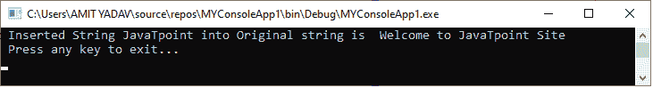

**11 时。remove():**remove 函数用于删除或删除指定位置的字符，直到定义的字符串对象结束。此外，我们可以使用 remove()函数，通过定义要从原始字符串中删除的字符的开始和结束位置来删除一组字符。

**语法:**

```

Remove Single Character
Public Function Remove( StartIndex As Integer ) As String
Set of Character
Public Function Remove( StartIndex As Integer, Length As Integer) As String 

```

让我们创建一个程序来理解 VB.NET 编程语言中 **Insert()** 函数的用法。

**String_Remove.vb**

```

Module String_Remove
    Sub Main()
        Dim str As String = " Welcome to JavaTpoint Site"
        ' For Single Character
        Console.WriteLine(" Remove a Single character {0}", str.Remove(3))

        ' For Group of character
        Console.WriteLine(" Remove a set of character from the original String {0}", str.Remove(1, 3))
        Console.WriteLine(" Press any key to exit...")
        Console.ReadKey()
    End Sub
End Module

```

**输出:**

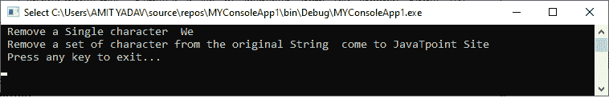

**12 时。Replace():**String Replace()函数用于从原始字符串对象中替换所有出现的指定字符或字符串，然后返回一个新字符串。

**语法:**

```

// Get the replace char
Public Function Replace ( oldValue As Char, newChar As Char ) As String
// Get the replace String
Public Function Replace (oldValue As String, newValue As String) As String

```

让我们创建一个程序来理解 VB.NET 编程语言中 **Replace()** 函数的用法。

**字符串 _ 替换. vb**

```

Imports System.String
Module String_Replace
    Sub Main()

        Dim ch As String = "abababab"
        'Use Replace() function to replace Single Character
        Dim strchar As String = ch.Replace("a", "c")
        Console.WriteLine(" Old Value is {0}", ch)
        Console.WriteLine(" New Value is {0}", strchar)

        Dim str As String = "It's Okay not to be Okay"
        'Use Replace() function to replace String
        Dim nstr As String = str.Replace("Okay", "Fine")
        Console.WriteLine(" Old String is {0}", str)
        Console.WriteLine(" New String is {0}", nstr)

        Console.WriteLine(" Press any key to exit...")
        Console.ReadKey()
    End Sub
End Module

```

**输出:**

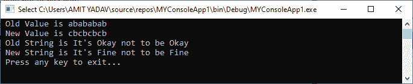

在上面的例子中，我们使用了 Replace()函数来替换 above 编程中给定字符串中的指定字符或字符串。

**13。Join():** 顾名思义， **Join()** 函数用于使用指定的分隔符连接字符串数组的所有指定元素。

句法

```

Public Shared Function Join ( Separator As String, paramArray Value As String() ) As String

```

让我们创建一个程序来理解 VB.NET 编程语言中 **Join()** 函数的用法。

**字符串 _ 连接**

```

Imports System.String
Module String_Join
    Sub Main()
        Dim strArray() As String = {"Hello", "Welcome", "to", "JavaTpoint", "Site"}
        'Use of String.Join() function
        Dim strSep As String = String.Join("-", strArray)
        Console.WriteLine(" Join String using the Hypen: {0}", strSep)

        Dim textArray() As String = {"want to learn", "VB.NET programming Language", "?", "Join", "the JavaTpoint Site"}
        'Use the String.Join() function with Space (vbCrLf) Seperator  

        Console.WriteLine(" Text is {0}", String.Join(vbCrLf, textArray))
        Console.WriteLine(" Press any key to exit...")
        Console.ReadKey()

    End Sub
End Module

```

**输出:**

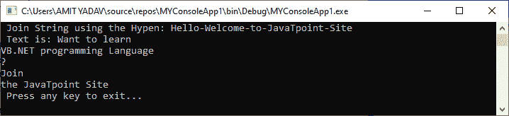

在上面的字符串 **Join()** 函数的程序中，我们使用了**连字符(-)** 和**逗号(，**分隔符来连接字符串数组的所有元素。

**14。Split():** 顾名思义，字符串 **Split()** 函数用于在分隔符的帮助下将给定的字符串拆分为子字符串，分隔符在 VB.NeT 编程语言中用于拆分字符串。此外，我们可以指定子字符串中应该返回的字符数。

**语法:**

```

Public Function Split (ParamArray separator As Char() ) As String()
' Specifies the character length
Public Function Split (ByVal separator As Char(), count As Integer) As String

```

让我们创建一个程序来理解 VB.NET 编程语言中 **Split()** 函数的用法。

**String_Split.vb**

```

Imports System.String
Module String_Split
    Sub Main()
        Dim str As String = "Welcome-to-JavaTpoint"
        'Use of Split() function
        Dim txtArray As String() = str.Split(New Char() {"-"c})
        For i As Integer = 0 To txtArray.Length - 1

            Console.WriteLine(txtArray(i))
        Next
        Console.WriteLine(" Press any key to exit...")
            Console.ReadKey()
    End Sub
End Module

```

**输出:**

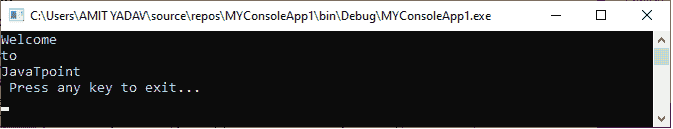

在上面的例子中，我们使用了一个 Split()函数，用一个分隔符连字符(-)来分割给定的字符串(欢迎来到 JavaTpoint”)，它返回一个数组形式的分割字符串。For 循环用于显示数组元素的每一项。

**15。StartsWith():**String 类的 StartsWith()函数用于确定字符串的开头是否与指定的字符串对象匹配。如果字符串匹配，则返回真值；否则，它显示“假”。

**语法:**

```

Public Function StartsWith ( ByVal As String ) As  Boolean

```

让我们创建一个程序来理解 VB.NET 编程语言中 **StartsWith()** 函数的用法。

**String_StartsWith.vb**

```

Imports System.String
Module String_StartsWith
    Sub Main()
        Dim str As String = "Welcome to JavaTpoint"
        Dim stwith As String = "Welcome"
        Dim st As String = "to"
        ' Use of StartsWith() function
        Console.WriteLine(" String is {0}", str)
        Console.WriteLine(" Does the string start with '{0}'? : {1}", stwith, str.StartsWith(stwith))
        Console.WriteLine(" Does string start with '{0}'? : {1}", st, str.StartsWith(st))
        Console.WriteLine(" Press any key to exit...")
        Console.ReadKey()
    End Sub
End Module
Output:
 String is Welcome to JavaTpoint
 Does the string start with 'Welcome'? : True
 Does string start with 'to'? : False
 Press any key to exit...

```

在上面的程序中，我们使用了 **StartsWith()** 函数来验证给定的字符串是否以**【欢迎】**开头。如果是，返回**真；**否则显示**假**。

**16。ToLower:**String 类的 ToLower 函数用于将任意字符串对象转换为小写。

```

Public Function ToLower As String

```

**17。ToUpper:**String 类的 ToUpper 函数用于将字符串对象转换为大写。

```

Public Function ToUpper As String

```

让我们创建一个程序来理解 VB.NET 编程语言中 **ToLower 和 ToUpper** 函数的用法。

**String_cases.vb**

```

Imports System.String
Module String_cases
    Sub Main()
        Dim str As String = "javatpoint"
        Dim txt As String = " VB.NET TUTORIAL"
        'Use ToUpper and ToLower method in String Class
        Console.WriteLine("String converted into Upper Case is {0}", str.ToUpper)
        Console.WriteLine("String converted into Lower Case is {0}", txt.ToLower)
        Console.WriteLine(" Press any key to exit...")
        Console.ReadKey()
    End Sub
End Module

```

**输出:**

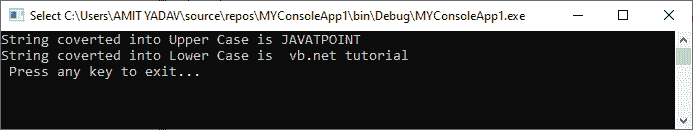

在上面的程序中，我们在 String 类中使用了 **ToLower** 和 **ToUpper** 方法，将一个给定的字符串转换成 above 程序的大写和小写。

**18。Trim():**Trim()函数用于从指定的字符串对象中删除所有出现的前导和尾随空白、字符和特殊符号。

**语法:**

```

Public Function Trim() As String
Public Function Trim( trimChars As Char()) As String

```

**Trim()** 函数的第一个语法表示它用于从给定字符串的开头和结尾移除所有空格。

第二个语法表示它用于从给定字符串对象的开头和结尾修剪所有指定的字符。

让我们创建一个程序来理解 VB.NET 编程语言中 Trim()函数的用法。

**修剪 vb**

```

Imports System.String
Module Trim
    Sub Main()
        Dim txt As String = "   VB.NET is the       "
        Dim ttxt As String = "   Best Tutorial   "
        Console.WriteLine(" Before Trim the String {0} {1}", txt, ttxt)
        'Use of Trim() Function to remove WhiteSpace
        Console.WriteLine(" After Trimming {0} {1}", txt.Trim(), ttxt.Trim())

        'Definition of Char() Array
        Dim trimChar As Char() = {"$c", "@", "&", "#"}
        Dim str As String = "$$## VB.NET is the Best Tutorial &&&@@@"
        Console.WriteLine(" Before Trim : {0}", str)
        ' USe of Trim() function to remove character
        Console.WriteLine(" After Trim : {0}", str.Trim(trimChar))
        Console.WriteLine(" Press any key to exit...")
        Console.ReadKey()
    End Sub
End Module

```

**输出:**

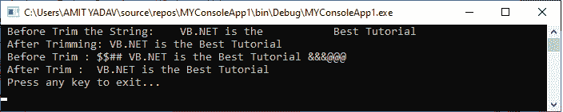

* * ***