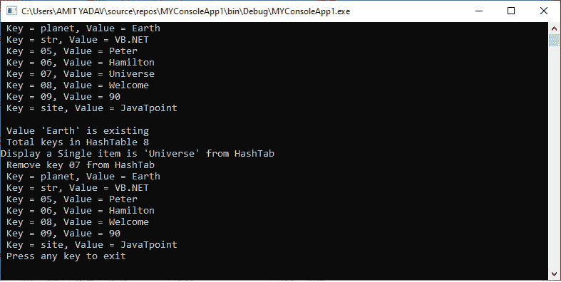

# VB.NET 哈希表

> 原文：<https://www.javatpoint.com/vb-net-hashtable>

哈希表用于存储键值对中不同类型数据的集合。这些表数据是基于哈希键组织的。一个哈希表由**系统提供。集合**命名空间。一个**键**用于识别和访问**哈希表**的每个元素，因为哈希表中的每个项目都有一个**键/值**对。

### 哈希表属性

下表描述了哈希表的属性

| 属性名称 | 描述 |
| **同步** | 它用于获取一个确定哈希表是否同步的值。 |
| is fixed DSI | 它用于获取确定哈希表是否具有固定大小的值。 |
| **计数** | 它用于计算哈希表中可用的键/值对元素的数量。 |
| **只读** | 用于获取确定**哈希表**是否为只读的值。 |
| **项** | 它用于获取或设置与指定键关联的值。 |
| **键** | 它用于获取哈希表中的键集合。 |
| **值** | 它用于获取哈希表中的值集合。 |

### 哈希表方法

以下是 VB.NET 常用的哈希表方法。

| 方法名称 | 描述 |
| **添加** | 它用于将具有指定键和值的元素添加到哈希表中。
**语法:**哈希表。添加(键、值) |
| **包含斯基** | 它用于检查哈希表中是否存在指定的键。
**语法:**哈希表。包含密钥(密钥) |
| 含氟 | 用于检查哈希表中是否存在指定的键值。
**语法:**哈希表。包含值(Value) |
| **移除** | 移除功能用于移除具有相应值的指定键。
**语法:**哈希表。移除(键) |
| **清除** | 它用于从哈希表中移除所有元素。 |
| **GetHash** | 一个 **GetHash** 用来获取 HashTable/ |

让我们创建一个程序来理解[VB.NET 编程语言](https://www.javatpoint.com/vb-net)中哈希表的概念。

**Array_Hash.vb**

```

Imports System.Collections
Module Array_Hash
    Sub Main()
        Dim hashTab As Hashtable = New Hashtable()
        Dim j As DictionaryEntry
        'Use of Add() function
        hashTab.Add("str", "VB.NET")
        hashTab.Add("05", "Peter")
        hashTab.Add("06", "Hamilton")
        hashTab.Add("07", "Universe")
        hashTab.Add("08", "Welcome")
        hashTab.Add("09", 90)
        hashTab.Add("site", "JavaTpoint")
        hashTab.Add("planet", "Earth")

        For Each j In hashTab
            Console.WriteLine(" Key = {0}, Value = {1}", j.Key, j.Value)
        Next j
        Console.WriteLine()

        ' Use of ContainsValue() function
        If hashTab.ContainsValue("Earth") Then
            Console.WriteLine(" Value 'Earth' is exist")
        Else
            Console.WriteLine(" Doesn't exist")
        End If
        Console.WriteLine(" Total keys in HashTable {0}", hashTab.Count)

        'Display a Single item.
        Console.WriteLine("Display a Single item is '{0}' from HashTab", hashTab("07"))

        'Use of ContainsKey() function
        'Console.WriteLine(" Is the key '05' exist : {0) ", hashTab("05"))

        'Use of Remove() function
        Console.WriteLine(" Remove key 07 from HashTab ")
        hashTab.Remove("07")
        For Each j In hashTab
            Console.WriteLine(" Key = {0}, Value = {1}", j.Key, j.Value)
        Next j

        Console.WriteLine(" Press any key to exit")
        Console.ReadKey()
    End Sub
End Module

```

**输出:**



* * *