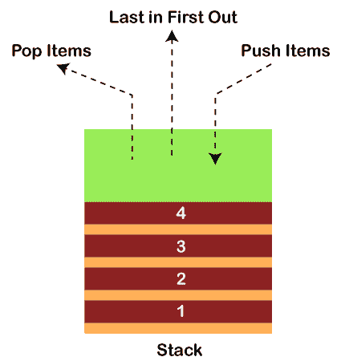
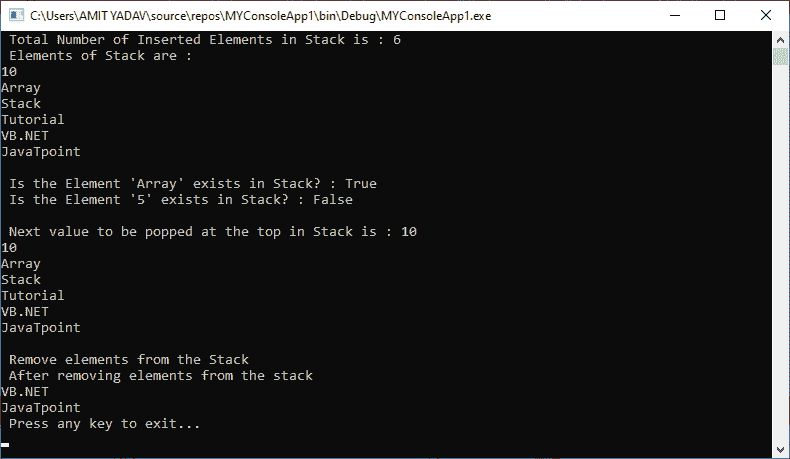

# VB.NET 堆栈

> 原文：<https://www.javatpoint.com/vb-net-stack>

**栈**是一个同质的元素集合，用于存储基于**后进先出**的元素。通常，堆栈对于以后进先出的方式访问对象集合中的元素很有用。此外，它使用**推动**和**弹出**操作来获取集合中的插入元素。Push 操作用于将项插入堆栈，pop 操作用于从堆栈中检索项。首先检索堆栈中最后添加的项。

下图显示了[VB.NET](https://www.javatpoint.com/vb-net)堆栈中的推送和弹出操作。



在上图中，Pop 表示从堆栈中检索最后一项 **(4)** ，Push 表示该项在堆栈中的插入。

### VB.NET 堆栈中的方法

以下是 VB.NET 最常用的堆栈方法。

| 方法名 | 描述 |
| **清除** | Clear 方法用于从堆栈中移除所有元素。
**语法:**公共可覆盖子清除 |
| **包含** | 它用于检查元素在堆栈中是否存在。
**语法:**栈。包含(元素) |
| **Peek** | Peek 方法用于返回堆栈中元素顶部的元素。 |
| **流行** | 它用于移除添加到堆栈中最后一个的项目。
**语法:**栈。Pop() |
| **推** | Push 方法用于在堆栈顶部插入一个项目。
**语法:**栈。推送(项目) |
| **toaarray** | ToArray 方法用于创建堆栈的副本。 |

让我们创建一个程序来理解 VB.NET 编程语言中 Stack 的各种操作。

**Stack_Collection.vb**

```vb

Imports System.Collections
Module Stack_Collection
    Sub Main()
        ' Create and initialize a Stack
        Dim St_col As Stack = New Stack()
        ' Inserting item in the Stack using the Push() Operation
        St_col.Push("JavaTpoint")
        St_col.Push("VB.NET")
        St_col.Push("Tutorial")
        St_col.Push("Stack")
        St_col.Push("Array")
        St_col.Push(10)

        ' Count all items of the Stack.
        Console.WriteLine(" Total Number of Inserted Elements in Stack is : {0}", St_col.Count)
        Console.WriteLine(" Elements of Stack are :")
        For Each item In St_col
            Console.WriteLine(item)
        Next
        Console.WriteLine()

        ' Use of Contains() function
        Console.WriteLine(" Is the Element 'Array' exists in Stack? : {0}", St_col.Contains("Array"))
        Console.WriteLine(" Is the Element '5' exists in Stack? : {0}", St_col.Contains(5))
        Console.WriteLine()

        ' Use of Peek() function
        Console.WriteLine(" Next value to be popped at the top in Stack is : {0}", St_col.Peek())
        For Each item In St_col
            Console.WriteLine(item)
        Next
        Console.WriteLine()
        ' Use of Pop() function
        Console.WriteLine(" Remove elements from the Stack")
        St_col.Pop()
        St_col.Pop()
        St_col.Pop()
        St_col.Pop()
        Console.WriteLine(" After removing elements from the stack")
        For Each item In St_col
            Console.WriteLine(item)
        Next

        Console.WriteLine(" Press any key to exit...")
        Console.ReadKey()
    End Sub

End Module

```

**输出:**



在上面的程序中，我们使用了 Stack 类的各种方法，如 **Push()** 方法用于将元素插入 Stack。 **Contains()** 方法用于检查特定元素是否存在， **Peep()** 方法用于将特定元素放在堆栈中所有元素的顶部， **Pop()** 方法用于从堆栈中移除元素。

* * *