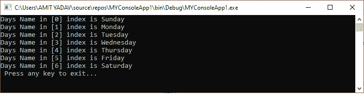
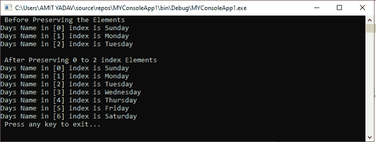

# VB.NET 动态阵列

> 原文：<https://www.javatpoint.com/vb-net-dynamic-array>

当我们不知道要在数组中插入多少项或元素时，使用动态数组。为了解决这个问题，我们使用了动态数组。它允许我们在运行时以顺序的方式插入或存储元素的数量。使用**“ReDim”**语句，可以在运行时根据程序的要求调整动态数组的大小。

### 数组的初始声明

**语法:**

```vb

Dim array_name() As Integer

```

### VB.NET 动态数组的运行时声明(调整大小)

**语法:**

```vb

ReDim {Preserve] array_name(subscripts)

```

**ReDim** 语句用于声明动态数组。为了调整数组的大小，我们使用了**保留**关键字来保留数组中的现有项目。**数组名称**代表要重新标注尺寸的数组的名称。一个**下标**代表数组的新维度。

### 动态数组的初始化

```vb

Dim myArr() As String
ReDim myArr(3)
myArr(0) = "One"
myArr(1) = "Two"
myArr(2) = "Three"
myArr(3) = "Four"

```

为了初始化一个动态数组，我们使用了创建一个名为 **myArr()** 的字符串数组，它使用了 Dim 语句，在该语句中我们不知道数组的实际大小。 **ReDim** 语句用于通过定义下标( **3** )来调整现有数组的大小。如果我们想在索引 4 中多存储一个元素，同时在数组中保留三个元素，请使用以下语句。

```vb

ReDim Preserve myArr(4)
myArr(4) = "Five" 

```

上面的数组有四个元素。

同样，如果我们想在一个数组中存储多个数据类型，我们必须使用一个**变量**数据类型。

```vb

Dim myArr() As Variant
ReDim myArr(3)
myArr(0) = 10
myArr(0) = "String"
myArr(0) = false
myArr(0) = 4.6 

```

让我们创建一个程序来理解动态数组。

**Dynamic_Arr.vb**

```vb

Imports System
Module Dynamic_Arr
    Sub Main()
        'Declaration and Initialization of String Array Days()
        Dim Days(20) As String
        ' Resize an Array using the ReDim Statement
        ReDim Days(6)
        Days(0) = "Sunday"
        Days(1) = "Monday"
        Days(2) = "Tuesday"
        Days(3) = "Wednesday"
        Days(4) = "Thursday"
        Days(5) = "Friday"
        Days(6) = "Saturday"

        For i As Integer = 0 To Days.Length - 1
            Console.WriteLine("Days Name in [{0}] index is {1}", i, Days(i))
        Next
        Console.WriteLine(" Press any key to exit...")
        Console.ReadKey()
    End Sub
End Module

```

**输出:**



### 向数组中添加新元素

当我们想要插入一些新元素到一个固定大小的数组中时，这个数组已经被旧的数组元素填满了。因此，在这种情况下，我们可以使用动态数组向现有数组添加新元素。

让我们创建一个程序来理解如何向动态数组中添加新元素。

**Dynamic_Arr1.vb**

```vb

Imports System
Module Dynamic_arr1
    Sub Main()
        'Declaration and Initialization of String Array Days()
        Dim Days() As String
        ' Resize an Array using the ReDim Statement
        ReDim Days(2)
        Days(0) = "Sunday"
        Days(1) = "Monday"
        Days(2) = "Tuesday"
        Console.WriteLine(" Before Preserving the Elements")
        For i As Integer = 0 To Days.Length - 1
            Console.WriteLine("Days Name in [{0}] index is {1}", i, Days(i))
        Next
        Console.WriteLine()

        Console.WriteLine(" After Preserving 0 to 2 index Elements")
        ReDim Preserve Days(6)
        Days(3) = "Wednesday"
        Days(4) = "Thursday"
        Days(5) = "Friday"
        Days(6) = "Saturday"
        For i As Integer = 0 To Days.Length - 1
            Console.WriteLine("Days Name in [{0}] index is {1}", i, Days(i))
        Next
        Console.WriteLine(" Press any key to exit...")
        Console.ReadKey()
    End Sub
End Module

```

**输出:**



在上面的程序中，我们创建了一个动态数组 **Days 作为一个字符串**，它执行 Days 的前三个元素，如**星期日，星期一，**和**星期二**。我们还使用了一个 Preserve 关键字，在动态数组 Days 中用新元素保留数组的现有元素。

* * *