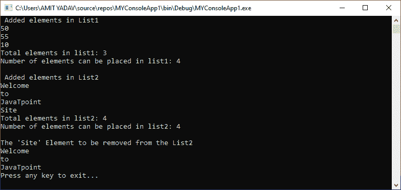
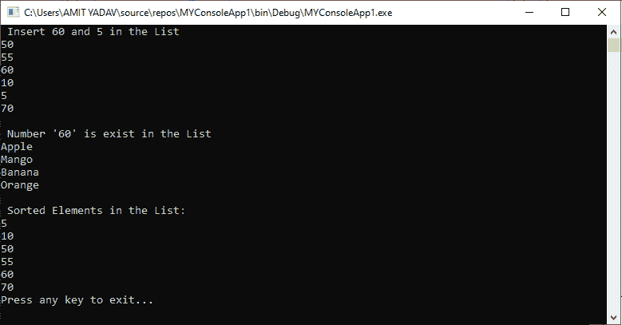

# VB.NET 名单

> 原文:[https://www.javatpoint.com/vb-net-list](https://www.javatpoint.com/vb-net-list)

列表类用于存储集合对象的一般类型。通过使用列表中的泛型类，我们可以存储一种类型的对象。列表大小可以根据应用程序的需要动态变化，例如向列表中添加、搜索或插入元素。一个[VB.NET](https://www.javatpoint.com/vb-net)列表类由**系统提供。集合.泛型**命名空间。

## VB.NET 名单的性质

以下是列表的常用属性。

| 属性名 | 描述 |
| **容量** | 它用于获取或设置一个数字，该数字指示列表中可放置的元素数量。 |
| **计数** | 它用于计算列表中可用元素的数量。 |
| **项** | 它用于在列表的指定位置获取或设置项目。 |

## VB.NET 列表方法

以下是 VB.NET 列表类执行各种操作的方法，如添加、搜索、删除、排序。

| 方法 | 描述 |
| **添加** | 如名称所示，Add()方法用于在列表的末尾添加一个对象 |
| add range | 它用于将指定集合的元素添加到列表的末尾。 |
| **清除** | 它用于清除列表中的所有记录。 |
| **包含** | 用于验证列表中是否存在指定的对象。 |
| **复制** | CopyTo()方法用于将列表中的所有记录复制到一维数组中。 |
| **查找** | Find()方法用于从与定义的状态匹配的列表中搜索指定的元素，并返回第一个匹配项。 |
| 发现全部 | FindAll()方法用于从与指定谓词定义的条件相匹配的列表中获取所有元素。 |
| **插入** | 它用于在列表的指定位置插入元素。 |
| 插入范围 | 它用于从指定位置开始插入列表中指定集合的所有元素。 |
| **移除** | 通过使用 Remove()方法，我们可以从列表中删除指定的元素。 |
| 删除 | 通过在列表中使用 RemoveAt()方法，我们可以从列表中的指定位置删除元素。 |
| **反转** | Reverse()方法用于反转元素的顺序列表。 |
| **排序** | Sort()方法用于对列表元素进行排序。 |
| **toaarray** | 它用于将列表中的所有元素复制到新的数组对象中。 |

让我们创建一个程序来理解如何在 VB.NET 编程语言中向动态数组添加新元素。

**Ar_List.vb**

```

Imports System.Collections.Generic
Module Ar_List
    Sub Main()
        Dim Lt As List(Of Integer) = New List(Of Integer)()
        Dim i As Integer
        'Dim j As String
        Console.WriteLine(" Added elements in List1")
        ' Use of Add() function
        Lt.Add(50)
        Lt.Add(55)
        Lt.Add(10)
        'Lt.Add(70)

        Dim Lt2 As List(Of String) = New List(Of String)()
        Lt2.Add("Welcome")
        Lt2.Add("to")
        Lt2.Add("JavaTpoint")
        Lt2.Add("Site")

        'Access all element of List1
        For Each i In Lt
            Console.WriteLine("{0}", i)
        Next i
        Console.WriteLine("Total elements in list1: {0}", Lt.Count)
        Console.WriteLine("Number of elements can be placed in list1: {0}", Lt.Capacity)
        Console.WriteLine()

        'Access all element of list2
        Console.WriteLine(" Added elements in List2")
        For Each j In Lt2
            Console.WriteLine("{0}", j)
        Next j
        Console.WriteLine("Total elements in list2: {0}", Lt2.Count)
        Console.WriteLine("Number of elements can be placed in list2: {0}", Lt2.Capacity)
        Console.WriteLine()

        'Use Remove() function to delete an element
        Console.WriteLine("The 'Site' Element to be removed from the List2", Lt2.Remove("Site"))
        'Retrieve using For Loop
        For Each j In Lt2
            Console.WriteLine("{0}", j)
        Next j
        Console.WriteLine("Press any key to exit...")
        Console.ReadKey()
    End Sub
End Module

```

**输出:**



让我们创建一个程序来理解 VB.NET 中的 Insert()，Contains()，Copy 数组到 List，Sort()函数。

**A_List2.vb**

```

Imports System.Collections.Generic
Module A_List2
    Sub Main()
        Dim Lt As List(Of Integer) = New List(Of Integer)()
        Dim i As Integer

        Console.WriteLine(" Insert 60 and 5 in the List")
        ' Use of Add() function
        Lt.Add(50)
        Lt.Add(55)
        Lt.Add(10)
        Lt.Add(70)

        ' Insert an Item in the list
        Lt.Insert(2, 60)
        Lt.Insert(4, 5)
        'Access all element of List1
        For Each i In Lt
            Console.WriteLine("{0}", i)
        Next i
        Console.WriteLine()

        ' Use of Contains() Function to check an item is exit
        If Lt.Contains("60") Then
            Console.WriteLine(" Number '60' is exist in the List")
        Else
            Console.WriteLine(" Not exist")
        End If

        ' Copy array to list
        Dim Str_Ar As String() = New String(4) {}
        Str_Ar(0) = "Apple"
        Str_Ar(1) = "Mango"
        Str_Ar(2) = "Banana"
        Str_Ar(3) = "Orange"
        Dim ar_List As New List(Of String)(Str_Ar)

        For Each St As String In Str_Ar
            Console.WriteLine(St)
        Next

        'Sort element of List
        Lt.Sort()
        Console.WriteLine(" Sorted Elements in the List:")
        For Each i In Lt
            Console.WriteLine("{0}", i)
        Next i
        Console.WriteLine("Press any key to exit...")
        Console.ReadKey()
    End Sub
End Module

```

**输出:**



* * *